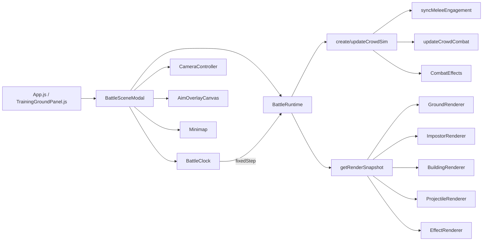

# 1. Repo 概览（战斗相关）

## 1.1 关键目录/文件（路径列表）

### 战斗相关文件树（frontend 内）

```text
frontend/src/
├─ App.js
├─ runtimeConfig.js
├─ components/game/
│  ├─ BattleSceneModal.js
│  ├─ PveBattleModal.js
│  ├─ TrainingGroundPanel.js
│  ├─ pveBattle.css
│  ├─ BattlefieldPreviewModal.js
│  └─ battleMath.js
└─ game/battle/
   ├─ presentation/
   │  ├─ assets/UnitVisualConfig.example.json
   │  ├─ render/
   │  │  ├─ WebGL2Context.js
   │  │  ├─ CameraController.js
   │  │  ├─ GroundRenderer.js
   │  │  ├─ ImpostorRenderer.js
   │  │  ├─ BuildingRenderer.js
   │  │  ├─ ProjectileRenderer.js
   │  │  └─ EffectRenderer.js
   │  ├─ runtime/
   │  │  ├─ BattleClock.js
   │  │  ├─ BattleRuntime.js
   │  │  ├─ BattleSummary.js
   │  │  ├─ RepMapping.js
   │  │  └─ FlagBearer.js
   │  └─ ui/
   │     ├─ BattleHUD.js
   │     ├─ SquadCards.js
   │     ├─ DeployActionButtons.js
   │     ├─ AimOverlayCanvas.js
   │     ├─ Minimap.js
   │     └─ BattleDebugPanel.js
   └─ simulation/
      ├─ crowd/
      │  ├─ CrowdSim.js
      │  ├─ crowdCombat.js
      │  ├─ crowdPhysics.js
      │  └─ engagement.js
      └─ effects/CombatEffects.js
```

## 1.2 运行方式/入口脚本

- 前端启动脚本：`frontend/package.json` `scripts.start` (`react-scripts start`)。
- 全项目启动脚本：`/start.sh`（启动 Mongo、backend、frontend 相关流程）。
- 围城战入口挂载路径：
  - `frontend/src/App.js` `handleOpenSiegePveBattle` 拉取 `/nodes/:nodeId/siege/pve/battle-init`。
  - `frontend/src/App.js` 挂载 `<PveBattleModal .../>`。
  - `frontend/src/components/game/PveBattleModal.js` 包装到 `<BattleSceneModal mode="siege" .../>`。
- 训练场入口挂载路径：
  - `frontend/src/components/game/TrainingGroundPanel.js` 拉取 `/army/training/init`。
  - 直接渲染 `<BattleSceneModal mode="training" .../>`。
- 后端地址不是写死常量字符串：统一由 `frontend/src/runtimeConfig.js` 的 `API_BASE`（`REACT_APP_BACKEND_ORIGIN` + fallback）提供。

---

# 2. 战斗场景 UI 与输入链路（React）

## 2.1 BattleSceneModal.js：如何创建/销毁战斗，如何拿到 battleId / map / armies

- 入口组件：`frontend/src/components/game/BattleSceneModal.js`。
- 关键 props：`open/loading/error/battleInitData/mode/...`。
- 初始化链路：`setupRuntime()` -> `new BattleRuntime(battleInitData, ...)`。
- `battleId/map/armies` 来源：`battleInitData`（来自 App/TrainingGroundPanel 的 API 返回）。
- 销毁链路：`open` 变 false 或组件卸载时，`runtimeRef.current = null` + `destroyRenderers()`。

关键代码片段（初始化 Runtime）：

```js
// BattleSceneModal.js (excerpt)
const setupRuntime = useCallback(() => {
  if (!open || !battleInitData) {
    runtimeRef.current = null;
    return;
  }
  const runtime = new BattleRuntime(battleInitData, {
    repConfig: {
      maxAgentWeight: 50,
      damageExponent: 0.75,
      strictAgentMapping: true
    },
    visualConfig: unitVisualConfig,
    rules: isTrainingMode ? { allowCrossMidline: true } : undefined
  });
  runtimeRef.current = runtime;
  const cardsRows = runtime.getCardRows();
  setCards(cardsRows);
  setPhase(runtime.getPhase());
  setBattleStatus(runtime.getBattleStatus());
  setMinimapSnapshot(runtime.getMinimapSnapshot());
  // ... UI state reset
}, [open, battleInitData, isTrainingMode]);
```

## 2.2 鼠标/键盘事件绑定位置：左键/右键/hover/wheel

- 鼠标绑定主入口：`BattleSceneModal.js`
  - `onMouseDown={handleSceneMouseDown}`
  - `onMouseMove={handlePointerMove}`
  - `onWheel={handleSceneWheel}`
  - `onContextMenu` 被 `preventDefault`
- 左键：`handleMapCommand`（部署选中/放置；战斗下发 move/attack_move/charge/skill）。
- 右键：部署阶段用于拖拽旋转视角（`deployYawDragRef`）；战斗阶段无“右键移动命令”逻辑。
- 滚轮：仅部署阶段缩放相机（`runtime.getPhase() === 'deploy'` 才生效）。
- hover：无独立 hover 事件驱动战斗交互按钮，仅有 AimOverlay 的指针移动采样。
- 键盘：`window keydown/keyup`
  - `Esc` 取消当前 UI 状态或关闭
  - `Space` 部署阶段拖拽辅助 / 战斗阶段暂停
  - `V` 切换 40°/90° 视角

## 2.3 选中部队/选中敌人/点击卡片：状态存在哪里

- 选中状态主要在 React state + Runtime 双轨：
  - React：`selectedSquadId`, `cards`, `aimState`, `commandMode`
  - Runtime：`selectedDeploySquadId`, `selectedBattleSquadId`, `focusSquadId`
- 卡片点击：`handleCardSelect/handleCardFocus`。
- 敌方卡片选中：战斗阶段被 `BattleRuntime.setSelectedBattleSquad` 拒绝（只允许 attacker）。
- 地图点选敌人：未实现专门逻辑（地图左键默认是发命令）。

## 2.4 “暂停/继续”的实现：暂停时哪些系统停

- 按钮/空格调用 `handleTogglePause` -> `clockRef.current.setPaused(next)`。
- 停止项：固定步长仿真 tick（`runtime.step` 不再被调用）。
- 未停止项：`requestAnimationFrame` 仍持续、相机更新仍持续、渲染仍持续、Overlay/UI 仍刷新。

关键代码片段（RAF + 固定步长）：

```js
// BattleSceneModal.js (excerpt)
const frame = (ts) => {
  const last = lastFrameRef.current || ts;
  const deltaSec = clamp((ts - last) / 1000, 0, 0.05);
  lastFrameRef.current = ts;

  resizeCanvasToDisplaySize(sceneCanvas, gl);

  const nowPhase = runtime.getPhase();
  if (nowPhase === 'battle') {
    clockRef.current.tick(deltaSec, (fixedStep) => runtime.step(fixedStep));
  }

  const focusAnchor = runtime.getFocusAnchor();
  const followAnchor = nowPhase === 'battle' ? { ...focusAnchor } : null;
  cameraRef.current.update(deltaSec, followAnchor);
  const cameraState = cameraRef.current.buildMatrices(sceneCanvas.width, sceneCanvas.height);

  const snapshot = runtime.getRenderSnapshot();
  renderers.ground.render(cameraState);
  renderers.building.render(cameraState, pitchMix);
  renderers.impostor.render(cameraState, pitchMix);
  renderers.projectile.render(cameraState);
  renderers.effect.render(cameraState);

  rafRef.current = requestAnimationFrame(frame);
};
```

---

# 3. 相机系统

## 3.1 相机数据结构（pos/yaw/pitch/zoom）

- 文件：`frontend/src/game/battle/presentation/render/CameraController.js`
- 核心字段：
  - 旋转：`yawDeg`, `worldYawDeg`, `pitchLow`, `pitchHigh`, `currentPitch`, `pitchFrom/to`
  - 缩放/距离：`distance`
  - 跟随中心：`centerX`, `centerY`
  - 矩阵：`view/projection/viewProjection/inverseViewProjection`
  - 相机向量：`eye/target/up`

## 3.2 视角切换（40° + 90°）在哪里做

- 切换入口：`BattleSceneModal.handleTogglePitch` -> `cameraRef.current.togglePitchMode()`。
- 具体插值：`CameraController.setPitchMode / update / smoothstep`。
- 配置值：`BATTLE_PITCH_LOW_DEG = 40`, `BATTLE_PITCH_HIGH_DEG = 90`（`BattleSceneModal.js`）。

## 3.3 当前抖动原因初判

初判为“多源平滑 + 目标源离散变化叠加”：

1. `BattleRuntime.updateCameraAnchor()` 先对 `raw focus anchor` 做一次平滑。
2. `CameraController.update()` 又对 anchor 做 `followLerp + lookAhead` 二次平滑。
3. `BattleRuntime.step()` 每 tick 对 squad/agent 位置做 clamp（边界/中线/障碍），焦点 squad 位置可能发生离散跳变。
4. 目标来源是“聚合 squad 锚点”而非单一 agent，但该锚点仍受编队重排、碰撞挤压、midline clamp 影响。

关键代码片段（runtime 锚点平滑）：

```js
// BattleRuntime.js (excerpt)
updateCameraAnchor(dtSec = 0.016) {
  const raw = this.resolveRawFocusAnchor();
  this.cameraAnchorRaw = { ...raw };
  const dt = Math.max(0.001, Number(dtSec) || 0.016);
  if (!this.cameraAnchor.squadId || this.cameraAnchor.squadId !== raw.squadId) {
    this.cameraAnchor = { ...raw };
    return;
  }
  const dx = raw.x - (Number(this.cameraAnchor.x) || 0);
  const dy = raw.y - (Number(this.cameraAnchor.y) || 0);
  const dist = Math.hypot(dx, dy);
  const followAlpha = clamp(dt * 6.6, 0, 1);
  if (dist > CAMERA_DEAD_ZONE) {
    this.cameraAnchor.x += dx * followAlpha;
    this.cameraAnchor.y += dy * followAlpha;
  }
  // ... velocity smoothing
}
```

## 3.4 相机对 worldToScreen / raycast 的影响点在哪里

- `worldToScreen`：Overlay/UI 锚定（选中圈、路径线、技能半径、世界按钮定位）
  - 位置：`CameraController.worldToScreen()`
  - 主要使用：`AimOverlayCanvas`, midline debug, world action DOM 锚点
- `screenToGround`：输入点击反投影到地面
  - 位置：`CameraController.screenToGround()`
  - 主要使用：`handleMapCommand`, `handlePointerMove`, minimap/canvas交互转换

---

# 4. BattleClock 与仿真主循环

## 4.1 BattleClock.js：固定步长、累积器、与 requestAnimationFrame 的关系

- 文件：`frontend/src/game/battle/presentation/runtime/BattleClock.js`
- `tick(deltaSec, stepFn)`：
  - 对帧间隔 `dt` 做 `maxFrame` 裁剪。
  - `accumulator += dt`，按 `fixedStep`（默认 1/30）循环调用 `stepFn`。
  - `maxCatchUp` 与 `steps > 24` 双保险防螺旋追帧。
- RAF 在 `BattleSceneModal` 驱动，BattleClock 负责把可变帧转为固定仿真步长。

关键代码片段（BattleClock）：

```js
export default class BattleClock {
  constructor({ fixedStep = 1 / 30, maxFrame = 0.05, maxCatchUp = 0.25 } = {}) {
    this.fixedStep = Math.max(1 / 120, Number(fixedStep) || (1 / 30));
    this.maxFrame = Math.max(this.fixedStep, Number(maxFrame) || 0.05);
    this.maxCatchUp = Math.max(this.fixedStep, Number(maxCatchUp) || 0.25);
    this.accumulator = 0;
    this.paused = false;
  }

  tick(deltaSec, stepFn) {
    const dt = Math.max(0, Math.min(this.maxFrame, Number(deltaSec) || 0));
    if (!stepFn || typeof stepFn !== 'function') return 0;
    if (this.paused) return 0;
    this.accumulator = Math.min(this.maxCatchUp, this.accumulator + dt);
    let steps = 0;
    while (this.accumulator >= this.fixedStep) {
      stepFn(this.fixedStep);
      this.accumulator -= this.fixedStep;
      steps += 1;
      if (steps > 24) { this.accumulator = 0; break; }
    }
    return steps;
  }
}
```

## 4.2 每个 tick 调用链（tick -> crowdSim.step -> combat.step -> render sync）

```mermaid
flowchart TD
  A[requestAnimationFrame in BattleSceneModal] --> B[BattleClock.tick(deltaSec)]
  B -->|fixedStep| C[BattleRuntime.step(dt)]
  C --> D[updateCrowdSim(crowd, sim, dt)]
  D --> E[syncMeleeEngagement]
  D --> F[leaderMove + formation + avoidance]
  D --> G[updateCrowdCombat(sim, crowd, dt)]
  G --> H[projectile detonation / melee&range damage]
  D --> I[stepEffectPool]
  A --> J[runtime.getRenderSnapshot()]
  J --> K[GroundRenderer.render]
  J --> L[BuildingRenderer.render]
  J --> M[ImpostorRenderer.render]
  J --> N[ProjectileRenderer.render]
  J --> O[EffectRenderer.render]
  A --> P[UI sync every ~120ms]
```

## 4.3 tick 内潜在 GC 点（可疑位置）

高频路径里存在较多每帧数组分配/复制：

- `CrowdSim.updateCrowdSim`
  - `.filter/.sort/[...agents]/push(...filtered)` 高频调用。
  - 位置示例：`CrowdSim.js` 1237, 1339, 1464。
- `crowdCombat.updateCrowdCombat`
  - `attackers/defenders` 每帧 `filter`；目标选择、近邻列表 `filter/sort/slice`。
  - 位置示例：`crowdCombat.js` 421-423, 485-489, 284-285。
- `BattleRuntime.step`
  - 每帧对 squads/agents/waypoints 多层循环 + 小对象构造（`clampRecord` 等）。
- Renderer 每帧 uniforms 传入时创建临时 `new Float32Array(...)`。
  - 例：`ImpostorRenderer.render` 301-302，其他 renderer 同类。

---

# 5. CrowdSim / CrowdCombat（核心战斗逻辑）

## 5.1 agent / unit / squad / army 的数据结构

### squad（AoS）
- 定义位置：`BattleRuntime.createSquad()`。
- 关键字段：
  - 身份：`id/name/team/classTag/roleTag`
  - 兵力：`units/startCount/remain/remainUnits/kills/losses`
  - 生存：`maxHealth/health/hpAvg/morale/stamina`
  - 运动：`x/y/vx/vy/dirX/dirY/speed/radius/waypoints/rallyPoint`
  - 状态机：`behavior/action/order/speedMode/speedPolicy/reformUntil`
  - 战斗：`targetSquadId`（在 combat 阶段写入）、`attackCooldown`,`underAttackTimer`,`effectBuff`,`activeSkill`,`skillRush`

### agent（AoS）
- 定义位置：`CrowdSim.createAgent()`。
- 关键字段：
  - 身份：`id/squadId/team/unitTypeId/typeCategory`
  - 运动：`x/y/vx/vy/yaw/radius`
  - 生命权重：`weight/initialWeight/hpWeight`
  - 战斗：`state/attackCd/targetAgentId/hitTimer`
  - 编队：`slotOrder/moveSpeedMul/isFlagBearer`

### 组织方式
- `crowd.agentsBySquad: Map<squadId, Agent[]>`
- `crowd.allAgents: Agent[]`
- `crowd.spatial: { size, map }`（空间哈希）
- 总体是 AoS，不是 SoA。

关键代码片段（agent 结构）：

```js
const createAgent = ({ id, squadId, team, unitTypeId, category, x, y, weight, slotOrder = 0 }) => ({
  id,
  squadId,
  team,
  unitTypeId,
  typeCategory: category,
  x: Number(x) || 0,
  y: Number(y) || 0,
  vx: 0,
  vy: 0,
  yaw: 0,
  radius: AGENT_RADIUS,
  weight: Math.max(0.2, Number(weight) || 1),
  initialWeight: Math.max(0.2, Number(weight) || 1),
  hpWeight: Math.max(0.2, Number(weight) || 1),
  state: 'idle',
  attackCd: 0,
  targetAgentId: '',
  slotOrder,
  moveSpeedMul: clamp(Number(moveSpeedMul) || 1, 0.6, 1.8),
  isFlagBearer: !!isFlagBearer,
  hitTimer: 0,
  dead: false
});
```

## 5.2 移动：寻路/转向/队形/避障在哪里实现

- 不是网格寻路（A*）实现；是目标驱动 + 编队槽位 + 局部避障。
- 关键函数：
  - `leaderMoveStep()`：队伍 leader 朝 waypoint/目标移动，含加减速、转向、体力消耗。
  - `slotOffsetForIndex()` + 每 agent slot 回归形成队形。
  - `computeTeamAwareSeparation()`：队内/敌我分离力。
  - `computeAvoidanceDirection()` + `pushOutOfRect()`：障碍规避与碰撞推出。
  - `estimateLocalFlowWidth()`：瓶颈宽度估算，动态压缩列数。

## 5.3 攻击：近战/远程判定与结算

- 入口：`updateCrowdCombat(sim, crowd, dt)`。
- 目标选择：`pickEnemySquadTarget` + 空间邻域选敌 agent。
- 近战：`applyDamageToAgent` 直接扣 `hpWeight/weight`。
- 远程：`spawnRangedProjectiles` 生成 arrow/shell，随后 `stepProjectiles` 检测命中/地爆。
- 建筑伤害：`applyDamageToBuilding` + `applyBlastDamageToWalls`（炮击）。

关键代码片段（combat 主循环入口）：

```js
export const updateCrowdCombat = (sim, crowd, dt) => {
  const squads = Array.isArray(sim?.squads) ? sim.squads : [];
  const attackers = squads.filter((row) => row.team === TEAM_ATTACKER && row.remain > 0);
  const defenders = squads.filter((row) => row.team === TEAM_DEFENDER && row.remain > 0);
  const walls = Array.isArray(sim?.buildings) ? sim.buildings.filter((wall) => wall && !wall.destroyed) : [];

  squads.forEach((squad) => {
    if (!squad || squad.remain <= 0) return;
    if ((Number(squad?.skillRush?.ttl) || 0) > 0) return;
    const behavior = typeof squad.behavior === 'string' ? squad.behavior : 'auto';
    if (behavior === 'retreat') return;
    if (squad.activeSkill && (squad.classTag === 'archer' || squad.classTag === 'artillery')) return;
    // ... target select / ranged or melee attack
  });
};
```

## 5.4 自由攻击/撤退/士气（若有）：状态机与触发条件

- `behavior` 状态包含：`idle/auto/defend/move/retreat/skill`。
- 撤退：`BattleRuntime.commandBehavior(..., 'retreat')` 设置 `waypoints=[rallyPoint]`。
- 士气：
  - `BattleRuntime.step` 持续衰减 morale。
  - `crowdCombat.applyDamageToAgent` 命中增减士气。
  - 影响移动速度惩罚（`moralePenalty`）。
- 自动撤退（士气=0）：未看到自动切 `behavior='retreat'` 的逻辑。

## 5.5 兵种技能（若已实现）

### 触发入口
- UI：`BattleSceneModal.handleToggleSkillAim` + 地图点击后 `runtime.commandSkill(...)`。
- Runtime：`BattleRuntime.commandSkill` -> `triggerCrowdSkill(sim, crowd, squadId, targetSpec)`。

### CD 存储
- 存在于 `squad.attackCooldown`（数值倒计时，sim 内扣减）。

### 各兵种实现

- 步兵（infantry）
  - 入口：`triggerCrowdSkill` infantry 分支。
  - 机制：写入 `squad.effectBuff { atkMul, defMul, speedMul, ttl }`。
  - 备注：逻辑增益有，专属视觉特效弱（仅通用 hit/effect）。

- 骑兵（cavalry）
  - 入口：`triggerCrowdSkill` cavalry 分支。
  - 机制：`squad.skillRush`（冲锋方向/剩余距离/命中集合 Set）。
  - 结算：`applyCavalryRushImpact` 扫掠线段命中、击退、士气变化。

- 弓兵（archer）
  - 入口：`triggerCrowdSkill` ranged ground-aoe 分支。
  - 机制：`activeSkill` 多波次，`emitGroundSkillWave` 连发投射物。
  - 参数：`GROUND_SKILL_CONFIG.archer`（半径、波数、间隔、CD、重力、伤害倍率等）。

- 炮兵（artillery）
  - 入口同弓兵，配置为 `GROUND_SKILL_CONFIG.artillery`。
  - 机制：shell 抛射 + 爆炸AOE + 建筑额外伤害 (`wallDamageMul`)。

关键代码片段（技能入口）：

```js
export const triggerCrowdSkill = (sim, crowd, squadId, targetInput) => {
  const squad = (sim?.squads || []).find((row) => row.id === squadId);
  if (!squad || squad.remain <= 0) return { ok: false, reason: '部队不可用' };
  if ((Number(squad.morale) || 0) <= 0) return { ok: false, reason: '士气归零，无法发动兵种攻击' };
  if ((Number(squad.attackCooldown) || 0) > 0.01) return { ok: false, reason: '兵种攻击冷却中' };

  if (squad.classTag === 'infantry') {
    squad.effectBuff = { type: 'infantry', ttl: 7.5, atkMul: 1.22, defMul: 1.3, speedMul: 0.78 };
    squad.attackCooldown = Math.max(Number(squad.attackCooldown) || 0, 2.1);
    return { ok: true };
  }

  if (squad.classTag === 'cavalry') {
    squad.skillRush = { ttl: ..., dirX: ..., dirY: ..., remainDistance: ..., hitAgentIds: new Set() };
    squad.attackCooldown = Math.max(Number(squad.attackCooldown) || 0, 2.8);
    return { ok: true };
  }

  // archer/artillery ground aoe
  squad.activeSkill = activeSkill;
  squad.attackCooldown = Math.max(Number(squad.attackCooldown) || 0, Number(cfg?.cooldownSec) || 6.5);
  return { ok: true };
};
```

## 5.6 “命中率/散布/弹道”参数在哪里

- 明确“命中率数值模型”（accuracy 命中概率）未单独实现。
- 已实现相关项：
  - 散布：`spawnRangedProjectiles` 中 `jitter`。
  - 弹道：projectile `vx/vy/vz/gravity/ttl` + `stepProjectiles`。
  - AOE 衰减：`blastFalloff`。
  - LOS：`hasLineOfSight`。
- 不存在“移动中射击惩罚命中率”的独立参数。

---

# 6. 空间结构与碰撞/射线

## 6.1 空间哈希结构：数据结构与查询 API

- 文件：`frontend/src/game/battle/simulation/crowd/crowdPhysics.js`
- 数据结构：`{ size, map: Map<string, Agent[]> }`，key 为 `floor(x/size):floor(y/size)`。
- API：
  - `buildSpatialHash(agents, cellSize)`
  - `querySpatialNearby(hash, x, y, radius)`

## 6.2 射线检测/视线检测：接口、I/O、使用系统

- 接口：
  - `raycastObstacles(start, end, obstacles, inflate)` -> 最近命中 `obstacle/x/y/t`
  - `hasLineOfSight(start, end, obstacles, inflate)` -> bool
- 使用点：
  - 技能目标 clipping/blocked：`CrowdSim.normalizeGroundSkillTargetSpec`
  - 交战目标评分 LOS 惩罚：`crowdCombat.pickEnemySquadTarget`, `engagement.scoreTargetSquad`
  - 投射物墙体扫掠命中：`crowdCombat.detectWallSweepHit`

## 6.3 旋转矩形碰撞：用于建筑/物品还是也用于单位

- 旋转矩形主体是建筑/障碍（`wall`）模型：
  - `isInsideRotatedRect`, `pushOutOfRect`, `lineIntersectsRotatedRect`, `raycastRotatedRect`
- 单位/agent 不是旋转矩形；单位与障碍碰撞通过“点+半径”被推离矩形。

关键代码片段（空间哈希 + LOS）：

```js
export const buildSpatialHash = (agents = [], cellSize = 14) => {
  const size = Math.max(2, Number(cellSize) || 14);
  const map = new Map();
  const keyOf = (x, y) => `${Math.floor(x / size)}:${Math.floor(y / size)}`;
  agents.forEach((agent) => {
    if (!agent || agent.dead) return;
    const key = keyOf(agent.x, agent.y);
    if (!map.has(key)) map.set(key, []);
    map.get(key).push(agent);
  });
  return { size, map };
};

export const querySpatialNearby = (hash, x, y, radius = 10) => {
  // scan neighbor cells and flatten
};

export const hasLineOfSight = (start, end, obstacles = [], inflate = 0) => {
  for (let i = 0; i < obstacles.length; i += 1) {
    const wall = obstacles[i];
    if (!wall || wall.destroyed) continue;
    if (lineIntersectsRotatedRect(start, end, wall, inflate)) return false;
  }
  return true;
};
```

---

# 7. 渲染系统（WebGL2）

## 7.1 WebGL2Context.js：上下文/缓冲/VAO 管理

- 文件：`frontend/src/game/battle/presentation/render/WebGL2Context.js`
- 关键函数：
  - `createBattleGlContext(canvas)`：请求 webgl2，上下文初始化（depth test / clear color）。
  - `createProgram`：shader 编译+链接。
  - `createStaticQuadVao`：统一 billboard quad VAO。
  - `createDynamicInstanceBuffer` / `updateDynamicBuffer`：动态实例缓冲上传。

## 7.2 renderer 分层

`BattleSceneModal` 渲染顺序固定：

1. `GroundRenderer`
2. `BuildingRenderer`
3. `ImpostorRenderer`（单位）
4. `ProjectileRenderer`
5. `EffectRenderer`

对应 snapshot 缓冲由 `BattleRuntime.getRenderSnapshot()` 填充：`units/buildings/projectiles/effects`。

## 7.3 ImpostorRenderer.js：实例化 per-instance attribute 布局

- `UNIT_INSTANCE_STRIDE = 12`
- 映射：
  - `iData0(vec4)` => `x, y, z, size`
  - `iData1(vec4)` => `yaw, team, hp, bodyIndex`
  - `iData2(vec4)` => `gearIndex, vehicleIndex, selected, flag`
- VAO 绑定：`vertexAttribPointer + vertexAttribDivisor(1)`。

关键代码片段（Impostor 实例布局）：

```js
export const UNIT_INSTANCE_STRIDE = 12;

// layout(location=2) iData0: x y z size
// layout(location=3) iData1: yaw team hp body
// layout(location=4) iData2: gear vehicle selected flag

gl.enableVertexAttribArray(this.attrs.iData0);
gl.vertexAttribPointer(this.attrs.iData0, 4, gl.FLOAT, false, strideBytes, 0);
gl.vertexAttribDivisor(this.attrs.iData0, 1);

gl.enableVertexAttribArray(this.attrs.iData1);
gl.vertexAttribPointer(this.attrs.iData1, 4, gl.FLOAT, false, strideBytes, 16);
gl.vertexAttribDivisor(this.attrs.iData1, 1);

gl.enableVertexAttribArray(this.attrs.iData2);
gl.vertexAttribPointer(this.attrs.iData2, 4, gl.FLOAT, false, strideBytes, 32);
gl.vertexAttribDivisor(this.attrs.iData2, 1);
```

## 7.4 shader 管线：uniform/动画帧/贴图 atlas

- Ground/Building/Projectile/Effect 都是简化 shader 管线。
- 关键 uniform：`uViewProj`, `uCameraRight`, `uCameraUp`, `uPitchMix`, `uDeployRange`。
- 动画帧：未见完整骨骼/sprite 帧动画系统。
- 贴图/atlas：
  - `ImpostorRenderer` 内有 `createTextureArray` 能力，但当前主渲染 shader未采样这些 texture arrays（实际是程序化着色+伪 palette）。
  - 因此“全兵种贴图 atlas 完整链路”尚未落地。
- UBO：未使用。

## 7.5 当前帧预算统计

- 已有：`fps/simStepMs/renderMs` + instance 数（debug panel）。
- 未见：draw call 计数、buffer upload 字节数、GPU timer query。

---

# 8. Overlay 与交互可视化（DOM/CSS + 2D Canvas）

## 8.1 AimOverlayCanvas.js：当前能画什么

- 选中 squad 圈。
- waypoints 虚线路径 + 节点点位。
- 技能瞄准圆（基于 `aimState.point/radiusPx`）。
- 文件：`frontend/src/game/battle/presentation/ui/AimOverlayCanvas.js`

关键代码片段：

```js
if (selectedSquad) {
  const center = worldToScreen({ x: selectedSquad.x, y: selectedSquad.y, z: 0 });
  if (center?.visible) {
    drawCircle(center, 12, 'rgba(250, 204, 21, 0.95)', 'rgba(250, 204, 21, 0.12)');
  }

  if (Array.isArray(waypoints) && waypoints.length > 0) {
    let prev = center;
    ctx.strokeStyle = 'rgba(56, 189, 248, 0.8)';
    ctx.lineWidth = 2;
    ctx.setLineDash([5, 4]);
    waypoints.forEach((point) => {
      const next = worldToScreen({ x: point.x, y: point.y, z: 0 });
      if (!next?.visible) return;
      ctx.beginPath();
      ctx.moveTo(prev.x, prev.y);
      ctx.lineTo(next.x, next.y);
      ctx.stroke();
      drawCircle(next, 4, 'rgba(56, 189, 248, 0.9)', 'rgba(56, 189, 248, 0.25)');
      prev = next;
    });
    ctx.setLineDash([]);
  }
}
```

## 8.2 Minimap.js：如何同步单位位置/视口

- 输入：`snapshot(field/buildings/squads/deployRange)` + `cameraCenter/cameraViewport`。
- 输出：
  - 绘制阵营底色、建筑、squad 点、相机矩形。
  - 点击回调 `onMapClick` 转回 world 坐标。
- 同步源：`BattleSceneModal` 每 120ms 从 runtime 拉 `getMinimapSnapshot()`。

## 8.3 指示标记/路径线/选中框定位

- 路径线：`AimOverlayCanvas` waypoint 虚线。
- 选中框：
  - 主战场选中圈（AimOverlay）
  - 小地图选中点外环（`Minimap`）
  - 卡片高亮（`SquadCards` + css `.pve2-card.selected`）
- 地图落点标记（右键命令 marker）未见独立实现。

---

# 9. 现状对照需求清单（逐条打勾）

- 需求条目：(1) 远程：技能攻击必须停下；自由攻击可移动但命中率更低
  - 状态：🟡 部分实现
  - 现有实现位置：
    - `CrowdSim.js` `triggerCrowdSkill` / `updateActiveGroundSkill`
    - `crowdCombat.js` `if (squad.activeSkill && ranged) return;`
  - 缺口/问题：
    - 远程技能期间会停普通攻击，但未强制“停止移动”。
    - 无“移动中命中率降低”的独立 accuracy 模型。
  - 我建议改造的入口点（文件/函数）：
    - `CrowdSim.js` `triggerCrowdSkill`, `leaderMoveStep`, `updateActiveGroundSkill`
    - `crowdCombat.js` `spawnRangedProjectiles`（加入 accuracy penalty）

- 需求条目：(2) 点击地图/卡片选中我方部队 -> 相机切换（并指出抖动点）
  - 状态：🟡 部分实现
  - 现有实现位置：
    - 卡片选中：`BattleSceneModal.js` `handleCardSelect/handleCardFocus`
    - 相机跟随：`BattleRuntime.getFocusAnchor` + `updateCameraAnchor` + `CameraController.update`
  - 缺口/问题：
    - 战斗阶段地图点击不做“选中部队”，默认是发命令。
    - 抖动点：runtime 与 camera 双平滑 + focus squad clamp 跳变。
  - 我建议改造的入口点（文件/函数）：
    - `BattleSceneModal.js` `handleMapCommand`
    - `BattleRuntime.js` `resolveRawFocusAnchor/updateCameraAnchor`
    - `CameraController.js` `update`

- 需求条目：(3) 选中/hover 显示 6 个按钮（地图锚定在旗帜上方、朝向相机；卡片 hover overlay）
  - 状态：❌ 缺失
  - 现有实现位置：
    - 仅部署阶段 3 按钮：`DeployActionButtons.js`（move/edit/delete）
    - 调用：`BattleSceneModal.js` 世界锚点 `.pve2-world-actions`
  - 缺口/问题：
    - 无战斗阶段 6 按钮系统。
    - 无 hover 驱动状态，无“旗帜上方朝向相机”3D 锚定。
  - 我建议改造的入口点（文件/函数）：
    - `BattleSceneModal.js`（新增 battle world action state + hover/pick）
    - `AimOverlayCanvas.js`（或新增 BattleActionOverlay）
    - `SquadCards.js`（卡片 hover overlay）

- 需求条目：(4) 右键移动：落点标记 + 路径显示
  - 状态：🟡 部分实现
  - 现有实现位置：
    - 路径显示：`AimOverlayCanvas.js` waypoints 虚线
    - 命令下发：`BattleSceneModal.js` `handleMapCommand`（当前是左键）
  - 缺口/问题：
    - 右键移动尚未实现。
    - 无落点 marker 生命周期管理。
  - 我建议改造的入口点（文件/函数）：
    - `BattleSceneModal.js` `handleSceneMouseDown/handleMapCommand`
    - `AimOverlayCanvas.js`（落点 marker 渲染）

- 需求条目：(5) a 规划路径（暂停 + waypoints + 右键撤销/退出）
  - 状态：🟡 部分实现
  - 现有实现位置：
    - waypoints append：`BattleRuntime.commandMove(..., { append })`
    - Shift append 来源：`BattleSceneModal.js` `handleMapCommand`
  - 缺口/问题：
    - 无“路径规划模式”状态机。
    - 无右键撤销 waypoint / 退出规划。
    - 无规划态 UI。
  - 我建议改造的入口点（文件/函数）：
    - `BattleSceneModal.js`（新增 planningMode state）
    - `BattleRuntime.js`（新增 waypoint undo/commit API）

- 需求条目：(6) b 行进模式弹层（整体行进/游离行进）
  - 状态：🟡 部分实现
  - 现有实现位置：
    - 速度模式按钮（B/C/A）：`BattleSceneModal.js` `handleCycleSpeedMode`
    - 模式落地：`BattleRuntime.commandSpeedMode`
  - 缺口/问题：
    - 无弹层 UI。
    - 模式语义与“整体/游离行进”一一映射未定义。
  - 我建议改造的入口点（文件/函数）：
    - `BattleSceneModal.js`（新增 mode popover）
    - `BattleRuntime.js`（扩展 mode 枚举与策略）

- 需求条目：(7) c 自由攻击（停原地警戒圈 + 目标性价比选择 + 近战追击回位/远程原地射击）
  - 状态：🟡 部分实现
  - 现有实现位置：
    - `behavior=auto/defend`：`BattleRuntime.commandBehavior`
    - 目标评分：`crowdCombat.js` `pickEnemySquadTarget`
    - 近战/远程距离行为：`CrowdSim.updateSquadBehaviorPlan`
  - 缺口/问题：
    - 无“警戒圈”可视化。
    - 无明确“回位”状态定义。
    - 远程并非严格原地射击（可被其他逻辑驱动移动）。
  - 我建议改造的入口点（文件/函数）：
    - `BattleRuntime.js`（新增 guard/fallback anchor）
    - `CrowdSim.js` `updateSquadBehaviorPlan/leaderMoveStep`
    - `AimOverlayCanvas.js`（警戒圈）

- 需求条目：(8) d 技能系统（技能按钮数量、CD UI、确认态、右键取消）
  - 状态：🟡 部分实现
  - 现有实现位置：
    - 技能确认态：`BattleSceneModal.js` `aimState` + 地图点击确认
    - CD：`squad.attackCooldown` (`CrowdSim.js`)
    - 技能触发：`BattleRuntime.commandSkill` -> `triggerCrowdSkill`
  - 缺口/问题：
    - 仅单技能按钮（`技能瞄准`），未多技能位。
    - 无 CD UI 可视化。
    - 右键取消未实现（当前 Esc 取消）。
  - 我建议改造的入口点（文件/函数）：
    - `BattleSceneModal.js`（技能栏/确认态/右键取消）
    - `BattleHUD.js` 或新增 `BattleSkillBar` 组件
    - `BattleRuntime.js`（技能元数据）

- 需求条目：(9) 步兵 buff 特效、骑兵冲锋箭头/击退、弓兵箭雨抛物线+AOE 圆贴合、炮兵炮击爆炸+建筑伤害
  - 状态：🟡 部分实现
  - 现有实现位置：
    - 步兵 buff 逻辑：`CrowdSim.js` `effectBuff`
    - 骑兵冲锋/击退：`skillRush` + `applyCavalryRushImpact`
    - 弓兵/炮兵多波次抛射：`emitGroundSkillWave`
    - 炮击建筑伤害：`crowdCombat.js` `applyBlastDamageToWalls`
    - AOE 圆 UI：`AimOverlayCanvas.js`
  - 缺口/问题：
    - 兵种特效可视化较弱（缺专属 FX 资产/箭头提示等）。
    - “贴合地形圆贴”是 2D overlay，不是地表 decal。
  - 我建议改造的入口点（文件/函数）：
    - `EffectRenderer.js` / `ProjectileRenderer.js`
    - `AimOverlayCanvas.js`（地面 decal 过渡）
    - `CrowdSim.js`（skill metadata -> renderer payload）

- 需求条目：(10) e 待命、f 撤退、士气=0 自动撤退
  - 状态：🟡 部分实现
  - 现有实现位置：
    - 待命/撤退命令：`BattleRuntime.commandBehavior`
    - 士气系统：`BattleRuntime.step` + `crowdCombat.applyDamageToAgent`
  - 缺口/问题：
    - 士气=0 自动撤退未实现（仅技能禁用/速度惩罚）。
  - 我建议改造的入口点（文件/函数）：
    - `BattleRuntime.step` 或 `CrowdSim.updateSquadBehaviorPlan`

- 需求条目：(11) 左键点其他地方按钮消失
  - 状态：🟡 部分实现
  - 现有实现位置：
    - 部署态：点击空白会 `setDeployActionAnchorMode('')`
  - 缺口/问题：
    - 战斗态无对应“按钮消失”系统（因为当前也没有 6 按钮系统）。
  - 我建议改造的入口点（文件/函数）：
    - `BattleSceneModal.js`（统一 world/card action visibility reducer）

- 需求条目：(12) 全兵种/全地图/全物品贴图与效果（且 2万+单位 30fps+ 性能约束）
  - 状态：🟡 部分实现
  - 现有实现位置：
    - Instancing：`ImpostorRenderer/BuildingRenderer/ProjectileRenderer/EffectRenderer`
    - 对象池：`CombatEffects.js`
    - 代表体映射（rep）：`RepMapping.js` + `CrowdSim.resolveVisibleAgentCount`
  - 缺口/问题：
    - 完整贴图库/atlas 管线未形成（Impostor 纹理数组代码未接主 shader 采样链路）。
    - 无 drawcall/带宽统计与自动预算控制。
    - 无明确“2万+单位 30fps+”验收与压测脚本。
  - 我建议改造的入口点（文件/函数）：
    - `ImpostorRenderer.js`（纹理采样、LOD 分级材质）
    - `BattleRuntime.getDebugStats` + 新增 perf telemetry 模块
    - `CrowdSim.js`（更积极 LOD/更新频率分层）

---

# 10. 给 ChatGPT 的“改造所需关键信息摘要”

## 10.1 如果要实现上述交互 + 技能 + 特效，最关键先改哪些文件

优先级建议：

1. `frontend/src/components/game/BattleSceneModal.js`
   - 增加战斗态交互状态机（右键命令、路径规划模式、技能确认/取消、6按钮显隐）。
   - 统一输入仲裁（左键选中 vs 发命令；右键撤销/取消）。
   - 承接模板/技能/行为 UI 到 runtime command。

2. `frontend/src/game/battle/presentation/runtime/BattleRuntime.js`
   - 扩展命令系统（command queue、plan begin/commit/cancel、目标锁定）。
   - 增加“士气=0自动撤退”与行为切换策略。
   - 相机 anchor 稳定化（可加入低通+抗跳变策略）。

3. `frontend/src/game/battle/simulation/crowd/CrowdSim.js`
   - 细化 behavior state machine（guard/hold/fire-on-move penalty/return-to-anchor）。
   - 技能统一数据模型（多技能位、CD、cast state、interrupt/cancel）。

4. `frontend/src/game/battle/simulation/crowd/crowdCombat.js`
   - 引入 accuracy/hit model（移动惩罚、姿态/距离/掩体影响）。
   - 强化目标性价比选择指标与可解释调试字段。

5. `frontend/src/game/battle/presentation/ui/AimOverlayCanvas.js` + 新增 `BattleActionOverlay`（建议）
   - 落点 marker、警戒圈、路径编辑态可视化。
   - 6按钮世界锚点（必要时从 DOM overlay 升级到世界投影层）。

6. `frontend/src/game/battle/presentation/render/ImpostorRenderer.js` / `EffectRenderer.js` / `ProjectileRenderer.js`
   - 兵种技能特效增强（冲锋箭头、箭雨落点、炮击冲击波/碎片）。
   - 引入真正 atlas/texture array 采样与材质变体。

## 10.2 已具备可复用基础（可直接利用）

- 固定步长时钟：`BattleClock`。
- 基础命令接口：`commandMove/AttackMove/Charge/Behavior/Skill`。
- 相机反投影与投影：`CameraController.screenToGround/worldToScreen`。
- 空间查询 + LOS + 射线 + 矩形碰撞：`crowdPhysics`。
- 实例化渲染框架：5 个 renderer + snapshot 缓冲上传。
- 2D overlay 通道：`AimOverlayCanvas`, `Minimap`。
- 技能基础框架：`triggerCrowdSkill + activeSkill + cooldown`。
- 对象池与代表体：`CombatEffects` + `RepMapping`。

## 10.3 目前缺口最大的模块

1. 命令系统深度不足
- 目前只有即时命令，不具备“规划/确认/撤销/多段队列”的命令状态机。

2. 技能 UI/确认态与 CD 显示不足
- 只有单个“技能瞄准”按钮，没有技能栏、CD 进度、右键取消。

3. 战斗态交互模型不完整
- 地图点选部队/点选敌人与发命令冲突未解耦。
- 右键命令语义缺失。

4. 相机稳定性
- raw anchor + runtime smoothing + camera smoothing + clamp 跳变，容易抖动。

5. 战术行为细化不足
- 自由攻击、回位、移动射击惩罚、警戒圈等策略未成体系。

6. 视觉与性能观测
- 技能逻辑已有，但兵种特效演出与地表贴合不足。
- perf 指标缺 drawcall/buffer upload/GPU 时间，难做 20k+ 单位工程化验收。

---

## 附：关键调用关系（总览）



