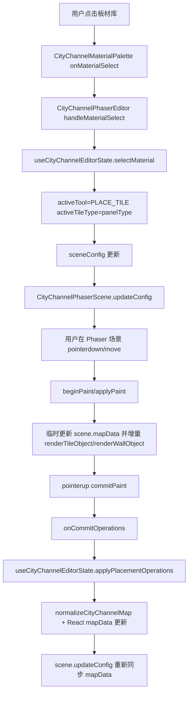
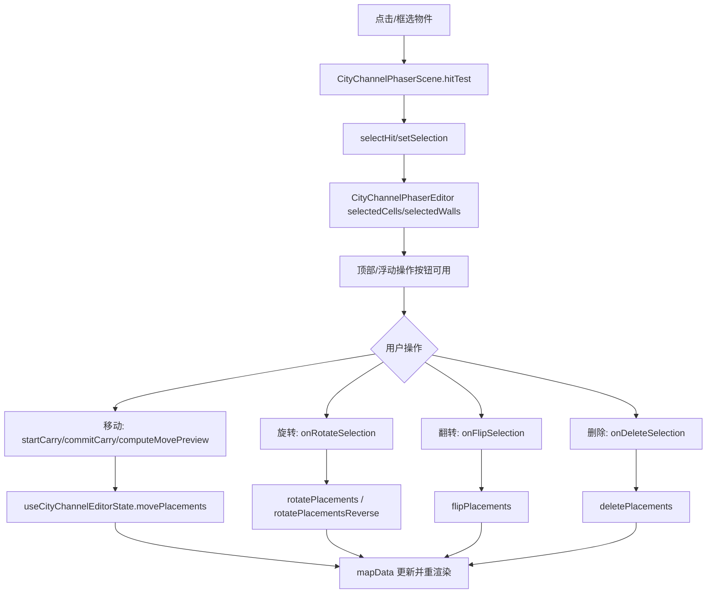
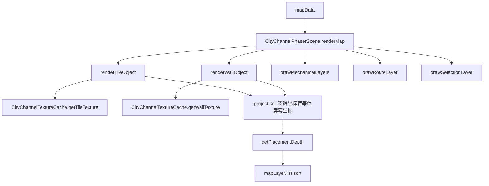
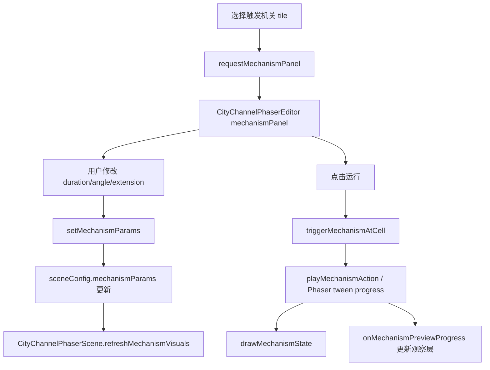
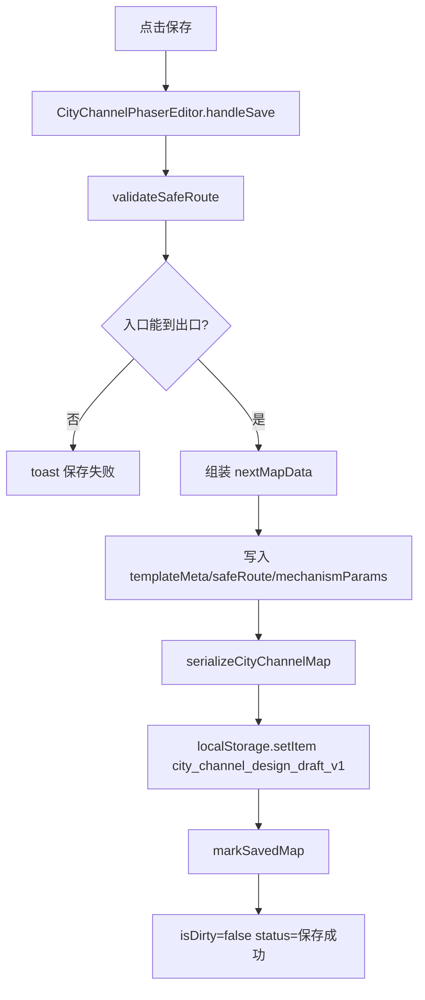

# 城内工坊编辑模板代码审计

> 范围：`城内工坊 -> 编辑模板`。本轮只读代码并生成文档；未修改业务代码。

## 1. 项目技术栈

| 项 | 结论 | 依据 |
|---|---|---|
| 前端框架 | React 18，Create React App / `react-scripts` | `frontend/package.json`、`frontend/src/index.js`、`frontend/src/App.js` |
| TypeScript | 未使用。源码是 `.js`，未发现 `tsconfig.json` | `frontend/src/**.js` |
| 渲染方式 | 当前编辑模板使用 Phaser 4 生成 2.5D 等距编辑器；纹理由 Phaser Graphics / Canvas 动态生成。仓库还保留旧版 DOM/SVG 编辑器 | `CityWorkshopPage.js` 使用 `CityChannelPhaserEditor`；`CityChannelPhaserScene.js`、`CityChannelTextureCache.js`；旧版 `CityChannelImmersiveEditor.js`、`CityChannelEditorCanvas.js` |
| 3D / WebGL | Phaser 通过 `Phaser.AUTO` 可走 WebGL 或 Canvas；另有 `three` 依赖，但本功能只在压力板观察面板里做 CSS/DOM 风格 3D 检视，不是 Three.js 主渲染 | `CityChannelPhaserEditor.js` 动态 import `phaser`；`CityChannelPressurePlateInspect3D.js` |
| 状态管理 | React 本地 state + 自定义 hook；无 Redux/Zustand/Pinia | `useCityChannelEditorState.js`、`CityChannelPhaserEditor.js` |
| 路由系统 | 没有 React Router。全局用 `view` 字符串切换页面，`cityWorkshop` 对应城内工坊 | `GameApp.js`、`AppShellPanels.js`、`useAppPageState.js` |
| 样式方案 | 普通全局 CSS 文件。未使用 CSS Modules、Tailwind、SCSS、styled-components | `*.css` imports |
| 数据持久化 | 当前模板与草稿保存到浏览器 `localStorage`：`city_channel_design_draft_v1`、`city_channel_user_templates_v1`。未接后端 API | `cityChannelSchema.js`、`cityChannelTemplates.js`、`CityChannelPhaserEditor.js` |
| 后端 | Node.js + Express + Mongoose，但未发现城内工坊模板 API | `backend/package.json`，全局搜索无 `city-channel` 后端路由 |
| 关键依赖 | `react`、`react-dom`、`phaser`、`lucide-react`；本功能未用 `three` 作为主编辑器 | `frontend/package.json` |

## 2. 功能入口与代码地图

入口链路：

1. 右侧/军务菜单点击“城内工坊”。
2. `setView('cityWorkshop')`。
3. `GameApp` 在 `view === "cityWorkshop"` 时渲染 `CityWorkshopPage`。
4. `CityWorkshopPage` 展示模板库，选择模板后打开 `CityChannelPhaserEditor`。

| 文件路径 | 作用 | 关键函数 / 组件 / 类型 | 与模板编辑功能的关系 |
|---|---|---|---|
| `frontend/src/components/layout/AppShellPanels.js` | 顶层菜单入口 | `onOpenCityWorkshop`、`setView('cityWorkshop')` | 用户进入城内工坊的导航入口 |
| `frontend/src/GameApp.js` | 页面视图分发 | `view === "cityWorkshop"`、`CityWorkshopPage` lazy import | 把 `cityWorkshop` 视图映射到工坊页面 |
| `frontend/src/hooks/app/useAppPageState.js` | 页面状态恢复/持久化 | `readSavedPageState`、`localStorage.setItem(PAGE_STATE_STORAGE_KEY)` | 记住 `cityWorkshop` 页面级状态，不保存模板数据 |
| `frontend/src/components/game/CityWorkshopPage.js` | 城内工坊页面 | `CityWorkshopPage`、`editingTemplate` | 模板库与编辑器之间的容器 |
| `frontend/src/components/game/cityChannel/CityChannelTemplateGallery.js` | 模板卡片列表 | `TemplateCard`、`TemplateGroup`、`readCityChannelDraft`、`readCityChannelUserTemplates` | 选择“创建新模板/草稿/我的模板/官方/分享” |
| `frontend/src/components/game/cityChannel/cityChannelTemplates.js` | 模板来源与本地模板库 | `CITY_CHANNEL_TEMPLATE_GROUPS`、`readCityChannelDraft`、`readCityChannelUserTemplates`、`saveCityChannelUserTemplate` | 定义官方/分享 mock 模板，读取/写入 localStorage |
| `frontend/src/components/game/cityChannel/CityChannelPhaserEditor.js` | 当前实际模板编辑器 React 壳 | `CityChannelPhaserEditor`、`handleSave`、`sceneConfig` | 初始化 Phaser、连接 React state 与场景、保存草稿 |
| `frontend/src/components/game/cityChannel/useCityChannelEditorState.js` | 编辑器状态与操作 reducer | `useCityChannelEditorState`、`applyMapMutation`、`applyPlacementOperations`、`movePlacements`、`rotatePlacements`、`flipPlacements`、`validateSafeRoute` | 核心数据修改、撤销重做、保存/加载本地草稿 |
| `frontend/src/components/game/cityChannel/cityChannelSchema.js` | 地图 schema / normalize / serialize | `CITY_CHANNEL_TILE_TYPES`、`createTile`、`createWall`、`normalizeCityChannelMap`、`serializeCityChannelMap` | 模板 JSON 结构的实际 schema |
| `frontend/src/components/game/cityChannel/cityChannelCatalog.js` | 可放置板材目录 | `CITY_CHANNEL_MATERIAL_CATALOG`、`CITY_CHANNEL_MATERIAL_GROUPS` | 决定板材种类、类别、视觉模型、连接口、隐藏模块 |
| `frontend/src/components/game/cityChannel/CityChannelMaterialPalette.js` | 板材库 UI | `CityChannelMaterialPalette` | 用户选择可放置板材 |
| `frontend/src/components/game/cityChannel/phaser/CityChannelPhaserScene.js` | Phaser 场景核心 | `createCityChannelPhaserScene`、`renderMap`、`beginPaint`、`commitPaint`、`hitTest`、`drawMechanicalLayers`、`triggerMechanismAtCell` | 2.5D 渲染、点击命中、拖拽放置、移动、连接、机关预览 |
| `frontend/src/components/game/cityChannel/phaser/renderer/CityChannelGeometry.js` | 等距投影与几何 | `projectCell`、`localToCell`、`createTileGeometry`、`createEdgeWallGeometry`、`createPortalGeometry` | 网格坐标与屏幕坐标转换、地板/墙/门几何 |
| `frontend/src/components/game/cityChannel/phaser/renderer/CityChannelDepth.js` | 深度排序 | `getPlacementDepth` | 2.5D 遮挡与 z/depth 排序 |
| `frontend/src/components/game/cityChannel/phaser/renderer/CityChannelTextureCache.js` | Phaser 动态纹理 | `getTileTexture`、`getWallTexture`、`createTileTexture`、`drawMechanismGlyph` | 为板材、墙、门、非触发机关生成纹理 |
| `frontend/src/components/game/cityChannel/phaser/runtime/CityChannelRuntimeIndex.js` | 运行时索引 | `rebuild` | 场景增量编辑后重建索引 |
| `frontend/src/components/game/cityChannel/cityChannelDomainModel.js` | 领域渲染/占用模型 | `buildCityChannelDomainModel`、`CITY_CHANNEL_PLACEMENT_KINDS`、`CITY_CHANNEL_PHYSICAL_LAYERS` | 把 `tiles/walls` 转成 placement/renderParts/occupancy/conflicts |
| `frontend/src/components/game/cityChannel/cityChannelValidation.js` | 白通路验证 | `validateCityChannelSafeRoute` | 保存前必须通过入口到出口 BFS |
| `frontend/src/components/game/cityChannel/cityChannelMechanismRuntime.js` | 机关参数与触发类型 | `CITY_CHANNEL_TRIGGER_MECHANISM_TYPES`、`normalizeMechanismParams`、`getMechanismTemplateKind` | 当前触发机关动画参数 schema |
| `frontend/src/components/game/cityChannel/cityChannelPressurePlateLayout.js` | 压力板机构布局常量 | `PRESSURE_PLATE_LAYOUT` | 压力板可视化机构绘制辅助 |
| `frontend/src/components/game/cityChannel/CityChannelPressurePlateInspect3D.js` | 观察模式 UI | `CityChannelPressurePlateInspect3D` | 选中压力/按钮板后的外部观察层 |
| `frontend/src/components/game/cityChannel/CityChannelDesignPage.js` | 旧版草稿编辑页 | `CityChannelDesignPage` | 当前工坊未使用，保留早期 DOM/SVG 编辑器 |
| `frontend/src/components/game/cityChannel/CityChannelEditorCanvas.js` | 旧版 Canvas/SVG/DOM 栅格 | `CityChannelEditorCanvas` | 当前 `CityWorkshopPage` 不走这条链路 |
| `frontend/src/components/game/cityChannel/CityChannelImmersiveEditor.js` | 旧版沉浸式 DOM/SVG 编辑器 | `CityChannelImmersiveEditor` | 当前被 `CityChannelPhaserEditor` 取代，但逻辑相近 |

## 3. 当前编辑器核心能力

| 能力 | 当前状态 |
|---|---|
| 网格 / 地图 / 单元格 | 支持。默认 `32 x 32 x 1`，`tiles` 按 `z:x:y` 存，`walls` 按 `z:x:y:edge` 存 |
| 坐标系统 | 逻辑坐标是 `{x,y,z}`，墙额外有 `edge`。屏幕坐标通过 `projectCell`、`localToCell` 在等距投影和单元格间转换 |
| 2.5D / 等距视角 | 支持。`projectWorldOffset` + `projectCell` 生成等距坐标，`cameraState.yaw` 支持视角旋转，`zoom/offset` 支持缩放平移 |
| 遮挡 / 深度排序 | 支持。`getPlacementDepth` 按 projected depth、物理层 phase、墙边/旋转 bias 排序，`mapLayer.list.sort` 应用 |
| 可放置物件类型 | 结构类：木/石/铁/玻璃地板、墙板/玻璃墙、入口、出口。机关类：压力板、方向压力板、纵/横向弹出按钮板、旋转按钮板、外/内/凸齿轮板、翻板、侧推柱板、弹簧板 |
| 物件数据结构 | tile：`x,y,z,panelType,category,rotation,walkable,solid,transparent,isVertical,marker,flipped,hiddenModule,mechanismModel,connectors,mechanicalPorts`。wall：`x,y,z,edge,panelType,rotation,walkable:false,solid:true,...` |
| 选择 | 支持单选、多选、框选，墙和 tile 分开存于 `selectedCells/selectedWalls` |
| 拖拽 / 放置 | 支持绘制式拖拽放置/擦除，墙可吸附到边缘且要求有支撑格 |
| 移动 | 支持选中后 `M` 或长按搬运，计算目标冲突后提交 `onMovePlacements` |
| 旋转 | 支持。tile 每次 90 度，wall 每次 180 度；放置状态滚轮旋转 active item |
| 翻转 | 支持 `flipped` 字段，选择后 Space/按钮切换 |
| 删除 | 支持 Del/按钮/擦除工具 |
| 复制 | 未看到复制/粘贴能力 |
| 缩放 | 支持编辑器视图 zoom，不是物件缩放 |
| 墙体 / 地板 / 门 | 支持。墙分 `walls` 边缘墙和历史 tile vertical；入口/出口是 portal tile |
| 机关 / 压力板 / 按钮 / 传动结构 | 数据和视觉支持较多；真实联动仿真有限。连接口和机械连线可建，但不会传播动力或驱动物件 |
| 物件动画 | 触发类机关支持预览动画：压力下压、纵/横向输出、旋转按钮；由 Phaser tween 驱动 `progress` |
| 可动物件 / 静态物件区分 | 没有通用 `dynamic/static` 字段。通过 `isTriggerMechanismTile`、`category`、`mechanismModel` 间接区分 |
| 连接关系 / 邻接关系 | `mechanicalPorts` + `mechanicalLinks` 支持端口连接；BFS 验证支持地板邻接和墙阻挡 |
| 碰撞 / 占格 / 可通行性 | `walkable/solid` 用于白通路验证；`computeMovePreview` 检查占格、越界、墙支撑；`domainModel` 也有 occupancy |
| 遮挡关系 | 渲染层面支持 depth；墙有半透视/透视/不透视模式 |
| 编辑器内运行预览 | 支持单个触发机关“运行”预览动画；不支持全图机关网络模拟或玩家走动模拟 |
| 保存 / 加载 / 导入 / 导出 | 保存和加载草稿支持 localStorage；模板库读取 localStorage。未见文件导入/导出 UI，未接后端 |
| JSON schema | 没有独立 JSON Schema 文件；`cityChannelSchema.js` 是代码级 schema/normalize/serialize |

## 4. 板材 / 压力板 / 机关概念对照

| 目标概念 | 当前是否存在 | 对应文件 | 实现程度 | 扩展性 / 最近扩展点 |
|---|---|---|---|---|
| 普通板材 | 存在 | `cityChannelCatalog.js`、`cityChannelSchema.js` | `wood_floor/stone_floor/iron_floor/glass_floor`，有 walkable/solid/transparent/visual | 容易扩展：加 catalog 项和 tile type |
| 地板板材 | 存在 | 同上 | 地面 tile，参与通路验证和放置 | 已有标准结构 |
| 墙壁板材 | 存在 | `createWall`、`CityChannelPhaserScene.resolveWallPlacementTarget` | 边缘墙 `walls`，支持吸附、遮挡模式、通路阻挡 | 结构稳定；注意旧代码里也曾用 vertical tile |
| 传动板材 | 不存在精确命名 | `mechanicalLinks`、`mechanicalPorts`、齿轮板目录 | 当前是机械端口/连线模型，不是独立“传动板材”类型 | 最近扩展点：`CITY_CHANNEL_MATERIAL_CATALOG` 新增 category，`mechanicalPorts`/`hiddenModule` 定义 |
| 压力板 | 存在 | `pressure_plate`、`directional_pressure_plate` | 有 catalog、hiddenModule、mechanismModel、连接口、触发动画、参数面板 | 可扩展；逻辑行为目前偏视觉预览 |
| 齿轮压力板 | 不存在精确类型 | 压力板 + 齿轮板 + `drawCenteredPressureMechanism` | 压力板视觉内部已经画齿轮/连杆，但没有独立 `gear_pressure_plate` | 可新增 tile type，并复用 `isTriggerMechanismTile` 和压力板绘制 |
| 旋转按钮板 | 存在 | `rotary_button`、`getMechanismTemplateKind` | 有旋转按钮动画和 `rotationAngle` 参数 | 已是触发机关，可继续扩展输出端 |
| 纵向弹出压力板 | 不存在精确命名；相近为纵向弹出按钮板 | `vertical_push_button` | 有纵向弹出动画和 `verticalExtensionLength` 参数 | 若必须“压力板”，可新增类型并映射到 `VERTICAL_POP_PLATE` |
| 横向弹出压力板 | 不存在精确命名；相近为横向弹出按钮板/方向压力板 | `horizontal_push_button`、`directional_pressure_plate` | 有横向输出动画和 `horizontalExtensionLength` 参数 | 可复用 `HORIZONTAL_POP_PLATE` |
| 承动板材 | 不存在精确命名 | `trapdoor_plate`、`side_pusher_plate`、`spring_plate` | 执行端/承动类已有视觉占位和输入端口，但不是系统级承动概念 | 最近扩展点：`mechanical_actuator` category |
| 传动骨骼 / 轨道 / 连接点 / 动力源 / 执行端 | 部分存在 | `mechanicalPorts`、`mechanicalLinks`、material category | 连接点、连线、source/actuator category 存在；骨骼/轨道/动力传播不存在 | 扩展点：`mechanicalLinks` schema + runtime 传播器 |
| 齿轮、轴、主动轮、从动轮、固定轴、活动轴 | 部分存在 | `external_gear_plate/internal_gear_plate/peg_gear_plate` | 有齿轮板、中心轴/齿端口和视觉 glyph；没有主动/从动/轴承运动逻辑 | 扩展点：齿轮 material hiddenModule + ports |
| 物件触发逻辑 | 部分存在 | `triggerMechanismAtCell`、`playMechanismAction` | 只能用户手动运行/双击/面板运行，不与玩家踩踏或连接网络联动 | 需要新增运行时事件系统 |
| 物件运动逻辑 | 部分存在 | Phaser tween progress | 只动画单个触发件可视部件；不改变通行/碰撞/连接网络状态 | 需要将 animation state 写入 map/testState 或 runtime sim |
| 动画配置参数 | 部分存在 | `cityChannelMechanismRuntime.js` | 有 duration、rotationAngle、verticalExtensionLength、horizontalExtensionLength；没有 delay、speed 曲线、自动复位开关、方向细项 | 参数 schema 可扩展，`mechanismParams[cellKey]` 已预留 |

重要判断：当前系统“视觉编辑 + 结构记录”已经比较完整，但“机关网络的运行时语义”还很薄。`mechanicalLinks` 能连，`triggerMechanismAtCell` 能动单体，但没有动力传播、齿轮比、相位、延迟、碰撞状态切换或角色踩踏触发。

## 5. 当前模板数据结构

`serializeCityChannelMap(mapData)` 输出的是 normalize 后的对象，核心结构如下：

```js
{
  version: 1,
  name: "未命名通道",
  templateMeta: {
    schemaVersion: 1,
    source: "local|create|draft|user|official|shared",
    templateId: "...",
    parentTemplateId: "...",
    rootTemplateId: "...",
    originalTemplateId: "...",
    authorId: null,
    visibility: "private|official|shared",
    forkedAt: null,
    savedAt: "...",
    lineage: []
  },
  width: 32,
  height: 32,
  layers: 1,
  tiles: {
    "0:15:16": {
      x: 15,
      y: 16,
      z: 0,
      panelType: "pressure_plate",
      category: "mechanical_sensor",
      rotation: 0,
      walkable: true,
      solid: false,
      transparent: false,
      isVertical: false,
      marker: null,
      flipped: false,
      hiddenModule: {},
      mechanismModel: {},
      connectors: [],
      mechanicalPorts: []
    }
  },
  walls: {
    "0:15:16:north": {
      x: 15,
      y: 16,
      z: 0,
      edge: "north",
      panelType: "wall",
      rotation: 0,
      walkable: false,
      solid: true
    }
  },
  entrances: [{ id: "entrance_main", x: 15, y: 16, z: 0 }],
  exits: [{ id: "exit_main", x: 16, y: 16, z: 0 }],
  safeRoute: [{ x: 15, y: 16, z: 0 }],
  mechanisms: [],
  mechanismParams: {
    "0:15:16": {
      durationSeconds: 1.5,
      rotationAngle: 90,
      verticalExtensionLength: 70,
      horizontalExtensionLength: 80
    }
  },
  mechanicalLinks: [
    {
      id: "link_...",
      medium: "rigid_rod|rope|belt|gear_mesh",
      from: { componentKey: "0:15:16", portId: "signal_out" },
      to: { componentKey: "0:16:16", portId: "drive_in" },
      routing: [],
      tensionMode: "push_pull|tension_only",
      slack: 0
    }
  ],
  testState: {
    mode: "idle",
    lastRunAt: null
  }
}
```

## 6. 当前数据流

### 6.1 进入页面与加载模板

```mermaid
flowchart TD
  A[点击军务菜单: 城内工坊] --> B[AppShellPanels setView('cityWorkshop')]
  B --> C[GameApp 渲染 CityWorkshopPage]
  C --> D[CityChannelTemplateGallery]
  D --> E[读取官方/分享 mock 模板]
  D --> F[readCityChannelDraft: localStorage city_channel_design_draft_v1]
  D --> G[readCityChannelUserTemplates: localStorage city_channel_user_templates_v1]
  E --> H[TemplateCard]
  F --> H
  G --> H
  H --> I[onOpenTemplate 设置 editingTemplate]
  I --> J[CityChannelPhaserEditor initialMapData]
  J --> K[useCityChannelEditorState normalizeCityChannelMap]
  J --> L[动态 import Phaser 和 CityChannelPhaserScene]
  L --> M[Phaser.Scene renderMap]
```

### 6.2 选择板材与放置



### 6.3 选择、移动、旋转、删除



### 6.4 渲染与深度排序



### 6.5 修改机关参数与预览



### 6.6 保存模板



当前没有相关后端 API，因此无请求体/返回体可列。城内工坊模板没有接入 `fetch`、`axios` 或 Express route；保存目标是浏览器本地存储。

## 7. 改造前风险与建议关注点

1. 当前实际编辑器是 Phaser 版本，旧的 `CityChannelImmersiveEditor` / `CityChannelDesignPage` 仍在仓库中，后续改造需要先决定是否继续维护旧链路。
2. 机关目录已经有“板材类型 + hiddenModule + mechanismModel + mechanicalPorts”的雏形，适合扩展四类板材设计，但不要误判为已有完整传动仿真。
3. `mechanismParams` 当前按 `cellKey` 保存，移动 tile 时已有搬迁逻辑，但删除/批量操作和端口连线的清理要重点回归。
4. `mechanicalLinks` 已能保存连接关系，但没有运行时传播。若设计图要求传动骨骼、动力源、执行端，建议新增明确的 mechanism graph/runtime，而不是只扩展视觉字段。
5. 保存目前只写草稿 key，没有把“我的模板库”作为编辑器保存目标。`saveCityChannelUserTemplate` 存在但当前 `CityChannelPhaserEditor.handleSave` 未调用它。
6. 白通路验证只看 `walkable/solid/walls/portal pass axis/stair`，不会考虑机关动态状态。后续若机关会改变通行性，需要扩展 validation/runtime。
