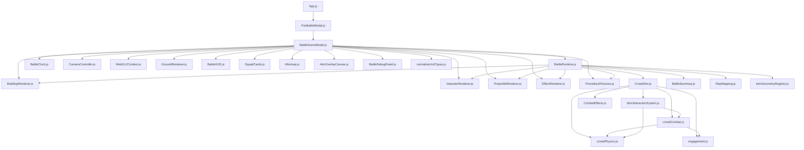
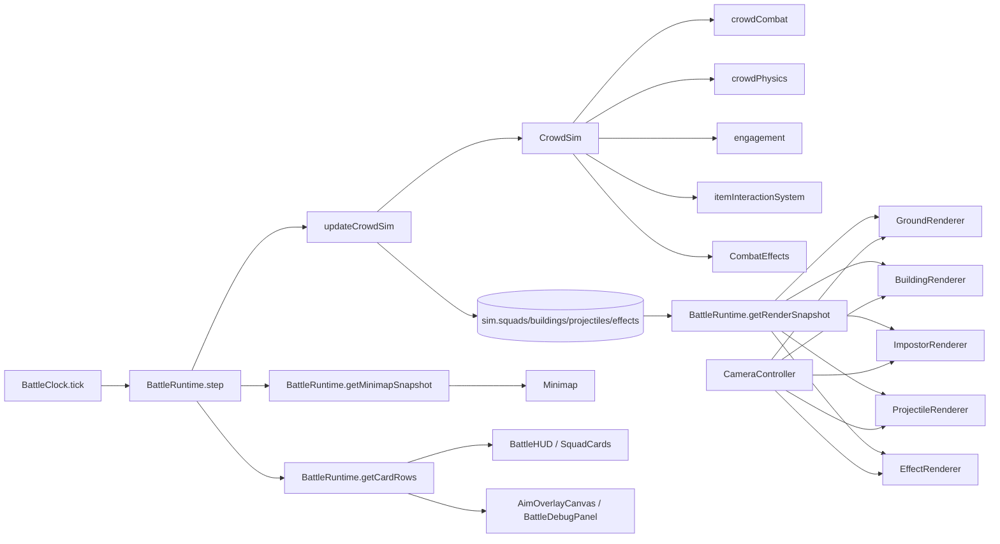

# 0. Executive Summary（结论）

- 当前“战场模块”并不是一个清晰的模块边界，而是由 `frontend/src/components/game/BattleSceneModal.js:420`、`frontend/src/game/battle/presentation/runtime/BattleRuntime.js:1031`、`frontend/src/game/battle/simulation/crowd/CrowdSim.js:1441` 和 `frontend/src/components/game/BattlefieldPreviewModal.js:2171` 四个大块相互穿透组成。
- 最大耦合点在 `BattleSceneModal -> BattleRuntime -> render stride / snapshot packing -> renderers` 这一条链：UI 组件直接持有 runtime、相机、渲染器、RAF 主循环和结果上报，runtime 又直接依赖 renderer stride 与贴图层规则。
- 第二个高风险点是“布防编辑器”和“实战运行时”对同一战场概念使用了不同实现：预览端有自己的投影、旋转、碰撞、部队 footprint、缓存和保存逻辑；实战端有另一套部署/阵型/碰撞/小地图逻辑。
- 坐标与朝向约定没有被封装成稳定协议：同一条链路中同时存在 `rotation`(度)、`facingRad`(弧度)、`yawDeg`(度)、`agent.yaw`(弧度)、`worldYawDeg`(度)；小地图还要额外对画布 Y 轴做反向旋转。
- 最严重的真实数据风险是“守军朝向丢失”：预览保存 `defenderDeployments.rotation`，但后端归一化与序列化没有稳定保留，runtime 构建 defender deploy group 时也没有消费它，导致 preview/editor 与 battle 结果不一致。
- 第三个维护风险是文件体量失控：`backend/routes/nodes.js:7411`/`:7522`/`:7887`/`:7983` 在一个 10k+ 行文件中同时承载 layout、battle-init、battle-result；前端 `BattlefieldPreviewModal.js` 近 6k 行，`BattleSceneModal.js` 近 4k 行。
- 第四个风险是状态散落：`BattleSceneModal.js:435-566`、`BattlefieldPreviewModal.js:2182-2236` 都包含大量 `useRef/useState`；同一状态既存在 React state，又存在 runtime 内部状态、localStorage cache、后端 layout state。
- 第五个风险是硬编码扩展成本高：兵种四分类、技能范围/AOE、堆叠上限、布局上限、默认墙体尺寸、缩放与镜头常量分散在 UI、runtime、sim、后端 schema/normalize 中。
- 现状最优先该拆的边界不是“先拆渲染器”，而是先把 `BattleRuntime` 从“UI+状态+渲染快照打包+sim 启动器”降为稳定 façade，再把输入与渲染管线从 `BattleSceneModal` 拆开。
- 第二优先级是统一 battle/preview/minimap 的数学协议：世界坐标、部署区、rotation/yaw、deg/rad、屏幕投影、碰撞 footprint；这是后续分阶段重构能否稳定推进的前提。
- 第三优先级是把 layout/catalog/battle-init 变成明确的数据接口层，避免前端组件自行拼 payload、后端 route 内部同时做兼容转换和业务逻辑。
- 如果只做局部整理而不先冻结接口，很容易把 3 套逻辑复制成第 4 套；因此建议先“收口接口、保留旧实现”，再逐步替换内部实现。

## 建议重构优先级 Top 5

1. **先抽 `BattleRuntime` 门面接口**
   - 收益：把 UI、sim、render 的交互统一到 `init/step/getSnapshot/dispatchCommand/dispose`，后续每层都能替换。
   - 风险：现有 `BattleSceneModal` 直接调用 runtime 大量方法，收口时需要先做适配层。
2. **统一 rotation / yaw / deg-rad / 坐标协议**
   - 收益：直接降低 preview 与 battle 不一致、建筑朝向错乱、小地图反转等 bug 风险。
   - 风险：涉及存量 layout 数据兼容，必须先定义迁移与 fallback。
3. **拆出 `InputController` 与命令总线**
   - 收益：把 `BattleSceneModal` 中散落的鼠标/滚轮/小地图/技能确认逻辑收敛成 Command，明显提升可测试性。
   - 风险：交互回归面大，需以 deploy/battle 两阶段逐步切换。
4. **把 preview/minimap/battle 共用几何与投影数学统一到共享层**
   - 收益：避免 `BattlefieldPreviewModal`、`battleMath.js`、`CameraController`、`Minimap` 四套坐标实现继续分叉。
   - 风险：短期内要保留旧 API，以免影响编辑器手感。
5. **收敛数据层：layout/catalog/battle-init/battle-result 单独服务化**
   - 收益：前端不再手写 payload，后端也能把兼容/normalize 从 route 大文件中迁出。
   - 风险：涉及前后端契约，需先以 adapter 形式并存。

# 1. 分层架构地图（Layered Architecture Map）

## UI层

- 职责边界
  - 做什么：弹窗开关、HUD、卡牌、按钮、结果面板、部署编辑表单、调试面板。
  - 不做什么：不直接驱动 sim 内部对象，不直接持有 WebGL/Three 渲染生命周期，不直接拼后端 payload。
- 关键入口文件
  - `frontend/src/App.js:3194`
  - `frontend/src/components/game/PveBattleModal.js:4`
  - `frontend/src/components/game/BattleSceneModal.js:420`
- 关键模块
  - `frontend/src/components/game/PveBattleModal.js`：`PveBattleModal`
  - `frontend/src/components/game/BattleSceneModal.js`：`BattleSceneModal`
  - `frontend/src/game/battle/presentation/ui/BattleHUD.js`：`BattleHUD`
  - `frontend/src/game/battle/presentation/ui/SquadCards.js`：`SquadCards`
  - `frontend/src/game/battle/presentation/ui/BattleActionButtons.js`：`BattleActionButtons`
  - `frontend/src/game/battle/presentation/ui/DeployActionButtons.js`：`DeployActionButtons`
- 依赖方向
  - UI 只应依赖 `BattleRuntime` façade、`InputController`、只读 snapshot、`CatalogService`。
  - 当前实际情况：`BattleSceneModal` 直接依赖 runtime、clock、camera、renderers、API、模板加载、结果上报。

## 输入层

- 职责边界
  - 做什么：把 DOM 事件、小地图点击、技能确认、路径规划、部署拖拽翻译为统一 `Command`。
  - 不做什么：不直接改 React state，不直接调用 sim/renderer 细节。
- 关键入口文件
  - `frontend/src/components/game/BattleSceneModal.js:1232`
  - `frontend/src/components/game/BattleSceneModal.js:1611`
  - `frontend/src/components/game/BattlefieldPreviewModal.js:3330`
- 关键模块
  - `frontend/src/components/game/BattleSceneModal.js`：`resolveEventWorldPoint`、`handleSceneMouseDown`、`handleSceneWheel`、`handlePointerMove`、`handleMinimapClick`、`executeBattleAction`
  - `frontend/src/components/game/BattlefieldPreviewModal.js`：`getWorldFromScreenPoint`（通过 `unprojectScreen`）、`handleWheel`、`handleCanvasDrop`、`moveDefenderDeployment`
  - `frontend/src/game/battle/presentation/ui/Minimap.js`：`handleClick`
- 依赖方向
  - 输入层只能依赖坐标转换器、`BattleRuntime.dispatchCommand`、只读查询接口。
  - 当前实际情况：输入实现散落在两个 React 大组件中，且直接调用 runtime 多个命令方法。

## 状态层

- 职责边界
  - 做什么：维护 battle phase、deploy groups、selected/focus、battle status、snapshot cache。
  - 不做什么：不关心具体 WebGL buffer 布局，不直接处理 DOM 事件。
- 关键入口文件
  - `frontend/src/game/battle/presentation/runtime/BattleRuntime.js:1031`
  - `backend/services/domainTitleStateStore.js:416`
- 关键模块
  - `frontend/src/game/battle/presentation/runtime/BattleRuntime.js`：`startBattle`、`getRenderSnapshot`、`getMinimapSnapshot`、`getCardRows`
  - `backend/services/domainTitleStateStore.js`：`normalizeBattlefieldState`、`normalizeBattlefieldDefenderDeployments`、`resolveNodeBattlefieldLayout`、`upsertNodeBattlefieldLayout`
  - `backend/models/DomainDefenseLayout.js`：战场布局 schema
- 依赖方向
  - 状态层可以依赖 sim 查询、catalog 数据、共享数学；不能依赖具体 renderer stride。
  - 当前实际情况：`BattleRuntime` 直接依赖 renderer stride、贴图层规则，并直接打包渲染快照。

## 仿真层

- 职责边界
  - 做什么：部队推进、碰撞、战斗、近战 engagement、投射物与特效状态推进。
  - 不做什么：不负责 React state、不负责 UI 卡牌/小地图组装。
- 关键入口文件
  - `frontend/src/game/battle/presentation/runtime/BattleClock.js:1`
  - `frontend/src/game/battle/simulation/crowd/CrowdSim.js:1441`
- 关键模块
  - `frontend/src/game/battle/presentation/runtime/BattleClock.js`：`tick`
  - `frontend/src/game/battle/simulation/crowd/CrowdSim.js`：`createCrowdSim`、`triggerCrowdSkill`、`updateCrowdSim`
  - `frontend/src/game/battle/simulation/crowd/crowdCombat.js`：`updateCrowdCombat`
  - `frontend/src/game/battle/simulation/crowd/crowdPhysics.js`：碰撞/射线/空间哈希
  - `frontend/src/game/battle/simulation/crowd/engagement.js`：`syncMeleeEngagement`
  - `frontend/src/game/battle/simulation/items/itemInteractionSystem.js`：`step`
  - `frontend/src/game/battle/simulation/effects/CombatEffects.js`：特效池
- 依赖方向
  - 仿真层只能依赖纯数据、共享几何、catalog 查询；不能依赖 UI 组件和 renderer。
  - 当前实际情况：仿真层基本独立，但大量 classTag/skill 常量与 runtime/UI 重复定义。

## 渲染层

- 职责边界
  - 做什么：消费 snapshot buffer，做 camera matrix 与 WebGL draw call。
  - 不做什么：不做游戏规则、不做网络请求、不做选择逻辑。
- 关键入口文件
  - `frontend/src/game/battle/presentation/render/CameraController.js:232`
  - `frontend/src/game/battle/presentation/render/WebGL2Context.js:30`
- 关键模块
  - `frontend/src/game/battle/presentation/render/CameraController.js`：`buildMatrices`、`worldToScreen`、`screenToGround`
  - `frontend/src/game/battle/presentation/render/GroundRenderer.js`：`setFieldSize`、`setDeployRange`、`render`
  - `frontend/src/game/battle/presentation/render/BuildingRenderer.js`：`updateFromSnapshot`、`render`
  - `frontend/src/game/battle/presentation/render/ImpostorRenderer.js`：`updateFromSnapshot`、`render`
  - `frontend/src/game/battle/presentation/render/ProjectileRenderer.js`：`updateFromSnapshot`、`render`
  - `frontend/src/game/battle/presentation/render/EffectRenderer.js`：`updateFromSnapshot`、`render`
- 依赖方向
  - 渲染层只能依赖 `RenderSnapshot`、camera state、textures/material config。
  - 当前实际情况：`BattleRuntime` 反向依赖 renderer stride，破坏了单向依赖。

## Overlay与小地图

- 职责边界
  - 做什么：战术提示、AOE/guard overlay、debug overlay、小地图只读绘制与点击回传。
  - 不做什么：不直接操作 sim，不自行定义新的世界坐标协议。
- 关键入口文件
  - `frontend/src/game/battle/presentation/ui/Minimap.js:6`
  - `frontend/src/game/battle/presentation/ui/AimOverlayCanvas.js:240`
  - `frontend/src/game/battle/presentation/ui/BattleDebugPanel.js:1`
- 关键模块
  - `frontend/src/game/battle/presentation/ui/Minimap.js`：`Minimap`
  - `frontend/src/game/battle/presentation/ui/AimOverlayCanvas.js`：`AimOverlayCanvas`
  - `frontend/src/game/battle/presentation/ui/BattleDebugPanel.js`：`BattleDebugPanel`
  - `frontend/src/game/formation/ArmyFormationRenderer.js`：preview 阵型 overlay/footprint
- 依赖方向
  - Overlay 只能依赖 snapshot、camera/projector、输入回调。
  - 当前实际情况：`Minimap` 和 preview editor 各自实现坐标转换；`BattleSceneModal` 负责把 minimap 点击直接解释为 runtime 操作。

## 数据层（battle-init、layout、catalog）

- 职责边界
  - 做什么：拉取/保存布局，提供 battle-init、battle-result、catalog/unitType DTO。
  - 不做什么：不在 route 中混入过多 UI 兼容逻辑，不把兼容层散落到前端组件。
- 关键入口文件
  - `frontend/src/App.js:3194`
  - `frontend/src/components/game/BattlefieldPreviewModal.js:3330`
  - `backend/routes/nodes.js:7411`
- 关键模块
  - `frontend/src/App.js`：`handleOpenSiegePveBattle`
  - `frontend/src/components/game/BattlefieldPreviewModal.js`：`buildLayoutPayload`、`persistBattlefieldLayout`
  - `backend/routes/nodes.js`：`/:nodeId/battlefield-layout`、`/:nodeId/siege/pve/battle-init`、`/:nodeId/siege/pve/battle-result`
  - `backend/services/placeableCatalogService.js`：`fetchBattlefieldItems`
  - `backend/services/unitTypeDtoService.js`：`toUnitTypeDtoV1`
  - `backend/services/domainTitleStateStore.js`：battlefield layout normalize/upsert/resolve
- 依赖方向
  - 数据层向上只暴露稳定 DTO；UI/runtime 不能自行拼接字段兼容逻辑。
  - 当前实际情况：前端 preview 组件手写 payload；后端 route 内部同时做 normalize、兼容、授权、DTO 拼装。

## 资源层（textures、preview meshes）

- 职责边界
  - 做什么：单位贴图层、建筑几何/碰撞、preview mesh、颜色/材质提示。
  - 不做什么：不负责战斗规则与状态推进。
- 关键入口文件
  - `frontend/src/game/battle/presentation/assets/ProceduralTextures.js:139`
  - `frontend/src/game/battlefield/items/itemGeometryRegistry.js:219`
- 关键模块
  - `frontend/src/game/battle/presentation/assets/ProceduralTextures.js`：`createBattleProceduralTextures`、`resolveTopLayer`
  - `frontend/src/game/battle/presentation/assets/UnitVisualConfig.example.json`：单位视觉层配置
  - `frontend/src/game/battlefield/items/itemGeometryRegistry.js`：`getItemGeometry`、`buildWorldColliderParts`、`createPreviewMesh`
  - `frontend/src/components/game/item/ArmyBattlefieldItemPreviewCanvases.js`：preview canvas 包装
- 依赖方向
  - 资源层可被 render/preview/data normalize 读取，但不应反向依赖 runtime/sim。
  - 当前实际情况：`BattleRuntime` 直接读取 `resolveTopLayer` 与 geometry registry，部分资源规则渗入状态层。

# 2. 入口与数据流（Entrypoints & Dataflow）

## 从打开 BattleSceneModal 到结束战斗的完整流程

1. `frontend/src/App.js:3168` 的 `handleOpenSiegePveBattle` 读取 `nodeId/gateKey/token`。
2. `App.js:3194` 发起 `GET /api/nodes/:nodeId/siege/pve/battle-init?gateKey=...`。
3. battle-init 响应写入 `pveBattleState.data`，由 `frontend/src/components/game/PveBattleModal.js:4` 透传给 `BattleSceneModal`。
4. `BattleSceneModal.js:601` 的 `setupRuntime` 调 `normalizeUnitTypes`，然后 `new BattleRuntime(normalizedInitData, ...)`。
5. 同一个组件在 `BattleSceneModal.js:799` 初始化 `WebGL2Context`、`GroundRenderer`、`BuildingRenderer`、`ImpostorRenderer`、`ProjectileRenderer`、`EffectRenderer`、`ProceduralTextures`。
6. deploy 阶段，UI 通过 `BattleSceneModal.js:1485`、`:1763`、`:2251` 等 handler 直接调用 runtime 的部署接口（移动/创建/编辑/删除/放置）。
7. 点击开始后，`BattleSceneModal.js:1140` 调 `runtime.startBattle()`，内部在 `BattleRuntime.js:1543` 生成 squads、复制 buildings、创建 `CrowdSim`。
8. RAF 主循环在 `BattleSceneModal.js:896` 启动；每帧用 `BattleClock.tick` 推进 `runtime.step`，后者再调用 `updateCrowdSim`。
9. 同一帧内调用 `BattleRuntime.getRenderSnapshot()`，把 sim/deploy state 打包成四类 instance buffer：`units/buildings/projectiles/effects`。
10. `BattleSceneModal.js:998-1001` 把 snapshot 喂给各 renderer，随后 `:1005-1009` 逐个 draw。
11. 每约 120ms，`BattleSceneModal.js:1015-1023` 拉取 `getBattleStatus/getCardRows/getMinimapSnapshot` 回写 React UI。
12. 当 `runtime.isEnded()` 为真时，`BattleSceneModal.js:1106-1110` 取 `runtime.getSummary()`，打开结果框并调用 `reportBattleResult`。
13. `BattleSceneModal.js:875` 发起 `POST /api/nodes/:nodeId/siege/pve/battle-result`；成功后触发 `onBattleFinished` 关闭或回收战斗上下文。

## 关键 API 请求与 payload

| API | 方向 | 关键请求参数 / payload | 关键响应字段 | 当前消费方 |
| --- | --- | --- | --- | --- |
| `GET /api/nodes/:nodeId/siege/pve/battle-init` | battle init | query: `gateKey` | `battleId,nodeId,gateKey,timeLimitSec,unitTypes,attacker,defender,battlefield{layouts,itemCatalog,objects,defenderDeployments}` | `frontend/src/App.js:3194` |
| `POST /api/nodes/:nodeId/siege/pve/battle-result` | battle result | `battleId,gateKey,durationSec,attacker,defender,details,startedAt,endedAt,endReason` | `success,battleId,recorded,duplicate?` | `frontend/src/components/game/BattleSceneModal.js:865` |
| `GET /api/nodes/:nodeId/battlefield-layout` | layout load | query: `gateKey,layoutId?` | `layoutBundle,defenderRoster,canEdit,canView` | `frontend/src/components/game/BattlefieldPreviewModal.js:3662` |
| `PUT /api/nodes/:nodeId/battlefield-layout` | layout save | `gateKey,layout{layoutId,name,fieldWidth,fieldHeight,maxItemsPerType},itemCatalog,objects,defenderDeployments` | `layoutBundle` | `frontend/src/components/game/BattlefieldPreviewModal.js:3360` |
| `GET /api/army/templates` | deploy helper data | bearer token | `templates[]` | `frontend/src/components/game/BattleSceneModal.js:768` |
| `GET /api/army/unit-types` / `GET /api/army/me` | preview/editor setup | bearer token | unitTypes / roster | `frontend/src/components/game/KnowledgeDomainScene.js:1452-1455` |

### layout save payload 关键结构

- 入口：`frontend/src/components/game/BattlefieldPreviewModal.js:527`
- 关键字段：
  - `layout.layoutId/name/fieldWidth/fieldHeight/maxItemsPerType`
  - `itemCatalog[].{itemId,width,depth,height,hp,defense,collider,renderProfile,interactions,sockets,maxStack}`
  - `objects[].{objectId,itemId,x,y,z,rotation,attach,groupId}`
  - `defenderDeployments[].{deployId,name,sortOrder,units,placed,unitTypeId,count,x,y,rotation}`

## rotation / yaw / deg-rad / 坐标系约定

- 世界坐标：当前 battle runtime / camera / minimap 默认都是 **X 左负右正、Y 下负上正、Z 向上**。
  - 证据：`CameraController.screenToGround` 返回 `x/y` 地面点（`frontend/src/game/battle/presentation/render/CameraController.js:441`）。
  - 证据：`Minimap` 的 `toMap` 用 `x + fw/2`，`y = fh/2 - worldY`（`frontend/src/game/battle/presentation/ui/Minimap.js:25`）。
- 建筑/布置对象 `rotation`：持久化与 preview 基本按“度数、0~360”处理。
  - 证据：`BattlefieldPreviewModal.normalizeDeg`、`normalizeDefenderFacingDeg`、`buildLayoutPayload.rotation`（`frontend/src/components/game/BattlefieldPreviewModal.js:129`, `:388`, `:586`）。
- 建筑渲染器 `yaw`：shader 侧明确要求“**弧度 + 逆时针 + 从 +X 轴起算**”。
  - 证据：`frontend/src/game/battle/presentation/render/BuildingRenderer.js:158`。
- camera 侧有两套 yaw：
  - `yawDeg`：镜头方位角；`worldYawDeg`：对世界做附加旋转；都以度保存，在 `buildMatrices` 内转弧度（`CameraController.js:337-344`）。
  - `mirrorX` 又能把 `yawDeg` 做镜像翻转（`CameraController.js:341`）。
- agent 侧朝向：`CrowdSim` 用 `Math.atan2` 维护 `agent.yaw`，即弧度（例如 `frontend/src/game/battle/simulation/crowd/CrowdSim.js:1108-1110`、`:1740+` 段）。
- 小地图旋转：由于 canvas Y 轴向下，额外执行 `ctx.rotate(-degToRad(part.yawDeg))`（`frontend/src/game/battle/presentation/ui/Minimap.js:75`）。

### 已确认的不一致点

1. **preview 守军默认朝向是 90°**：`DEFENDER_DEFAULT_FACING_DEG = 90`（`BattlefieldPreviewModal.js:56`）。
2. **runtime 阵型默认朝向是 defender = π（180°）**：`normalizeFormationFacing`（`BattleRuntime.js:573`）。
3. **battle scene 相机 deploy/battle 默认 yaw 都是 0°**：`BattleSceneModal.js:35-44`。
4. **preview 存的是 deployment.rotation（度）**，但 runtime deploy group 目前不消费这个 rotation，后端序列化也未稳定保留。
5. **preview / battleMath / camera / minimap** 至少存在四套投影/反投影或旋转实现，公式相似但边界条件和坐标翻转不同。

## 三条核心流

### A) API -> runtime snapshot -> renderer

`App.handleOpenSiegePveBattle`
-> `GET battle-init`
-> `BattleSceneModal.setupRuntime`
-> `new BattleRuntime(initData)`
-> `BattleRuntime.getRenderSnapshot()`
-> `Ground/Building/Impostor/Projectile/EffectRenderer.updateFromSnapshot()`
-> `render()`

### B) UI选择/输入 -> command -> sim -> snapshot

`BattleSceneModal event handlers / Minimap click`
-> `runtime.commandMove / commandSetWaypoints / commandSkill / commandGuard / moveDeployGroup`
-> `BattleRuntime.step()`
-> `updateCrowdSim()`
-> `crowdCombat / engagement / itemInteractionSystem`
-> `BattleRuntime.getRenderSnapshot()` / `getCardRows()` / `getMinimapSnapshot()`

### C) minimap -> selection/camera -> scene

`Minimap.handleClick`
-> `BattleSceneModal.handleMinimapClick`
-> deploy 阶段：`moveDeployGroup + setDeployGroupPlaced`
-> battle 阶段：`camera.centerX / centerY`
-> `CameraController.buildMatrices`
-> scene redraw

# 3. 战场相关文件清单（Inventory Table）

> 范围：以 `BattleSceneModal` 依赖闭包为核心，补充 upstream battle-init、preview/layout/catalog 与后端 battlefield state。

| file_path | layer | responsibilities | key_exports | key_deps | risk_notes |
| --- | --- | --- | --- | --- | --- |
| `frontend/src/App.js` | other | 负责打开 PVE 战斗并拉取 `battle-init` | `App`, `handleOpenSiegePveBattle` | `PveBattleModal`, `runtimeConfig`, `parseApiResponse` | 6k+ 行；battle 入口埋在全局 App 中 |
| `frontend/src/components/game/PveBattleModal.js` | ui | 对 `BattleSceneModal` 的 PVE 包装 | `PveBattleModal` | `BattleSceneModal` | 仅透传，说明入口层很薄 |
| `frontend/src/components/game/BattleSceneModal.js` | other | 战斗主场景：UI、输入、RAF、runtime、renderer、结果上报 | `BattleSceneModal` | `BattleRuntime`, `BattleClock`, `CameraController`, renderers, `Minimap`, `AimOverlayCanvas` | 3.8k+ 行；多职责；状态与输入高度集中 |
| `frontend/src/components/game/BattlefieldPreviewModal.js` | other | 布防编辑器：Three 场景、碰撞/吸附、缓存、保存、守军部署编辑 | `BattlefieldPreviewModal`, `buildLayoutPayload`, `persistBattlefieldLayout` | `three`, `ArmyFormationRenderer`, `itemGeometryRegistry`, `runtimeConfig` | 5.9k+ 行；编辑/渲染/数据写入混在一起 |
| `frontend/src/components/game/KnowledgeDomainScene.js` | other | 领域场景入口，负责打开 battlefield preview | `KnowledgeDomainScene`, `openBattlefieldPreview` | `BattlefieldPreviewModal`, 多个业务 API | 5.1k+ 行；入口与其他领域 UI 强耦合 |
| `frontend/src/components/game/battleMath.js` | input | 提供投影/旋转/碰撞数学工具（当前未被 battle 主链复用） | `normalizeDeg`, `degToRad`, `projectWorld`, `unprojectScreen`, `getRectCorners` | 无 | 实际无引用；和 preview 本地实现重复 |
| `frontend/src/components/game/item/ArmyBattlefieldItemPreviewCanvases.js` | assets | 用 Three/canvas 生成战场物体近景预览 | `ArmyBattlefieldItemCloseupPreview`, `ArmyBattlefieldItemBattlePreview` | `itemGeometryRegistry`, `three` | preview 资源逻辑分散 |
| `frontend/src/game/formation/ArmyFormationRenderer.js` | assets | preview 侧共享阵型可视化与 footprint 估算 | `createFormationVisualState`, `reconcileCounts`, `getFormationFootprint`, `renderFormation` | 无 | 与 live battle 的 formation 逻辑平行存在 |
| `frontend/src/game/battle/presentation/runtime/BattleRuntime.js` | state | 持有部署/战斗状态，启动 sim，并打包 render/minimap/card snapshot | `BattleRuntime` 类 | `CrowdSim`, `BattleSummary`, `RepMapping`, render stride constants, `itemGeometryRegistry` | 2.5k+ 行；状态层反向依赖渲染层 |
| `frontend/src/game/battle/presentation/runtime/BattleClock.js` | sim | 固定步长时钟 | `BattleClock` | 无 | 边界清晰，适合作为稳定接口保留 |
| `frontend/src/game/battle/presentation/runtime/BattleSummary.js` | state | 汇总 battle result 统计 | `buildBattleSummary` | 无 | 体量小，可独立保留 |
| `frontend/src/game/battle/presentation/runtime/RepMapping.js` | state | 人数到代表 agent 的映射/缩放 | `estimateRepAgents`, `buildRepConfig`, `withRepConfig` | 无 | 与 runtime 紧耦合但边界还算清晰 |
| `frontend/src/game/battle/simulation/crowd/CrowdSim.js` | sim | 群体仿真主循环、技能触发、agent 推进 | `createCrowdSim`, `triggerCrowdSkill`, `updateCrowdSim` | `crowdPhysics`, `crowdCombat`, `engagement`, `CombatEffects`, `itemInteractionSystem` | 2k 行；硬编码常量密集 |
| `frontend/src/game/battle/simulation/crowd/crowdCombat.js` | sim | 伤害、投射物、仇恨/目标选择 | `updateCrowdCombat`, `applyDamageToAgent`, `pickEnemySquadTarget` | `crowdPhysics`, `CombatEffects`, `engagement` | 800+ 行；规则常量多 |
| `frontend/src/game/battle/simulation/crowd/crowdPhysics.js` | sim | 射线、碰撞、空间哈希、矩形/障碍物数学 | `raycastObstacles`, `pushOutOfRect`, `buildSpatialHash` | 无 | battle/preview 都有相似几何逻辑但未共享 |
| `frontend/src/game/battle/simulation/crowd/engagement.js` | sim | 近战咬合/插槽/车道选择 | `syncMeleeEngagement` | `crowdPhysics` | 规则参数多，缺少公共查询接口 |
| `frontend/src/game/battle/simulation/items/itemInteractionSystem.js` | sim | 场景物体与 squad 接触/伤害/显隐逻辑 | `itemInteractionSystem.step` | `crowdPhysics`, `crowdCombat` | item 规则与 sim 规则缠在一起 |
| `frontend/src/game/battle/simulation/effects/CombatEffects.js` | sim | projectile/hit effect 池 | `createCombatEffectsPool`, `acquireProjectile`, `stepEffectPool` | 无 | 清晰但被 runtime/sim 直接共享结构 |
| `frontend/src/game/battle/presentation/render/CameraController.js` | render | 相机矩阵、世界/屏幕投影、地面拾取 | `CameraController` 类 | 无 | 和 preview 投影数学重复但更完善 |
| `frontend/src/game/battle/presentation/render/WebGL2Context.js` | render | shader/program/buffer 基础设施 | `createBattleGlContext`, `createProgram`, `updateDynamicBuffer` | 无 | `bufferData` 更新策略可能有额外重分配 |
| `frontend/src/game/battle/presentation/render/GroundRenderer.js` | render | 绘制战场地面和部署区 | `GroundRenderer` 类 | `WebGL2Context` | shader 常量内联，缺少 pipeline 抽象 |
| `frontend/src/game/battle/presentation/render/BuildingRenderer.js` | render | 建筑 instanced 渲染 | `BuildingRenderer`, `BUILDING_INSTANCE_STRIDE` | `WebGL2Context` | stride 暴露给 runtime；含 dev orientation check |
| `frontend/src/game/battle/presentation/render/ImpostorRenderer.js` | render | 单位 impostor instanced 渲染 | `ImpostorRenderer`, `UNIT_INSTANCE_STRIDE` | `WebGL2Context` | runtime 直接依赖其 stride；shader 语义敏感 |
| `frontend/src/game/battle/presentation/render/ProjectileRenderer.js` | render | 投射物渲染 | `ProjectileRenderer`, `PROJECTILE_INSTANCE_STRIDE` | `WebGL2Context` | 与 runtime snapshot 强绑定 |
| `frontend/src/game/battle/presentation/render/EffectRenderer.js` | render | 命中特效/烟尘/爆炸渲染 | `EffectRenderer`, `EFFECT_INSTANCE_STRIDE` | `WebGL2Context` | 与 runtime snapshot 强绑定 |
| `frontend/src/game/battle/presentation/ui/BattleHUD.js` | ui | 顶部 HUD 状态展示 | `BattleHUD` | React | 简单显示层 |
| `frontend/src/game/battle/presentation/ui/SquadCards.js` | ui | 部队卡牌列表与动作入口 | `SquadCards` | `DeployActionButtons`, `BattleActionButtons` | 既是显示又承载动作入口 |
| `frontend/src/game/battle/presentation/ui/DeployActionButtons.js` | ui | 部署态动作按钮 | `DeployActionButtons` | React | 逻辑轻，但按钮含状态语义 |
| `frontend/src/game/battle/presentation/ui/BattleActionButtons.js` | ui | 战斗态动作按钮与 action id | `BattleActionButtons`, `BATTLE_ACTION_IDS` | React | action id 与 runtime 命令耦合 |
| `frontend/src/game/battle/presentation/ui/Minimap.js` | ui | 小地图绘制与点击回传 | `Minimap` | React | 自带一套坐标/旋转规则 |
| `frontend/src/game/battle/presentation/ui/AimOverlayCanvas.js` | ui | guard/技能/路径等 overlay | `AimOverlayCanvas` | React | 依赖上层传入 worldToScreen 与技能半径 |
| `frontend/src/game/battle/presentation/ui/BattleDebugPanel.js` | ui | 调试面板 | `BattleDebugPanel` | React | 显示层，但暴露内部 stats 结构 |
| `frontend/src/game/battle/presentation/assets/ProceduralTextures.js` | assets | 生成单位/投射物/特效 texture array | `createBattleProceduralTextures`, `resolveTopLayer` | WebGL | 资源规则被 runtime 直接读取 |
| `frontend/src/game/battle/presentation/assets/UnitVisualConfig.example.json` | assets | 单位视觉层配置样例 | JSON config | 被 `BattleSceneModal` 直接加载 | 配置未与 DTO/version 强绑定 |
| `frontend/src/game/battlefield/items/itemGeometryRegistry.js` | assets | 统一 item 几何、collider、socket、preview mesh、颜色 | `getItemGeometry`, `buildWorldColliderParts`, `buildWorldPolygon`, `createPreviewMesh` | `three` | battle/preview 共用关键资源层，值得沉淀成正式接口 |
| `frontend/src/game/unit/normalizeUnitTypes.js` | data | 归一化 unitType DTO | `normalizeUnitType`, `normalizeUnitTypes` | `types.js` | 前后端 DTO 逻辑有重复 |
| `frontend/src/game/unit/types.js` | data | DTO 基础类型归一化 | `normalizeRpsType`, `normalizeRoleTag` | 无 | 小而稳定 |
| `backend/routes/nodes.js` | data | 布局读取/保存、battle-init、battle-result 等战场路由 | `/:nodeId/battlefield-layout`, `/:nodeId/siege/pve/battle-init`, `/:nodeId/siege/pve/battle-result` | `DomainDefenseLayout`, `placeableCatalogService`, `domainTitleStateStore` | 10k+ 行 route 大文件；battle 逻辑嵌在通用 nodes 路由中 |
| `backend/services/domainTitleStateStore.js` | data | battlefield state normalize/resolve/upsert、旧新字段兼容 | `normalizeBattlefieldLayout`, `resolveNodeBattlefieldLayout`, `upsertNodeBattlefieldLayout` | `DomainDefenseLayout`, `battlefieldScale` | 兼容逻辑复杂；新旧 schema 并存 |
| `backend/services/placeableCatalogService.js` | data | battlefield item / city building catalog 序列化与读取 | `fetchBattlefieldItems`, `serializeBattlefieldItem` | `BattlefieldItem`, `battlefieldScale` | 边界清晰，可保留 |
| `backend/services/unitTypeDtoService.js` | data | 统一 unit type DTO 输出 | `toUnitTypeDtoV1`, `normalizeClassTag`, `inferClassTag` | 无 | 与前端 normalize 有概念重叠 |
| `backend/services/battlefieldScale.js` | data | 战场物体尺寸/缩放常量 | `normalizeBattlefieldItemGeometryScale`, 常量导出 | 无 | 前端仍有平行常量 |
| `backend/models/BattlefieldItem.js` | data | 战场物体目录 schema | Mongoose model | `mongoose` | schema 稳定，但与 preview 常量并未完全统一 |
| `backend/models/DomainDefenseLayout.js` | data | 旧/新 battlefield layout 持久化 schema | Mongoose model, `createDefaultBattlefieldLayouts` | `mongoose`, `battlefieldScale` | 同时维护 `battlefieldLayout` 与 `battlefieldLayouts/Objects/...`，易分叉 |

## Top10 最大文件（按行数）

| rank | file | lines |
| --- | --- | ---: |
| 1 | `backend/routes/nodes.js` | 10352 |
| 2 | `frontend/src/App.js` | 6729 |
| 3 | `frontend/src/components/game/BattlefieldPreviewModal.js` | 5983 |
| 4 | `frontend/src/components/game/KnowledgeDomainScene.js` | 5165 |
| 5 | `frontend/src/components/game/BattleSceneModal.js` | 3838 |
| 6 | `frontend/src/game/battle/presentation/runtime/BattleRuntime.js` | 2539 |
| 7 | `frontend/src/game/battle/simulation/crowd/CrowdSim.js` | 1989 |
| 8 | `backend/services/domainTitleStateStore.js` | 1165 |
| 9 | `frontend/src/game/formation/ArmyFormationRenderer.js` | 1066 |
| 10 | `frontend/src/game/battle/simulation/crowd/crowdCombat.js` | 838 |

# 4. 依赖图（Dependency Graph）

## 图1：从 BattleSceneModal 出发的模块依赖图（深度2~4）



## 图2：仿真与渲染的依赖关系（CrowdSim/Combat/Physics/Clock 与 renderers/overlay/minimap）



# 5. 维护性问题清单（Smells & Evidence）

1. **`BattleSceneModal` 是典型 God Component**
   - 影响：可测试性差；改一个交互容易牵动渲染、sim、网络和状态。
   - 证据：`frontend/src/components/game/BattleSceneModal.js:420` 组件定义；`436-566` 大量 `useRef/useState`；`601` 初始化 runtime；`799` 初始化 renderers；`865` 结果上报；`896` RAF 主循环。

2. **`BattlefieldPreviewModal` 同时承担编辑器、渲染器、缓存层、数据写层**
   - 影响：布防编辑功能难以分阶段替换；任何保存逻辑修改都可能影响渲染和吸附。
   - 证据：`frontend/src/components/game/BattlefieldPreviewModal.js:2171` 组件定义；`2182-2236` 大量局部状态；`3330` `persistBattlefieldLayout`；`3940+` Three 场景搭建。

3. **`BattleRuntime` 同时是状态机、sim 启动器、UI 适配层、渲染快照打包器**
   - 影响：边界模糊，后续无论拆 sim 还是拆 render pipeline 都必须先碰 runtime。
   - 证据：`frontend/src/game/battle/presentation/runtime/BattleRuntime.js:1543` `startBattle`；`:1833` `commandMove`；`:2176` `getCardRows`；`:2256` `getRenderSnapshot`；`:2468` `getMinimapSnapshot`。

4. **状态层反向依赖渲染层**
   - 影响：render buffer 布局一变，runtime 必须同步改；难以替换 renderer 实现。
   - 证据：`BattleRuntime.js:22-26` 直接导入 `UNIT_INSTANCE_STRIDE/BUILDING_INSTANCE_STRIDE/PROJECTILE_INSTANCE_STRIDE/EFFECT_INSTANCE_STRIDE/resolveTopLayer`。

5. **UI 直接调用 runtime 内部命令方法，没有统一 Command 总线**
   - 影响：输入逻辑分散，不利于回放、录制、AI/网络输入复用。
   - 证据：`BattleSceneModal.js:1408` `runtime.commandSetWaypoints`；`:1455` `runtime.commandGuard`；`:1473` `runtime.commandBehavior`；`:1676` `runtime.commandMove`；`:1692-1706` `runtime.commandSkill`；`:1786-1789` 直接 `moveDeployGroup/setDeployGroupPlaced`。

6. **preview 保存了 defender rotation，但后端 normalize 不保留 rotation**
   - 影响：编辑器看到的守军朝向不能稳定进入 battle-init，真实布防与战斗不一致。
   - 证据：`BattlefieldPreviewModal.js:586` 在 `buildLayoutPayload` 里发送 `rotation`；但 `backend/services/domainTitleStateStore.js:416-480` 的 `normalizeBattlefieldDefenderDeployments` 仅保留 `layoutId/deployId/name/sortOrder/units/unitTypeId/count/x/y/placed`。

7. **后端 layout 序列化也没有稳定返回 defender rotation**
   - 影响：即使前端发了 rotation，回读 layoutBundle 时也会丢失朝向。
   - 证据：`backend/routes/nodes.js:2222` `serializeBattlefieldDefenderDeploymentsForLayout` 返回字段里只有 `units/unitTypeId/count/x/y/placed`，没有 `rotation`。

8. **runtime 构建 defender deploy groups 时完全忽略 deployment.rotation**
   - 影响：即使后端未来补回字段，battle deploy 阶段仍不会按预览朝向渲染/开战。
   - 证据：`frontend/src/game/battle/presentation/runtime/BattleRuntime.js:687-736` 的 `buildDefenderDeployGroups` 只把 `x/y/units/name` 写入 group，没有把 `deploy.rotation` 变成 `formationRect.facingRad`。

9. **默认朝向定义不一致：preview 90°，runtime defender 默认 π，camera 默认 0°**
   - 影响：守军看起来“朝向对了”但开战后阵型方向变化，定位困难。
   - 证据：`BattlefieldPreviewModal.js:56` `DEFENDER_DEFAULT_FACING_DEG = 90`；`BattleRuntime.js:573` `normalizeFormationFacing` defender fallback 为 `Math.PI`；`BattleSceneModal.js:35-44` 相机 deploy/battle yaw 默认都是 `0`。

10. **degree / radian / yaw / rotation 命名混用，且缺少共享协议**
   - 影响：易出现“传了 90 结果按 90rad 用”或反之类 bug；阅读成本高。
   - 证据：`BattlefieldPreviewModal.js:129/136/590` 用 `normalizeDeg/degToRad/rotate2D`；`CameraController.js:337-344` 用 `yawDeg/worldYawDeg -> rad`；`BuildingRenderer.js:158` shader 明确是 yaw(rad)；`CrowdSim.js` 多处 `Math.atan2` 写 `agent.yaw`。

11. **preview / battleMath / camera / minimap 各自实现坐标变换**
   - 影响：一个坐标 bug 要修 3~4 处；不同视图间边界条件很难一致。
   - 证据：`BattlefieldPreviewModal.js:602` `projectWorld`、`:615` `unprojectScreen`；`frontend/src/components/game/battleMath.js:34/47` 同名实现；`CameraController.js:425/441` `worldToScreen/screenToGround`；`Minimap.js:25/114` 另一套 map/click 转换。

12. **`battleMath.js` 已经成为未接入的平行数学层**
   - 影响：团队会误以为这里是共享数学入口，但 BattleSceneModal/Preview 都没有真正复用它。
   - 证据：`frontend/src/components/game/battleMath.js` 定义完整投影与碰撞工具，但仓库内无任何 `battleMath` import 命中。

13. **preview 与 live battle 的阵型逻辑平行存在**
   - 影响：footprint、人数缩放、朝向、碰撞半径在编辑器与战斗部署阶段不一致。
   - 证据：preview 使用 `ArmyFormationRenderer`（`BattlefieldPreviewModal.js:6-10`, `:2908`, `:4409`）；battle deploy 使用 `BattleRuntime.buildFormationSlots/rotateFormationSlot`（`BattleRuntime.js:625`, `:671`）。

14. **小地图有自己的一套建筑旋转和坐标规则**
   - 影响：minimap 呈现与主场景/preview 稍有不同就难排查，尤其是 Y 轴翻转问题。
   - 证据：`frontend/src/game/battle/presentation/ui/Minimap.js:25` 标注标准方向；`:75` 为 canvas 额外执行负向旋转；`:114-116` 点击再做一次世界坐标逆变换。

15. **渲染器 render 阶段存在每帧小对象/TypedArray 分配**
   - 影响：长时间战斗会增加 GC 压力，移动端更明显。
   - 证据：`ImpostorRenderer.js:404-405`、`BuildingRenderer.js:350`、`ProjectileRenderer.js:145-146`、`EffectRenderer.js:146-147`、`GroundRenderer.js:108` 都在 render 时 `new Float32Array(cameraState...)`。

16. **动态 buffer 更新使用 `gl.bufferData` 而非更稳定的增量更新**
   - 影响：驱动层可能重分配 GPU buffer，增加帧时间抖动。
   - 证据：`frontend/src/game/battle/presentation/render/WebGL2Context.js:96` `updateDynamicBuffer` 直接 `gl.bufferData(..., array.subarray(...), gl.DYNAMIC_DRAW)`。

17. **render loop 同时承担状态轮询与 UI 派生计算**
   - 影响：RAF 主循环过重，任何 UI 更新都可能影响渲染稳定性。
   - 证据：`BattleSceneModal.js:1015-1023` 在渲染循环中周期性执行 `getBattleStatus/getCardRows/getMinimapSnapshot` 并 `setState`。

18. **开发态建筑朝向校验反向依赖 minimap snapshot**
   - 影响：renderer 和 runtime/minimap 的边界被打穿，调试逻辑侵入正式链路。
   - 证据：`BattleSceneModal.js:988-998` 先取 `runtime.getMinimapSnapshot().buildings` 再传给 `BuildingRenderer.updateFromSnapshot(..., orientationCheckBuildings)`；`BuildingRenderer.js:300-329` 做 dev orientation check。

19. **兵种四分类硬编码横跨 backend DTO、runtime、sim、UI**
   - 影响：新增兵种/技能类别会引发全链路修改，回归面大。
   - 证据：`backend/services/unitTypeDtoService.js:3-22`、`BattleRuntime.js:59-78`、`CrowdSim.js:65-99`、`BattleSceneModal.js:78-87` 都写死 `infantry/cavalry/archer/artillery` 及其技能常量。

20. **布局/物体/堆叠上限常量分散在前后端多处**
   - 影响：同一限制可能在编辑器、后端 normalize、schema 校验中不一致。
   - 证据：`BattlefieldPreviewModal.js:24-31` 的 `MAX_STACK_LEVEL/WALL_WIDTH/...`；`backend/models/BattlefieldItem.js:71-76` `maxStack` 限制；`backend/services/domainTitleStateStore.js:327+` 使用 `BATTLEFIELD_ITEM_LIMIT/BATTLEFIELD_OBJECT_LIMIT/...`；`backend/routes/nodes.js:7586` 等路径再做二次校验。

21. **preview 组件没有复用全局 `API_BASE`，而是重建自己的前缀策略**
   - 影响：API 根路径变更时，preview 可能最先漂移。
   - 证据：`frontend/src/components/game/BattlefieldPreviewModal.js:9` 只引入 `BACKEND_ORIGIN`，`49` 定义 `const API_BASE = BACKEND_ORIGIN`，随后在 `:3360`/`:3662` 手写 `/api/nodes/...`；而全局配置在 `frontend/src/runtimeConfig.js:26` 已提供 `API_BASE = ${BACKEND_ORIGIN}/api`。

22. **battle-init 入口仍然放在全局 App 中，而不是 battle data service**
   - 影响：战斗入口难复用；切换不同战斗模式时容易继续把流程塞进 App。
   - 证据：`frontend/src/App.js:3168-3220` 的 `handleOpenSiegePveBattle` 负责 token/nodeId/gateKey 解析、请求、错误处理、modal state。

23. **`BattleSceneModal` 内还耦合了 army template 读取与预填充逻辑**
   - 影响：部署 UI 与外部 army 数据管理强绑定，增大组件职责面。
   - 证据：`BattleSceneModal.js:739-798` 在打开战斗时额外请求 `/api/army/templates`，并维护 `armyTemplates/templateFillPreview` 状态。

24. **新旧 battlefield schema 并存，兼容镜像会持续放大分叉风险**
   - 影响：任何字段新增都必须同时考虑 `battlefieldLayout` 旧镜像与 `battlefieldLayouts/battlefieldObjects/...` 新结构。
   - 证据：`backend/models/DomainDefenseLayout.js:399-491` 同时定义旧 `battlefieldLayout` 和新 `battlefieldLayouts/battlefieldObjects/battlefieldDefenderDeployments/battlefieldItems`；`domainTitleStateStore.js:1024-1044` upsert 时同步写两套结构。

25. **战场后端接口埋在 `nodes.js` 单一大文件中**
   - 影响：后端战场改动与节点领域的其他逻辑相互干扰，review 成本高。
   - 证据：`backend/routes/nodes.js:7411` layout GET、`:7522` layout PUT、`:7887` battle-init、`:7983` battle-result 都在一个 10k+ 行 route 文件中。

26. **React 组件状态过密，且与 runtime 内部状态重复存在**
   - 影响：源状态不唯一，容易出现“UI 选中”和“runtime 选中”错位。
   - 证据：`BattleSceneModal.js:467-566` 大量 `phase/cards/selectedSquadId/minimapSnapshot/cameraAssert/...`；`BattlefieldPreviewModal.js:2207-2236` 大量 `walls/camera/ghost/layout/cache/deployments/...`。

# 6. 建议的目标架构接口（Public Interfaces）

> 只定义接口形态与职责，不涉及实现。

## 6.1 `BattleRuntime`

```ts
interface BattleRuntime {
  init(initData: BattleInitDto, options?: RuntimeOptions): Promise<void> | void;
  step(dtSec: number): void;
  getSnapshot(): BattleSnapshot;
  dispatchCommand(command: BattleCommand): CommandResult;
  dispose(): void;
}
```

- 职责
  - 维护 battle phase / selection / deploy groups / summary。
  - 持有 `Simulation` 实例并推进时钟。
  - 对外只暴露稳定 snapshot，不暴露 renderer stride。
- 当前最接近的模块
  - `frontend/src/game/battle/presentation/runtime/BattleRuntime.js`
- 需要拆分出去的内容
  - `getRenderSnapshot` 里的 instance buffer packing
  - `getCardRows` / `getMinimapSnapshot` 这种 UI-specific 组装
  - 与 `resolveTopLayer`、renderer stride constants 的直接耦合

## 6.2 `Simulation`

```ts
interface Simulation {
  applyCommand(command: BattleCommand): CommandResult;
  step(dtSec: number): void;
  query(selector?: QuerySpec): SimulationQueryResult;
}
```

- 职责
  - 纯仿真推进：移动、战斗、投射物、物体交互、可见性。
  - 返回纯 sim state，不关心 UI 卡牌和渲染 buffer。
- 当前最接近的模块
  - `frontend/src/game/battle/simulation/crowd/CrowdSim.js`
  - `frontend/src/game/battle/simulation/crowd/crowdCombat.js`
  - `frontend/src/game/battle/simulation/crowd/engagement.js`
- 需要拆分出去的内容
  - `BattleRuntime` 里对 sim 的 command 包装
  - UI 上下文相关的 `inputType`、selected/focus 语义

## 6.3 `RenderPipeline`

```ts
interface RenderPipeline {
  updateFromSnapshot(snapshot: BattleSnapshot, camera: CameraState): void;
  render(): void;
  dispose(): void;
}
```

- 职责
  - 接受稳定 snapshot，管理 renderer 生命周期与 draw 顺序。
  - 内部可持有 `GroundRenderer/BuildingRenderer/ImpostorRenderer/...`。
- 当前最接近的模块
  - `BattleSceneModal` 的 `useEffect` + RAF 循环（`896-1127`）
  - renderers 本身
- 需要拆分出去的内容
  - `BattleSceneModal` 中 WebGL 初始化、resize、draw 顺序、debug orientation check

## 6.4 `InputController`

```ts
interface InputController {
  bind(target: HTMLElement | Window): void;
  unbind(): void;
  translateEvent(event: unknown, ctx: InputContext): BattleCommand[];
}
```

- 职责
  - 统一处理鼠标/触控/滚轮/小地图/快捷键。
  - 只输出 command，不直接写 state。
- 当前最接近的模块
  - `BattleSceneModal` 里的 `resolveEventWorldPoint/handleSceneMouseDown/handlePointerMove/handleMinimapClick`
  - `BattlefieldPreviewModal` 里的 drag/wheel/drop/snap handlers
- 需要拆分出去的内容
  - React `setState`、DOM popup 定位、battle/deploy 分支判断

## 6.5 `CatalogService`

```ts
interface CatalogService {
  getUnitType(unitTypeId: string): UnitTypeDto | null;
  getItemType(itemId: string): BattlefieldItemDto | null;
}
```

- 职责
  - 为 runtime、preview、sim、renderer 提供统一只读目录查询。
  - 隐藏 unit/item DTO 的 normalize 与版本差异。
- 当前最接近的模块
  - 后端：`backend/services/placeableCatalogService.js`、`backend/services/unitTypeDtoService.js`
  - 前端：`frontend/src/game/unit/normalizeUnitTypes.js`、`BattleRuntime.buildUnitTypeMap`
- 需要拆分出去的内容
  - `BattleRuntime` 内部 unit/item map 构造
  - `BattlefieldPreviewModal` 的 `itemCatalogById` + payload 手工序列化

# 7. 分阶段重构路线图（Phased Refactor Plan）

## Phase 1：冻结协议与数学约定

- 目标
  - 先定义并文档化：世界坐标、部署区、rotation/yaw、deg/rad、snapshot DTO、layout DTO。
- 具体改动范围（文件清单）
  - `frontend/src/components/game/BattleSceneModal.js`
  - `frontend/src/components/game/BattlefieldPreviewModal.js`
  - `frontend/src/components/game/battleMath.js`
  - `frontend/src/game/battle/presentation/render/CameraController.js`
  - `frontend/src/game/battle/presentation/runtime/BattleRuntime.js`
  - `backend/routes/nodes.js`
  - `backend/services/domainTitleStateStore.js`
- 风险与回滚策略
  - 风险：暴露出历史数据不一致，短期会看到更多兼容分支。
  - 回滚：只先加 adapter / schema 注释 / 兼容转换，不删旧字段。
- 验收标准
  - 能明确回答“一个 deployment.rotation 从编辑器到 battle renderer 的单位和方向是什么”。
  - layout DTO 与 battle-init DTO 都有单一字段说明。

## Phase 2：抽出 Battle Data Service

- 目标
  - 把 battle-init/layout/catalog/result 的前端访问入口从组件中收敛到 service/adaptor。
- 具体改动范围（文件清单）
  - `frontend/src/App.js`
  - `frontend/src/components/game/BattleSceneModal.js`
  - `frontend/src/components/game/BattlefieldPreviewModal.js`
  - `backend/routes/nodes.js`
  - `backend/services/placeableCatalogService.js`
  - `backend/services/unitTypeDtoService.js`
- 风险与回滚策略
  - 风险：接口封装时可能改变错误处理行为。
  - 回滚：先保留原 payload 形状，只把请求入口搬运成 service。
- 验收标准
  - `BattleSceneModal` 不再自己发 `battle-result`。
  - preview 不再自己拼 API 前缀与大 payload 细节。

## Phase 3：把 `BattleRuntime` 收口为 façade

- 目标
  - 把现有几十个 runtime 方法收口成少量稳定接口：`dispatchCommand / getSnapshot / query`。
- 具体改动范围（文件清单）
  - `frontend/src/game/battle/presentation/runtime/BattleRuntime.js`
  - `frontend/src/game/battle/presentation/runtime/BattleSummary.js`
  - `frontend/src/game/battle/presentation/runtime/RepMapping.js`
  - `frontend/src/components/game/BattleSceneModal.js`
- 风险与回滚策略
  - 风险：BattleSceneModal 现有直接方法调用非常多，切换成本高。
  - 回滚：先提供 façade 包裹旧方法，再逐步替换调用点。
- 验收标准
  - UI 层不再调用 `runtime.commandMove/...` 之外的内部方法。
  - runtime 不再向外暴露 renderer stride 相关语义。

## Phase 4：拆 Simulation Core

- 目标
  - 让 `CrowdSim + crowdCombat + engagement + itemInteractionSystem` 成为可独立步进、可查询的 sim 核心。
- 具体改动范围（文件清单）
  - `frontend/src/game/battle/simulation/crowd/CrowdSim.js`
  - `frontend/src/game/battle/simulation/crowd/crowdCombat.js`
  - `frontend/src/game/battle/simulation/crowd/crowdPhysics.js`
  - `frontend/src/game/battle/simulation/crowd/engagement.js`
  - `frontend/src/game/battle/simulation/items/itemInteractionSystem.js`
  - `frontend/src/game/battle/simulation/effects/CombatEffects.js`
- 风险与回滚策略
  - 风险：行为回归会直接影响战斗手感。
  - 回滚：优先保留旧 sim state shape；只做模块边界拆分，不改战斗数值。
- 验收标准
  - `Simulation.step()` 不依赖 React state 或 renderer。
  - 能对单次 command / 单帧 step 做最小单元测试。

## Phase 5：拆 RenderPipeline 与 InputController

- 目标
  - 把 battle 场景主循环和 DOM 事件从 `BattleSceneModal` 拆出去。
- 具体改动范围（文件清单）
  - `frontend/src/components/game/BattleSceneModal.js`
  - `frontend/src/game/battle/presentation/render/CameraController.js`
  - `frontend/src/game/battle/presentation/render/WebGL2Context.js`
  - `frontend/src/game/battle/presentation/render/*.js`
  - `frontend/src/game/battle/presentation/ui/Minimap.js`
  - `frontend/src/game/battle/presentation/ui/AimOverlayCanvas.js`
- 风险与回滚策略
  - 风险：输入手感、镜头行为、minimap 点击行为容易出现微妙回归。
  - 回滚：先用适配器把原 handler 包进去，不马上删原逻辑。
- 验收标准
  - `BattleSceneModal` 主要只剩组合 UI 与订阅 snapshot。
  - RenderPipeline 可以脱离 React 组件单独初始化/销毁。

## Phase 6：统一 Preview / Minimap / Battle 共享几何层

- 目标
  - 把 preview、minimap、battle 共用的旋转、投影、footprint、socket/collider 统一沉淀。
- 具体改动范围（文件清单）
  - `frontend/src/components/game/BattlefieldPreviewModal.js`
  - `frontend/src/components/game/battleMath.js`
  - `frontend/src/game/formation/ArmyFormationRenderer.js`
  - `frontend/src/game/battlefield/items/itemGeometryRegistry.js`
  - `frontend/src/game/battle/presentation/ui/Minimap.js`
  - `frontend/src/components/game/item/ArmyBattlefieldItemPreviewCanvases.js`
- 风险与回滚策略
  - 风险：编辑器吸附/碰撞手感会变化。
  - 回滚：保留旧实现 behind feature flag，以 gate-by-gate 验证。
- 验收标准
  - preview、battle deploy、minimap 对同一物体的 footprint 与 rotation 解释一致。
  - `battleMath.js` 不再是死文件，而成为共享数学入口或被安全删除。

# 附录A：关键搜索命中（Search Hits）

- `frontend/src/App.js:3194` | `battle-init` | 打开 PVE 战斗时的 battle-init 请求入口。
- `frontend/src/components/game/PveBattleModal.js:4` | `BattleSceneModal` | PVE 包装层，说明 battle scene 真实入口仍是 BattleSceneModal。
- `frontend/src/components/game/BattleSceneModal.js:420` | `BattleSceneModal` | 主战斗组件定义。
- `frontend/src/components/game/BattleSceneModal.js:601` | `BattleRuntime` | `setupRuntime`，battle-init -> runtime 的接入点。
- `frontend/src/components/game/BattleSceneModal.js:768` | `templates` | 战斗弹窗内额外拉取部队模板。
- `frontend/src/components/game/BattleSceneModal.js:865` | `battle-result` | 结果上报入口。
- `frontend/src/components/game/BattleSceneModal.js:896` | `BattleClock` | RAF 主循环起点。
- `frontend/src/components/game/BattleSceneModal.js:960` | `buildMatrices` | 每帧构建 camera matrix。
- `frontend/src/components/game/BattleSceneModal.js:963` | `screenToGround` | 用相机计算视口世界矩形。
- `frontend/src/components/game/BattleSceneModal.js:970` | `worldToScreen` | 把世界坐标转成 UI/overlay 坐标。
- `frontend/src/components/game/BattleSceneModal.js:984` | `getRenderSnapshot` | runtime -> renderer 的关键快照接口。
- `frontend/src/components/game/BattleSceneModal.js:993` | `Minimap` | dev 模式从 minimap snapshot 取建筑参考数据。
- `frontend/src/components/game/BattleSceneModal.js:998` | `Renderer` | `BuildingRenderer.updateFromSnapshot`。
- `frontend/src/components/game/BattleSceneModal.js:999` | `Renderer` | `ImpostorRenderer.updateFromSnapshot`。
- `frontend/src/components/game/BattleSceneModal.js:1000` | `Renderer` | `ProjectileRenderer.updateFromSnapshot`。
- `frontend/src/components/game/BattleSceneModal.js:1001` | `Renderer` | `EffectRenderer.updateFromSnapshot`。
- `frontend/src/components/game/BattleSceneModal.js:1005` | `Renderer` | `GroundRenderer.render`。
- `frontend/src/components/game/BattleSceneModal.js:1006` | `Renderer` | `BuildingRenderer.render`。
- `frontend/src/components/game/BattleSceneModal.js:1007` | `Renderer` | `ImpostorRenderer.render`。
- `frontend/src/components/game/BattleSceneModal.js:1020` | `Minimap` | UI 同步阶段刷新 minimap snapshot。
- `frontend/src/components/game/BattleSceneModal.js:1143` | `startBattle` | 从 deploy 切到 battle 的入口。
- `frontend/src/components/game/BattleSceneModal.js:1238` | `screenToGround` | 把点击坐标转成世界点。
- `frontend/src/components/game/BattleSceneModal.js:1408` | `command` | 路径规划提交到 `runtime.commandSetWaypoints`。
- `frontend/src/components/game/BattleSceneModal.js:1488` | `selection` | `handleMapCommand` 中读取地图点击。
- `frontend/src/components/game/BattleSceneModal.js:1676` | `command` | 右键移动命令 `runtime.commandMove`。
- `frontend/src/components/game/BattleSceneModal.js:1692` | `command` | infantry 技能命令。
- `frontend/src/components/game/BattleSceneModal.js:1697` | `command` | cavalry 技能命令。
- `frontend/src/components/game/BattleSceneModal.js:1706` | `command` | ranged 技能命令。
- `frontend/src/components/game/BattleSceneModal.js:1763` | `Minimap` | `handleMinimapClick`，部署与镜头的双重入口。
- `frontend/src/components/game/BattleSceneModal.js:1817` | `selection` | 指针移动时持续做世界坐标解析。
- `frontend/src/components/game/BattleSceneModal.js:1931` | `Minimap` | 拖拽部署过程中同步 minimap snapshot。
- `frontend/src/components/game/BattleSceneModal.js:1943` | `yaw` | deploy 旋转拖拽直接改 `camera.worldYawDeg`。
- `frontend/src/components/game/BattleSceneModal.js:2023` | `command` | `executeBattleAction` 的统一动作分发。
- `frontend/src/components/game/BattleSceneModal.js:2053` | `selection` | 技能确认后再次落到 runtime.commandSkill。
- `frontend/src/components/game/BattleSceneModal.js:3575` | `Minimap` | 战斗场景 JSX 中的小地图挂载点。
- `frontend/src/components/game/BattlefieldPreviewModal.js:56` | `deg` | `DEFENDER_DEFAULT_FACING_DEG = 90`。
- `frontend/src/components/game/BattlefieldPreviewModal.js:129` | `deg` | preview 局部 `normalizeDeg`。
- `frontend/src/components/game/BattlefieldPreviewModal.js:136` | `rad` | preview 局部 `degToRad`。
- `frontend/src/components/game/BattlefieldPreviewModal.js:388` | `rotation` | `normalizeDefenderFacingDeg`，守军朝向规范化。
- `frontend/src/components/game/BattlefieldPreviewModal.js:527` | `layout` | `buildLayoutPayload`，布局保存 payload 入口。
- `frontend/src/components/game/BattlefieldPreviewModal.js:586` | `rotation` | layout payload 中显式写入 defender deployment rotation。
- `frontend/src/components/game/BattlefieldPreviewModal.js:602` | `yaw` | preview 的 `projectWorld`。
- `frontend/src/components/game/BattlefieldPreviewModal.js:615` | `yaw` | preview 的 `unprojectScreen`。
- `frontend/src/components/game/BattlefieldPreviewModal.js:989` | `rotation` | `getWallFootprintCorners`，物体 footprint 几何核心。
- `frontend/src/components/game/BattlefieldPreviewModal.js:1109` | `building` | `hasCollision`，preview 物体碰撞判定。
- `frontend/src/components/game/BattlefieldPreviewModal.js:1403` | `building` | `solveSocketSnap`，基于 socket 的吸附。
- `frontend/src/components/game/BattlefieldPreviewModal.js:1814` | `selection` | `evaluateGhostPlacement`，鼠标/ghost 放置求解。
- `frontend/src/components/game/BattlefieldPreviewModal.js:2171` | `BattlefieldPreviewModal` | 编辑器组件入口。
- `frontend/src/components/game/BattlefieldPreviewModal.js:3330` | `layout` | `persistBattlefieldLayout`，保存入口。
- `frontend/src/components/game/BattlefieldPreviewModal.js:3360` | `layout` | `PUT /api/nodes/:nodeId/battlefield-layout`。
- `frontend/src/components/game/BattlefieldPreviewModal.js:3662` | `layout` | `GET /api/nodes/:nodeId/battlefield-layout`。
- `frontend/src/components/game/BattlefieldPreviewModal.js:4409` | `overlay` | `renderFormation`，守军阵型预览绘制。
- `frontend/src/components/game/BattlefieldPreviewModal.js:4634` | `rad` | camera yaw/tilt 转弧度，构建 preview 相机位置。
- `frontend/src/components/game/BattlefieldPreviewModal.js:5372` | `rotation` | 滚轮旋转守军 deployment。
- `frontend/src/components/game/battleMath.js:6` | `deg` | 共享 `normalizeDeg` 候选实现。
- `frontend/src/components/game/battleMath.js:34` | `yaw` | 共享 `projectWorld` 候选实现。
- `frontend/src/components/game/battleMath.js:47` | `yaw` | 共享 `unprojectScreen` 候选实现。
- `frontend/src/game/formation/ArmyFormationRenderer.js:907` | `selection` | `getFormationFootprint`，preview 阵型占地计算。
- `frontend/src/game/formation/ArmyFormationRenderer.js:1003` | `overlay` | `renderFormation`，preview 阵型渲染入口。
- `frontend/src/game/battle/presentation/runtime/BattleClock.js:1` | `BattleClock` | 固定步长时钟定义。
- `frontend/src/game/battle/presentation/runtime/BattleRuntime.js:573` | `rad` | defender 默认阵型朝向为 `Math.PI`。
- `frontend/src/game/battle/presentation/runtime/BattleRuntime.js:687` | `rotation` | `buildDefenderDeployGroups`，构建 defender deploy state。
- `frontend/src/game/battle/presentation/runtime/BattleRuntime.js:1543` | `command` | `startBattle`，deploy -> sim 的切换。
- `frontend/src/game/battle/presentation/runtime/BattleRuntime.js:1833` | `command` | `commandMove`。
- `frontend/src/game/battle/presentation/runtime/BattleRuntime.js:1924` | `command` | `commandSetWaypoints`。
- `frontend/src/game/battle/presentation/runtime/BattleRuntime.js:1997` | `command` | `commandSkill`。
- `frontend/src/game/battle/presentation/runtime/BattleRuntime.js:2011` | `CrowdSim` | `step(dtSec)` 推进 sim。
- `frontend/src/game/battle/presentation/runtime/BattleRuntime.js:2256` | `Renderer` | `getRenderSnapshot`，打包 renderer buffer。
- `frontend/src/game/battle/presentation/runtime/BattleRuntime.js:2468` | `Minimap` | `getMinimapSnapshot`，打包 minimap 数据。
- `frontend/src/game/battle/presentation/render/CameraController.js:337` | `yaw` | `buildMatrices`，同时处理 `yawDeg/worldYawDeg/pitch`。
- `frontend/src/game/battle/presentation/render/CameraController.js:425` | `selection` | `worldToScreen`，overlay 与 UI anchor 都依赖它。
- `frontend/src/game/battle/presentation/render/CameraController.js:441` | `selection` | `screenToGround`，battle 输入拾取核心。
- `frontend/src/game/battle/presentation/render/GroundRenderer.js:3` | `shader` | 地面 renderer 的顶点 shader 定义。
- `frontend/src/game/battle/presentation/render/ImpostorRenderer.js:7` | `shader` | 注释明确 runtime stride 与 shader attribute 必须同步。
- `frontend/src/game/battle/presentation/render/ImpostorRenderer.js:22` | `yaw` | `layout(location=3)` 里声明单位 yaw 字段。
- `frontend/src/game/battle/presentation/render/ImpostorRenderer.js:375` | `Renderer` | `updateFromSnapshot(snapshotUnits)`。
- `frontend/src/game/battle/presentation/render/BuildingRenderer.js:158` | `rotation` | shader 注释：CCW yaw from +X axis。
- `frontend/src/game/battle/presentation/render/BuildingRenderer.js:329` | `building` | `updateFromSnapshot(buildings, debugReferenceBuildings)`。
- `frontend/src/game/battle/presentation/render/ProjectileRenderer.js:125` | `Renderer` | 投射物 snapshot 消费入口。
- `frontend/src/game/battle/presentation/render/EffectRenderer.js:126` | `Renderer` | 特效 snapshot 消费入口。
- `frontend/src/game/battle/presentation/ui/Minimap.js:6` | `Minimap` | 小地图组件入口。
- `frontend/src/game/battle/presentation/ui/Minimap.js:25` | `selection` | 标注 world left/right 与 minimap left/right 对齐。
- `frontend/src/game/battle/presentation/ui/Minimap.js:75` | `rotation` | 因 canvas Y 轴向下而反向旋转建筑。
- `frontend/src/game/battle/presentation/ui/AimOverlayCanvas.js:240` | `overlay` | overlay canvas 输出点。
- `frontend/src/game/battle/simulation/crowd/CrowdSim.js:1441` | `CrowdSim` | `createCrowdSim` 入口。
- `frontend/src/game/battle/simulation/crowd/CrowdSim.js:1513` | `command` | `triggerCrowdSkill`。
- `frontend/src/game/battle/simulation/crowd/CrowdSim.js:1638` | `CrowdSim` | `updateCrowdSim` 主推进函数。
- `frontend/src/game/battle/simulation/crowd/crowdCombat.js:1` | `building` | 战斗/投射物/物体伤害逻辑所在文件。
- `frontend/src/game/battle/simulation/crowd/engagement.js:468` | `selection` | `syncMeleeEngagement`，近战配对与插槽。
- `frontend/src/game/battlefield/items/itemGeometryRegistry.js:41` | `deg` | 资源层自己的 `normalizeDeg`。
- `frontend/src/game/battlefield/items/itemGeometryRegistry.js:219` | `building` | `getItemGeometry`。
- `frontend/src/game/battlefield/items/itemGeometryRegistry.js:246` | `building` | `buildWorldColliderParts`。
- `frontend/src/game/battlefield/items/itemGeometryRegistry.js:351` | `building` | `buildWorldPolygon`。
- `frontend/src/game/battlefield/items/itemGeometryRegistry.js:446` | `preview` | `createPreviewMesh`，preview mesh 入口。
- `backend/routes/nodes.js:2222` | `rotation` | `serializeBattlefieldDefenderDeploymentsForLayout`，未带 rotation。
- `backend/routes/nodes.js:7411` | `layout` | battlefield-layout GET。
- `backend/routes/nodes.js:7522` | `layout` | battlefield-layout PUT。
- `backend/routes/nodes.js:7887` | `battle-init` | battle-init 路由入口。
- `backend/routes/nodes.js:7983` | `battle-result` | battle-result 路由入口。
- `backend/services/domainTitleStateStore.js:416` | `rotation` | `normalizeBattlefieldDefenderDeployments`，部署归一化未保留 rotation。
- `backend/models/DomainDefenseLayout.js:399` | `building` | 旧 battlefieldLayout schema。
- `backend/models/DomainDefenseLayout.js:479` | `layout` | 新 battlefieldLayouts schema。
- `backend/models/BattlefieldItem.js:57` | `building` | `collider` schema，数据层承载碰撞几何。
