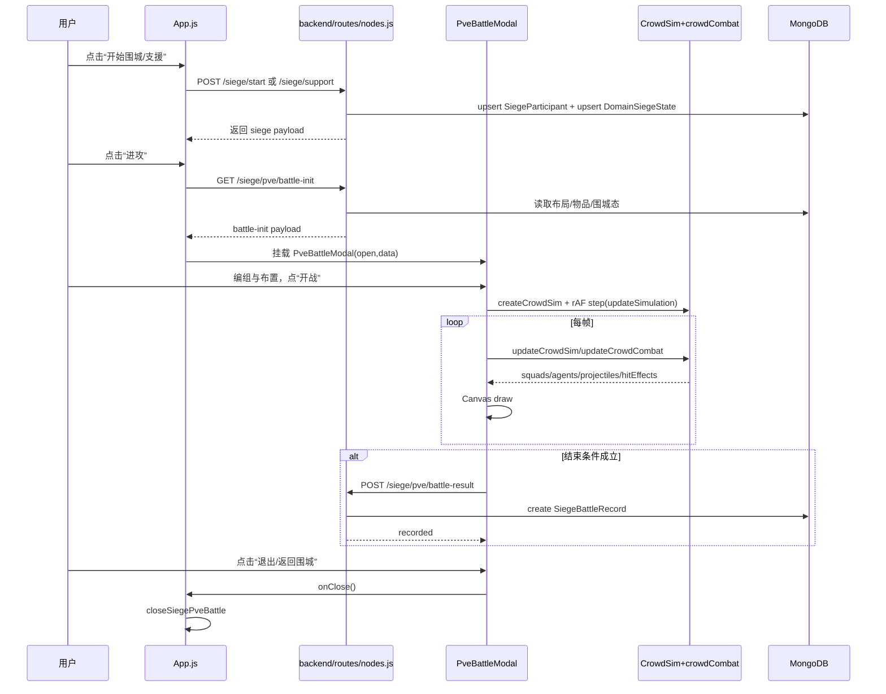
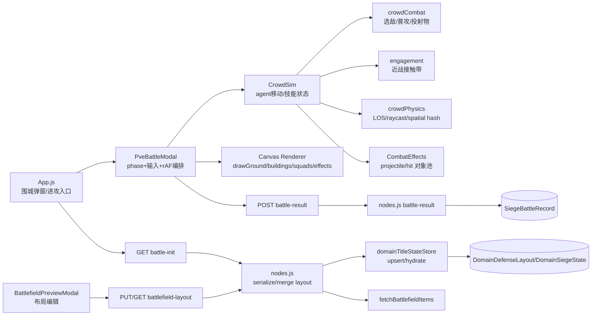

# PVE 攻占知识域战斗系统全链路审计

- 审计范围：`攻击知识域 -> 进入战斗 -> 战斗进行 -> 暂停/继续 -> 结算/退出` 全链路。
- 审计方式：静态代码审计（以代码为准，文档仅作交叉对照）。
- 审计时间：2026-02-27。

## 目录
- [Step 0：定位所有相关文件](#step-0定位所有相关文件)
- [Step 1：梳理开战入口与路由状态来源](#step-1梳理开战入口与路由状态来源)
- [Step 2：梳理战斗仿真（Sim）层](#step-2梳理战斗仿真sim层)
- [Step 3：梳理渲染与特效层](#step-3梳理渲染与特效层)
- [Step 4：地图、障碍物、战场编辑预览关联](#step-4地图障碍物战场编辑预览关联)
- [Step 5：暂停继续退出结算](#step-5暂停继续退出结算)
- [Step 6：面向整块重做的改造切入点](#step-6面向整块重做的改造切入点)
- [可复用/需替换对照表（模块粒度）](#可复用需替换对照表模块粒度)
- [性能相关热点清单](#性能相关热点清单)
- [未发现实现项与检索证据](#未发现实现项与检索证据)

## Step 0：定位所有相关文件

### 0.1 检索命令（ripgrep）
```bash
rg -n --glob '!**/node_modules/**' "PVE|battle|PveBattleModal|CrowdSim|crowd|projectile|CombatEffects|skill|targetSpec|overlay|minimap|siege|domain|attacker|defender|formation|flag|pause|resume|wall|obstacle|raycast|spatial|hash" frontend/src backend docs *.md
rg -l --glob '!**/node_modules/**' --glob '!frontend/build/**' "PVE|PveBattleModal|battle-init|battle-result|CrowdSim|crowd|projectile|CombatEffects|skill|targetSpec|overlay|minimap|siege|domain|attacker|defender|formation|flag|pause|resume|wall|obstacle|raycast|spatial|hash" frontend/src backend docs DEV_NOTE.md ARCHITECTURE_REBUILD_PLAN.md SCALABILITY_REFACTOR_PROGRESS.md BATTLEFIELD_PREVIEW_EDITOR_AUDIT.md | sort
```

### 0.2 文件索引（按目录分组）

#### frontend
- `frontend/src/App.js`：围城弹窗入口、`进攻`按钮、`PveBattleModal` 挂载、围城状态轮询。参考 `frontend/src/App.js:2550-2599`（`fetchSiegeStatus`）、`frontend/src/App.js:3057-3112`（`handleOpenSiegePveBattle`）、`frontend/src/App.js:6426-6458`（按钮与 modal 挂载）。
- `frontend/src/components/game/PveBattleModal.js`：PVE 主容器，含编组、输入、rAF 主循环、仿真推进、渲染、结算上报。参考 `frontend/src/components/game/PveBattleModal.js:2248-4163`（`PveBattleModal`）。
- `frontend/src/components/game/battleMath.js`：战场投影/反投影、旋转矩形几何与碰撞辅助。参考 `frontend/src/components/game/battleMath.js:37-60`（`projectWorld`/`unprojectScreen`）、`frontend/src/components/game/battleMath.js:127-162`。
- `frontend/src/game/battle/crowd/CrowdSim.js`：agent 级仿真核心、技能触发与队列、与 combat/effects 集成。参考 `frontend/src/game/battle/crowd/CrowdSim.js:890-911`（`createCrowdSim`）、`frontend/src/game/battle/crowd/CrowdSim.js:919-991`（`triggerCrowdSkill`）、`frontend/src/game/battle/crowd/CrowdSim.js:993-1204`（`updateCrowdSim`）。
- `frontend/src/game/battle/crowd/crowdCombat.js`：选敌、普攻、投射物推进、命中与溅射/墙体伤害。参考 `frontend/src/game/battle/crowd/crowdCombat.js:413-545`（`updateCrowdCombat`）、`frontend/src/game/battle/crowd/crowdCombat.js:370-411`（`stepProjectiles`）。
- `frontend/src/game/battle/crowd/crowdPhysics.js`：空间哈希、LOS、射线与障碍几何。参考 `frontend/src/game/battle/crowd/crowdPhysics.js:163-243`（`raycastObstacles`、`buildSpatialHash`、`querySpatialNearby`）。
- `frontend/src/game/battle/crowd/engagement.js`：近战接触带/槽位系统（feature flag）。参考 `frontend/src/game/battle/crowd/engagement.js:16-42`（`MELEE_ENGAGEMENT_CONFIG`）、`frontend/src/game/battle/crowd/engagement.js:418-524`（`syncMeleeEngagement`）。
- `frontend/src/game/battle/effects/CombatEffects.js`：投射物/命中特效对象池。参考 `frontend/src/game/battle/effects/CombatEffects.js:8-14`（pool 结构）、`frontend/src/game/battle/effects/CombatEffects.js:69-112`（acquire/step）。
- `frontend/src/game/formation/ArmyFormationRenderer.js`：编队可视化实例分配与渲染预算。参考 `frontend/src/game/formation/ArmyFormationRenderer.js:701-793`（`createFormationVisualState`）、`frontend/src/game/formation/ArmyFormationRenderer.js:1003-1038`（`renderFormation`）。
- `frontend/src/components/game/BattlefieldPreviewModal.js`：战场布局预览/编辑与保存（对象、守军部署）。参考 `frontend/src/components/game/BattlefieldPreviewModal.js:386-467`、`frontend/src/components/game/BattlefieldPreviewModal.js:2102-2189`、`frontend/src/components/game/BattlefieldPreviewModal.js:2265-2475`。
- `frontend/src/components/game/KnowledgeDomainScene.js`：承/启门战场预览入口与弹窗挂载。参考 `frontend/src/components/game/KnowledgeDomainScene.js:1090-1103`、`frontend/src/components/game/KnowledgeDomainScene.js:3925-3944`、`frontend/src/components/game/KnowledgeDomainScene.js:4546-4553`。

#### backend
- `backend/routes/nodes.js`：围城状态、围城发起/支援/撤退、PVE 初始化与结果写入主路由。参考 `backend/routes/nodes.js:7429-7515`（`GET /siege`）、`backend/routes/nodes.js:7611-7690`（`battle-init`）、`backend/routes/nodes.js:7701-7775`（`battle-result`）、`backend/routes/nodes.js:7837-8482`（`start/support/retreat`）。
- `backend/services/domainTitleStateStore.js`：标题态集合化读写（战场布局/围城状态）权威入口。参考 `backend/services/domainTitleStateStore.js:796-852`（hydrate）、`backend/services/domainTitleStateStore.js:868-905`（resolve）、`backend/services/domainTitleStateStore.js:939-1021`（upsert）。
- `backend/services/siegeParticipantStore.js`：围城参与者外置集合生命周期管理。参考 `backend/services/siegeParticipantStore.js:55-308`。
- `backend/services/placeableCatalogService.js`：战场物品目录读取。参考 `backend/services/placeableCatalogService.js:43-47`（`fetchBattlefieldItems`）。
- `backend/models/DomainDefenseLayout.js`：战场布局/对象/守军布置 schema。参考 `backend/models/DomainDefenseLayout.js:104-209`、`backend/models/DomainDefenseLayout.js:210-248`。
- `backend/models/BattlefieldItem.js`：障碍物模板（宽深高/hp/def/style）定义。参考 `backend/models/BattlefieldItem.js:3-66`。
- `backend/models/DomainSiegeState.js`：围城状态集合模型。参考 `backend/models/DomainSiegeState.js:81-155`。
- `backend/models/SiegeParticipant.js`：围城参与者集合模型与索引。参考 `backend/models/SiegeParticipant.js:16-99`。
- `backend/models/SiegeBattleRecord.js`：战斗结果记录模型。参考 `backend/models/SiegeBattleRecord.js:3-69`。
- `backend/server.js`：Socket.IO 初始化（PVE 当前未用 socket 推进）。参考 `backend/server.js:27-38`、`backend/server.js:130-139`。

#### docs
- `docs/PVE_MELEE_COMBAT_CONTEXT.md`：上一轮 PVE 近战链路审计，确认前端权威仿真。参考 `docs/PVE_MELEE_COMBAT_CONTEXT.md:63-66`。
- `docs/PVE_UNIT_SKILLS_CONTEXT.md`：技能/投射物链路审计。参考 `docs/PVE_UNIT_SKILLS_CONTEXT.md:7-11`。
- `docs/MELEE_ENGAGEMENT_IMPLEMENTATION.md`：近战接触带实现说明。参考 `docs/MELEE_ENGAGEMENT_IMPLEMENTATION.md:10-36`。
- `BATTLEFIELD_PREVIEW_EDITOR_AUDIT.md`：战场预览/编辑链路审计。参考 `BATTLEFIELD_PREVIEW_EDITOR_AUDIT.md:31-44`。
- `DEV_NOTE.md`：ground skill `targetSpec`/`activeSkill` 设计说明。参考 `DEV_NOTE.md:5-45`。
- `SCALABILITY_REFACTOR_PROGRESS.md`：围城参与者外置与任务化改造背景。参考 `SCALABILITY_REFACTOR_PROGRESS.md:56-66`、`SCALABILITY_REFACTOR_PROGRESS.md:82-84`。

## Step 1：梳理开战入口与路由状态来源

### 1.1 UI 入口链路（攻击知识域 -> 开战）

1. 用户先在围城弹窗发起/参与围城（攻占）。
- 前端发起围城：`POST /api/nodes/:nodeId/siege/start`。参考 `frontend/src/App.js:2764-2811`（`startSiege`）。
- 后端入围城参与者集合并写回围城状态：参考 `backend/routes/nodes.js:7837-7968`（`router.post('/:nodeId/siege/start')`），关键写入 `upsertSiegeParticipant` 和 `upsertNodeSiegeState` 在 `backend/routes/nodes.js:7913-7952`。

2. 围城进行中，用户点击 `进攻` 进入 PVE。
- UI 按钮与 modal 挂载：`frontend/src/App.js:6426-6458`。
- 点击处理函数：`frontend/src/App.js:3057-3112`（`handleOpenSiegePveBattle`）。
- 请求初始化：`GET /api/nodes/:nodeId/siege/pve/battle-init?gateKey=...` 于 `frontend/src/App.js:3077-3081`。

3. 后端校验并返回 battle-init。
- 路由：`backend/routes/nodes.js:7611-7690`（`router.get('/:nodeId/siege/pve/battle-init')`）。
- 入口上下文校验（是否该门有效围城、是否是该门参战攻方）：`backend/routes/nodes.js:3056-3123`（`resolveSiegePveBattleContext`）。

### 1.2 开战数据来源与响应结构

`battle-init` 返回结构（关键字段）：
- 顶层：`battleId/nodeId/nodeName/gateKey/serverTime/timeLimitSec/unitsPerSoldier`。
- 双方：`attacker{username,totalCount,units[]}`、`defender{username,totalCount,units[]}`。
- 战场：`battlefield{version,layoutMeta,layouts,itemCatalog,objects,defenderDeployments,updatedAt}`。
- 参考 `backend/routes/nodes.js:7657-7690`（响应体构建）。

战场数据来源：
- 物品目录来自 `fetchBattlefieldItems`：`backend/routes/nodes.js:7637-7642`、`backend/services/placeableCatalogService.js:43-47`。
- 布局与对象来自 `resolveNodeBattlefieldLayout + serializeBattlefieldStateForGate`：`backend/routes/nodes.js:7638-7644`、`backend/routes/nodes.js:2200-2215`。
- 守军部署来自 `layoutBundle.defenderDeployments`：`backend/routes/nodes.js:7644-7655`。

### 1.3 路由/状态刷新机制（轮询 vs WS）

- 围城状态是轮询：`frontend/src/App.js:1978-1990`（`setInterval` 调 `fetchSiegeStatus`），请求 `GET /api/nodes/:nodeId/siege` 在 `frontend/src/App.js:2550-2599`。
- PVE 战斗过程不走 WebSocket 推进，战斗在前端本地 rAF 内推进；后端仅 init/result。前端推进见 `frontend/src/components/game/PveBattleModal.js:3206-3350`，后端 socket 初始化但未接入 PVE 链路见 `backend/server.js:27-38`、`backend/server.js:130-139`。

### 1.4 后端“围城状态写入/落库”路径

- 标题状态集合化入口：`backend/routes/nodes.js:49-59` 引入 `domainTitleStateStore`。
- hydrate/resolve：`backend/services/domainTitleStateStore.js:796-905`。
- 围城状态 upsert：`backend/services/domainTitleStateStore.js:981-1021`。
- 战场布局 upsert：`backend/services/domainTitleStateStore.js:973-979`。
- 围城参与者外置：`backend/services/siegeParticipantStore.js:55-308` + model `backend/models/SiegeParticipant.js:16-99`。

## Step 2：梳理战斗仿真（Sim）层

### 2.1 主循环与 dt 控制

- rAF 入口：`frontend/src/components/game/PveBattleModal.js:3206-3350`（effect `renderFrame`）。
- dt 计算：`frontend/src/components/game/PveBattleModal.js:3232-3233`，`dt` 被夹在 `[0.001, 0.05]`。
- 战斗分支推进：`frontend/src/components/game/PveBattleModal.js:3292-3296` 调 `updateSimulation(sim, dt)`。
- sim 主更新：`frontend/src/components/game/PveBattleModal.js:1162-1183`（`updateSimulation`），若存在 crowd 则调 `updateCrowdSim`（`frontend/src/components/game/PveBattleModal.js:1168-1170`）。

### 2.2 核心数据结构（创建者/消费者/更新者）

| 结构 | 关键字段 | 创建者 | 消费者 | 更新者 |
|---|---|---|---|---|
| `sim` | `battleId,nodeId,gateKey,field,squads,buildings,effects,projectiles,hitEffects,timerSec,ended` | `startBattle` (`frontend/src/components/game/PveBattleModal.js:2642-2699`) | 渲染层 `draw*`、结果汇总 `buildBattleSummary` | `updateSimulation` + crowd/combat (`frontend/src/components/game/PveBattleModal.js:1162-1183`) |
| `squad` | `units,startCount,remain,health,maxHealth,stats,classTag,behavior,waypoints,attackCooldown,morale` | `createSquadEntity` (`frontend/src/components/game/PveBattleModal.js:498-547`) | 行为决策、UI 卡片、渲染旗手/圆环 | `updateCrowdSim`/`updateCrowdCombat` |
| `building/obstacle` | `x,y,rotation,width,depth,height,hp,defense,destroyed` | `buildObstacleList` (`frontend/src/components/game/PveBattleModal.js:316-355`) | LOS、碰撞、投射物扫掠与墙体受伤 | `crowdCombat.applyDamageToBuilding` (`frontend/src/game/battle/crowd/crowdCombat.js:247-257`) |
| `crowd` | `agentsBySquad,allAgents,effectsPool,spatial,engagement` | `createCrowdSim` (`frontend/src/game/battle/crowd/CrowdSim.js:890-911`) | combat、engagement、render（通过 agents） | `updateCrowdSim` (`frontend/src/game/battle/crowd/CrowdSim.js:993-1204`) |
| `agent` | `x,y,vx,vy,weight,hpWeight,attackCd,targetAgentId,engage*` | `createAgentsForSquad`（内部） | combat/engagement/render | `updateCrowdSim` + `updateCrowdCombat` |
| `projectile` | `x,y,z,vx,vy,vz,gravity,damage,radius,impactRadius,blastRadius,target*` | `acquireProjectile` (`frontend/src/game/battle/effects/CombatEffects.js:69-78`) | `stepProjectiles` | `stepProjectiles` (`frontend/src/game/battle/crowd/crowdCombat.js:370-411`) |
| `activeSkill/targetSpec` | `kind,x,y,radius,clipPolygon,blockedByWall,waves/cd/duration` | UI overlay + trigger (`frontend/src/components/game/PveBattleModal.js:1940-1962`, `frontend/src/components/game/PveBattleModal.js:901-934`) | crowd skill 发射与波次推进 | `triggerCrowdSkill/updateActiveGroundSkill` (`frontend/src/game/battle/crowd/CrowdSim.js:919-991`, `frontend/src/game/battle/crowd/CrowdSim.js:443-460`) |

### 2.3 伤害结算逻辑（近战/远程/AoE/墙体）

- 近战命中：`applyDamageToAgent` 直接扣 `hpWeight/weight`，并同步 squad 士气和击杀。参考 `frontend/src/game/battle/crowd/crowdCombat.js:143-178`。
- 远程普攻：`spawnRangedProjectiles` 生成 arrow/shell，随后在 `stepProjectiles` 扫掠推进。参考 `frontend/src/game/battle/crowd/crowdCombat.js:180-212`、`frontend/src/game/battle/crowd/crowdCombat.js:370-411`。
- 墙体遮挡与扫掠：`detectWallSweepHit` 用 `raycastObstacles` + inside-rect 判定。参考 `frontend/src/game/battle/crowd/crowdCombat.js:311-343`、`frontend/src/game/battle/crowd/crowdPhysics.js:163-178`。
- AoE/溅射：`applyAreaDamageToAgents` + `applyBlastDamageToWalls`（shell 生效）。参考 `frontend/src/game/battle/crowd/crowdCombat.js:259-309`。
- 近战接触带辅助：`syncMeleeEngagement` 计算 pair/anchor/pressure，影响攻击目标与移动。参考 `frontend/src/game/battle/crowd/engagement.js:418-524`。

### 2.4 技能系统（targetSpec -> sim 生效）

链路：
1. UI 构建 `targetSpec`：`buildSkillAimOverlay` 在弓/炮分支生成 `kind='ground_aoe'`。参考 `frontend/src/components/game/PveBattleModal.js:1874-1962`。
2. 点击确认时将 `targetSpec` 传给 sim：`handleCanvasPointerDown` 战斗分支。参考 `frontend/src/components/game/PveBattleModal.js:2948-2984`。
3. `triggerSquadSkill` 转发 crowd：`frontend/src/components/game/PveBattleModal.js:901-904`。
4. crowd 归一化目标与配置：`normalizeGroundSkillTargetSpec` + `GROUND_SKILL_CONFIG`。参考 `frontend/src/game/battle/crowd/CrowdSim.js:42-73`、`frontend/src/game/battle/crowd/CrowdSim.js:292-338`。
5. 波次发射与持续：`emitGroundSkillWave` + `updateActiveGroundSkill`。参考 `frontend/src/game/battle/crowd/CrowdSim.js:362-460`。

## Step 3：梳理渲染与特效层

### 3.1 渲染技术与入口

- 当前战斗场景是 `Canvas2D`，非 Three/WebGL。证据：`canvas.getContext('2d')` 于 `frontend/src/components/game/PveBattleModal.js:3226-3229`。
- 渲染入口：`renderFrame` 内按顺序调用 `drawGround -> drawBuildings -> drawBattleMoveGuides -> drawEffects -> drawSquads -> drawSkillAimOverlay`。参考 `frontend/src/components/game/PveBattleModal.js:3245-3333`。

### 3.2 相机逻辑（缩放/旋转/平移）

- 参数状态：`cameraPitch/cameraYaw/zoom/panWorldRef`。参考 `frontend/src/components/game/PveBattleModal.js:2280-2283`、`frontend/src/components/game/PveBattleModal.js:2269`。
- 视口/投影：`getViewport` 与 `projectWorld/unprojectScreen`。参考 `frontend/src/components/game/PveBattleModal.js:549-567`、`frontend/src/components/game/battleMath.js:37-60`。
- 输入：
  - 中键/右键旋转：`frontend/src/components/game/PveBattleModal.js:2836-2860`、`frontend/src/components/game/PveBattleModal.js:3036-3048`。
  - 平移（compose 中）与滚轮缩放：`frontend/src/components/game/PveBattleModal.js:2890-2910`、`frontend/src/components/game/PveBattleModal.js:3368-3401`。
- 跟随对象：当前没有“相机跟随旗手/部队中心”机制；仅在屏幕上把浮动按钮锚到选中部队旗帜（非相机跟随）。参考 `frontend/src/components/game/PveBattleModal.js:3299-3319`。

### 3.3 特效与投射物（对象池/碰撞/命中反馈）

- 对象池：`createCombatEffectsPool` + free/live 双数组。参考 `frontend/src/game/battle/effects/CombatEffects.js:8-14`。
- 分配与回收：`acquireProjectile/acquireHitEffect/stepEffectPool`。参考 `frontend/src/game/battle/effects/CombatEffects.js:69-112`。
- 物理推进/碰撞：`stepProjectiles`（位置积分、扫墙、落地爆炸、近邻命中）。参考 `frontend/src/game/battle/crowd/crowdCombat.js:370-411`。
- HP 互动：命中后调用 `applyDamageToAgent` 与 `applyDamageToBuilding`。参考 `frontend/src/game/battle/crowd/crowdCombat.js:143-178`、`frontend/src/game/battle/crowd/crowdCombat.js:247-257`。

### 3.4 UI Overlay 与 sim 交互

- 瞄准显示：`drawSkillAimOverlay`（冲锋箭头、抛物线、AoE 区域）。参考 `frontend/src/components/game/PveBattleModal.js:1976-2047`。
- 阻挡裁剪：`clipPointByBuildings` 与 `targetSpec.blockedByWall/clipPolygon`。参考 `frontend/src/components/game/PveBattleModal.js:780-805`、`frontend/src/components/game/PveBattleModal.js:1940-1962`。
- 传给 sim：点击确认时读 overlay 里的 `targetSpec`。参考 `frontend/src/components/game/PveBattleModal.js:2973-2979`。

## Step 4：地图、障碍物、战场编辑预览关联

### 4.1 地图数据来源与编辑器关联

- 战场编辑器保存：`PUT /api/nodes/:nodeId/battlefield-layout`。前端调用见 `frontend/src/components/game/BattlefieldPreviewModal.js:2102-2145`；后端路由见 `backend/routes/nodes.js:7294-7421`。
- battle-init 读取同一份布局：`resolveNodeBattlefieldLayout + serializeBattlefieldStateForGate`。参考 `backend/routes/nodes.js:7638-7644`、`backend/routes/nodes.js:2200-2215`。
- 前端 PVE 将 `battlefield.objects + itemCatalog` 映射成 `sim.buildings`。参考 `frontend/src/components/game/PveBattleModal.js:316-355`。

### 4.2 障碍物/墙体数据结构与坐标系

- 后端 schema（对象）：`layoutId/objectId/itemId/x/y/z/rotation`。参考 `backend/models/DomainDefenseLayout.js:104-144`。
- 物品模板：`width/depth/height/hp/defense/style`。参考 `backend/models/BattlefieldItem.js:20-51`。
- 守军部署 schema：`deployId/units/x/y/placed`。参考 `backend/models/DomainDefenseLayout.js:146-208`。
- 前端碰撞形状：旋转矩形（circle-rect、segment-rect、LOS/raycast）。参考 `frontend/src/components/game/battleMath.js:127-157`、`frontend/src/game/battle/crowd/crowdPhysics.js:118-189`。

### 4.3 可射击/遮挡规则

- LOS：`hasLineOfSight`。参考 `frontend/src/game/battle/crowd/crowdPhysics.js:180-189`。
- 扫掠中墙：`raycastObstacles`。参考 `frontend/src/game/battle/crowd/crowdPhysics.js:163-178`。
- 技能裁剪：`clipPointByBuildings` + ground target clip。参考 `frontend/src/components/game/PveBattleModal.js:780-805`、`frontend/src/game/battle/crowd/CrowdSim.js:271-338`。

### 4.4 屋顶遮挡/俯视内部切换基础

- 现状：未发现“屋顶遮挡剔除/屋顶透明切换/室内透视”代码基础。
- 检索证据见 [未发现实现项与检索证据](#未发现实现项与检索证据) 中 roof/occlusion 结果。

## Step 5：暂停/继续/退出/结算

### 5.1 暂停/继续现状与插入点

- 当前 PVE 未实现显式 `pause/resume` 控制（UI 与 sim gate 都未发现）。
- 最合理插入点：
  - UI 控制点：顶栏按钮区域 `frontend/src/components/game/PveBattleModal.js:3721-3723`（当前只有计时和退出）。
  - sim gate：`renderFrame` 的战斗更新分支 `frontend/src/components/game/PveBattleModal.js:3292-3296`；可引入 `sim.paused`，暂停时跳过 `updateSimulation` 但保留渲染。

### 5.2 结束条件与结算写回

- 结束条件：时间到/任一方兵力归零。参考 `frontend/src/components/game/PveBattleModal.js:1175-1182`。
- 汇总：`buildBattleSummary`。参考 `frontend/src/components/game/PveBattleModal.js:1185-1226`。
- 自动上报：`finishBattleIfNeeded -> saveBattleResult`。参考 `frontend/src/components/game/PveBattleModal.js:2712-2722`、`frontend/src/components/game/PveBattleModal.js:2601-2640`。
- 后端落库：`POST /siege/pve/battle-result` 创建 `SiegeBattleRecord`。参考 `backend/routes/nodes.js:7701-7775`、`backend/models/SiegeBattleRecord.js:3-69`。
- 重要现状：`battle-result` 仅记录战报，不改 `DomainSiegeState`/占领归属。证据：`SiegeBattleRecord` 仅在 `backend/routes/nodes.js:7733-7755` 被写入，仓库未发现其余消费路径（检索 `backend/**` 仅命中 model+该路由）。

### 5.3 退出路径与资源清理

- 退出按钮：`closeModal` 调父级 `onClose`。参考 `frontend/src/components/game/PveBattleModal.js:3645-3656`。
- 父级关闭：`closeSiegePveBattle` 清空 `pveBattleState`。参考 `frontend/src/App.js:2978-2987`。
- 组件清理：
  - 关闭/卸载时 reset 内部状态：`frontend/src/components/game/PveBattleModal.js:2427-2464`。
  - rAF 清理：`frontend/src/components/game/PveBattleModal.js:3347-3350`。
  - window 事件监听清理：`frontend/src/components/game/PveBattleModal.js:2531-2534`、`frontend/src/components/game/PveBattleModal.js:2559-2563`、`frontend/src/components/game/PveBattleModal.js:3200-3203`。

## Step 6：面向整块重做的改造切入点

### 6.1 与目标新方案对齐（你给的 3 个要点）

目标方案：
1. 单位渲染改为三层 cutout impostor（身体/装备/载具），支持 40°/90° 双资源与切换 cross-fade。
2. 战斗逻辑尽量复用（CrowdSim/伤害/技能/投射物），渲染层和相机交互层大改。
3. 支持大地图跟随（旗手 anchor）+ 小地图全局 + 卡片切焦点，后续可加迷雾。

现状匹配结论：
- `CrowdSim/crowdCombat/crowdPhysics/CombatEffects` 可作为逻辑层候选复用边界（现有输入输出清晰，且与渲染分离到一定程度）。参考 `frontend/src/game/battle/crowd/CrowdSim.js:993-1204`、`frontend/src/game/battle/crowd/crowdCombat.js:413-545`、`frontend/src/game/battle/crowd/crowdPhysics.js:163-243`、`frontend/src/game/battle/effects/CombatEffects.js:8-112`。
- `PveBattleModal` 内 draw+输入+编组+仿真编排高度耦合，渲染层重做时必须拆分。参考 `frontend/src/components/game/PveBattleModal.js:1382-2095`、`frontend/src/components/game/PveBattleModal.js:2824-3366`。

### 6.2 建议的改造边界（保持接口不变候选）

建议先固定 `BattleRuntime` 接口，不动核心战斗数据协议：
- `init(initPayload)`：输入 battle-init payload（保持 `battlefield.objects/itemCatalog/defenderDeployments` 兼容）。来源 `backend/routes/nodes.js:7657-7690`。
- `command.move/behavior/skill`：复用 `issueSquadMove/setSquadBehavior/triggerSquadSkill` 语义。参考 `frontend/src/components/game/PveBattleModal.js:721-765`、`frontend/src/components/game/PveBattleModal.js:901-934`。
- `step(dt)`：内部继续调用 `updateCrowdSim/updateCrowdCombat`。
- `snapshot()`：至少包含 `squads/agents/projectiles/hitEffects/buildings/timer/ended`（当前渲染依赖这些字段）。

### 6.3 必须替换模块

- 旧 Canvas 渲染函数族：`drawGround/drawBuildings/drawSquads/drawEffects/drawSkillAimOverlay`（`frontend/src/components/game/PveBattleModal.js:1382-2095`）必须替换为新 renderer。
- 相机与交互层：当前只提供 pitch/yaw/zoom/pan，不支持地图级跟随与双视角资源切换动画。入口在 `frontend/src/components/game/PveBattleModal.js:549-567`、`frontend/src/components/game/PveBattleModal.js:2824-3366`。
- 单位表现层：当前是简单 2D primitive（椭圆/矩形）+ formation 描述符，不能承载 cutout impostor 双资源交叉淡入。参考 `frontend/src/components/game/PveBattleModal.js:1626-1872`。

### 6.4 隐含耦合风险

- UI 直接读写 sim 内部对象（`simRef.current` 被输入/渲染/快捷键多处分支直接改写），不利于渲染替换。参考 `frontend/src/components/game/PveBattleModal.js:2948-2992`、`frontend/src/components/game/PveBattleModal.js:3133-3168`。
- 渲染 effect 与 sim effect 共用结构（`sim.projectiles/sim.hitEffects` 直接用于绘制），未来多后端回放或多视图消费时会互相牵连。参考 `frontend/src/components/game/PveBattleModal.js:1536-1624`、`frontend/src/game/battle/crowd/CrowdSim.js:1201-1204`。
- 结算依赖前端汇总后直传，缺少 server authoritative 仲裁，重做流程时要先明确“记录制”还是“裁决制”。参考 `frontend/src/components/game/PveBattleModal.js:1185-1226`、`backend/routes/nodes.js:7701-7775`。

## 可复用/需替换对照表（模块粒度）

| 模块名 | 目的 | 关键文件 | 关键 API/数据结构 | 当前实现方式 | 重构建议（保留/替换/改接口） |
|---|---|---|---|---|---|
| Siege 入口控制 | 从围城弹窗进入 PVE | `frontend/src/App.js:3057-3112` | `handleOpenSiegePveBattle`、`pveBattleState` | UI 直接 fetch init 并挂 modal | 保留（改接口）：抽离为 `battleGateway.init()` |
| PVE 运行时编排 | 管理 phase、rAF、输入、渲染、结算 | `frontend/src/components/game/PveBattleModal.js:2248-4163` | `phase/simRef/renderFrame/saveBattleResult` | 单组件大一统 | 替换：拆为 `BattleRuntime + BattleRenderer + BattleUI` |
| CrowdSim 核心 | agent 运动、技能状态、汇总 | `frontend/src/game/battle/crowd/CrowdSim.js:993-1204` | `createCrowdSim/updateCrowdSim/triggerCrowdSkill` | 前端权威 sim | 保留（小改）：固化输入输出快照接口 |
| Combat 结算 | 选敌/普攻/投射物/爆炸 | `frontend/src/game/battle/crowd/crowdCombat.js:413-545` | `updateCrowdCombat/stepProjectiles/applyDamage*` | 与 crowd 紧耦合但职责清晰 | 保留（小改）：拆 `projectileSystem` 子模块 |
| 近战接触带 | 槽位/推挤/阻挡重定向 | `frontend/src/game/battle/crowd/engagement.js:418-524` | `syncMeleeEngagement` | feature flag 可开关 | 保留 |
| 几何/空间查询 | LOS、射线、空间哈希 | `frontend/src/game/battle/crowd/crowdPhysics.js:163-243` | `raycastObstacles/buildSpatialHash/querySpatialNearby` | 纯函数工具 | 保留 |
| 特效对象池 | 控制投射物/命中对象分配 | `frontend/src/game/battle/effects/CombatEffects.js:8-112` | `createCombatEffectsPool/acquire*/stepEffectPool` | free/live 池化 | 保留 |
| 单位视觉分配 | 编队实例预算与描述符 | `frontend/src/game/formation/ArmyFormationRenderer.js:701-1038` | `createFormationVisualState/renderFormation` | 2D descriptor | 改接口：输出抽象实例供新 impostor renderer 消费 |
| 战场布局编辑 | 生成/保存 objects + defenderDeployments | `frontend/src/components/game/BattlefieldPreviewModal.js:386-467` `frontend/src/components/game/BattlefieldPreviewModal.js:2102-2189` | `buildLayoutPayload/persistBattlefieldLayout` | 前端编辑+后端 PUT | 保留 |
| 布局序列化 | gate 维度布局规范化 | `backend/routes/nodes.js:2200-2314` | `serializeBattlefieldStateForGate/mergeBattlefieldStateByGate` | 路由内 helper | 保留（后续下沉 service） |
| 标题态存储 | 战场/围城集合化读写 | `backend/services/domainTitleStateStore.js:796-1021` | `hydrate/resolve/upsert` | 集合化 + 兼容旧字段 | 保留 |
| 参与者外置集合 | 围城参与者分页与状态迁移 | `backend/services/siegeParticipantStore.js:55-308` | `upsert/list/getPreview/retreat` | 独立集合 + 游标分页 | 保留 |
| 战果记录 | 持久化 battle summary | `backend/routes/nodes.js:7701-7775` `backend/models/SiegeBattleRecord.js:3-69` | `POST battle-result` | 记录制（非裁决） | 改接口：为后续 server 裁决预留校验字段 |

## 性能相关热点清单

### 1) 每帧/高频循环点（tick/update/render）

| 热点 | 代码位置 | 当前复杂度特征 | 风险 |
|---|---|---|---|
| 主帧循环 | `frontend/src/components/game/PveBattleModal.js:3206-3350` (`renderFrame`) | 每帧执行 update + 多次 draw | UI/仿真耦合，某段抖动会拖慢整帧 |
| crowd 主更新 | `frontend/src/game/battle/crowd/CrowdSim.js:993-1204` (`updateCrowdSim`) | 近似 `O(A*k + S)`，含邻域查询/阵型更新 | 大规模时 CPU 峰值高 |
| combat 更新 | `frontend/src/game/battle/crowd/crowdCombat.js:413-545` (`updateCrowdCombat`) | squad 选敌 `O(S^2)` + agent 局部选敌 | 队伍数多时选敌开销上升 |
| 投射物更新 | `frontend/src/game/battle/crowd/crowdCombat.js:370-411` (`stepProjectiles`) | `O(P * (wallScan + nearQuery))` | 炮击密集时压力明显 |
| 绘制建筑/单位/特效 | `frontend/src/components/game/PveBattleModal.js:1382-1624`、`frontend/src/components/game/PveBattleModal.js:1731-1872` | Canvas CPU 绘制，按对象数量线性增长 | 大量实例时 fill/stroke 成本高 |

### 2) 对象分配/GC 风险点

- `sim.effects = map/filter` 每帧新数组：`frontend/src/components/game/PveBattleModal.js:1166`。
- `crowd.allAgents` 每帧重建：`frontend/src/game/battle/crowd/CrowdSim.js:1000-1005`、`frontend/src/game/battle/crowd/CrowdSim.js:1197-1199`。
- 多处 `filter/sort/map` 在高频路径创建临时数组（如 shooter 排序、目标候选排序）。参考 `frontend/src/game/battle/crowd/CrowdSim.js:369-380`、`frontend/src/game/battle/crowd/crowdCombat.js:279-282`。

### 3) 可能的 O(N^2) 与空间查询策略

- squad 级选敌是 `squads x enemySquads`：`frontend/src/game/battle/crowd/crowdCombat.js:423-439`。
- agent 级避免全局 N^2：已用空间哈希 `buildSpatialHash/querySpatialNearby`。参考 `frontend/src/game/battle/crowd/crowdPhysics.js:215-243`。
- 墙体 LOS/raycast 对每条线遍历障碍数组：`frontend/src/game/battle/crowd/crowdPhysics.js:163-189`，墙体很多时仍会放大。

### 4) 当前已有优化

- 投射物/命中特效对象池：`frontend/src/game/battle/effects/CombatEffects.js:8-112`。
- 空间哈希近邻查询：`frontend/src/game/battle/crowd/crowdPhysics.js:215-243`。
- 近战 engagement 低频重建（`updateHz` 节流）：`frontend/src/game/battle/crowd/engagement.js:16-18`、`frontend/src/game/battle/crowd/engagement.js:445-454`。
- 编队渲染预算随 zoom 调整：`frontend/src/components/game/PveBattleModal.js:90-97`。

### 5) 建议的可测量指标与插桩位置

建议指标：
- `fps`
- `frame_time_ms`
- `sim_step_ms`
- `combat_step_ms`
- `projectile_step_ms`
- `draw_ms`（ground/buildings/squads/effects 分项）
- `active_agents` / `active_projectiles` / `active_walls`

建议插桩点：
- 帧总耗时：`frontend/src/components/game/PveBattleModal.js:3212-3344`（`renderFrame` 首尾）。
- sim 耗时：`frontend/src/components/game/PveBattleModal.js:3295`（`updateSimulation` 前后）。
- crowd/combat：`frontend/src/game/battle/crowd/CrowdSim.js:993-1204`、`frontend/src/game/battle/crowd/crowdCombat.js:413-545`。
- 投射物：`frontend/src/game/battle/crowd/crowdCombat.js:370-411`。
- draw 分项：`frontend/src/components/game/PveBattleModal.js:3296-3333` 的每个 draw 调用前后。

## 未发现实现项与检索证据

### A. PVE 暂停/继续
- 结论：未发现 PVE 专用暂停/继续实现。
- 检索命令：
```bash
rg -n --glob '!**/node_modules/**' "pause|resume|minimap|mini-map|battle pause|暂停|继续" frontend/src/components/game/PveBattleModal.js frontend/src/game/battle backend/routes/nodes.js frontend/src/components/game/KnowledgeDomainScene.js
```
- 结果：仅命中 `KnowledgeDomainScene` 的情报窃取 pause 逻辑（非 PVE）、`PveBattleModal` 的“继续围城（重开）”文本（非 pause gate）。

### B. PVE 小地图（minimap）
- 结论：未发现 PVE minimap 实现。
- 检索命令：
```bash
rg -n --glob '!**/node_modules/**' "minimap|miniMap|mini-map|小地图" frontend/src/components/game/PveBattleModal.js frontend/src/game/battle frontend/src/components/game/BattlefieldPreviewModal.js backend/routes/nodes.js
```
- 结果：无命中。

### C. 屋顶遮挡/室内透视切换
- 结论：未发现 roof occlusion / interior reveal 相关实现。
- 检索命令：
```bash
rg -n --glob '!**/node_modules/**' "roof|屋顶|occlusion|遮挡|俯视|top[- ]?down|fog|迷雾" frontend/src/components/game/PveBattleModal.js frontend/src/components/game/BattlefieldPreviewModal.js frontend/src/game/battle
```
- 结果：只命中相机 yaw/pitch 文本和变量，没有屋顶遮挡逻辑。

## 附：流程图（开战到结束/退出）



## 附：模块依赖图（UI -> sim -> effects -> render -> backend）



