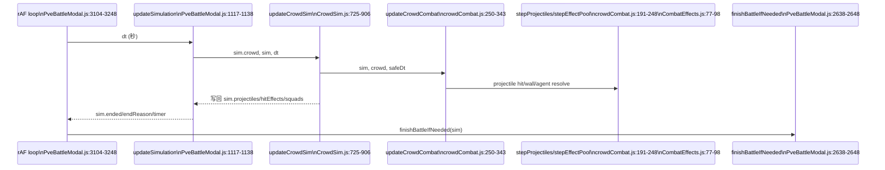
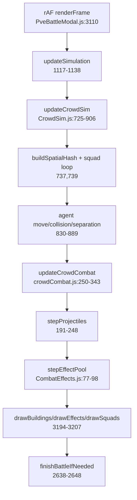
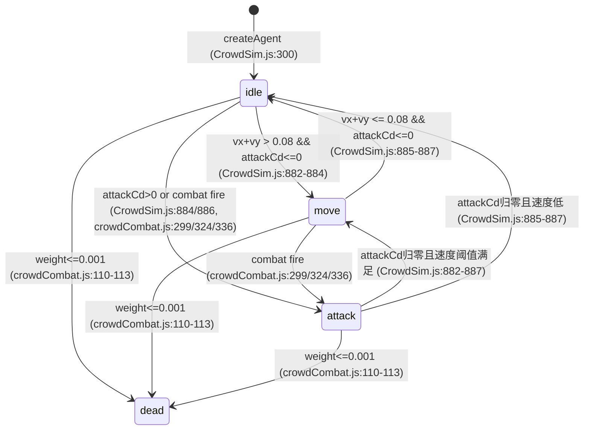

# PVE Melee Combat Context for neruoWar

## 0. Scope & Goal (What this document is for)
- 目标：给后续 AI/架构师提供“PVE 近战混战改造”的代码上下文，定位当前实现为何不够像全战/骑砍。
- 范围：仅覆盖“围城 -> PVE 开战后”的战斗链路（入口、模拟循环、AI、碰撞、伤害、结算）。
- 方法：静态审计（未跑全链路联调）。涉及运行时行为的结论均标注“未验证 + 推断依据”。

## 1. Repo Topology (frontend/backend responsibilities)
- 前端：`frontend/src/components/game/PveBattleModal.js` 持有战斗主状态、输入处理、rAF 循环、渲染调用、结果上报。
- 前端战斗逻辑模块：`frontend/src/game/battle/crowd/*`（agent/crowd 运动与战斗），`frontend/src/game/formation/ArmyFormationRenderer.js`（编队可视化分配规则）。
- 后端：`backend/routes/nodes.js` 提供围城状态、PVE 初始化、战果写入；`backend/models/SiegeBattleRecord.js` 持久化战斗记录。

证据（目录索引命令）：
```bash
find frontend/src backend -path '*/node_modules/*' -prune -o -type d -print | sort
```

证据（路由挂载，`backend/server.js:47-53`）：
```js
47	app.use('/api', authRoutes);
48	app.use('/api/admin', adminRoutes);
49	app.use('/api/nodes', nodeRoutes);
50	app.use('/api/alliances', allianceRoutes);
51	app.use('/api/army', armyRoutes);
52	app.use('/api/senses', senseRoutes);
53	app.use('/api/users', usersRoutes);
```

## 2. Code Discovery (search commands & ranked file list)
- Commands:
```bash
rg -n -i -e "battle|combat|pve|melee|siege|attack|attacker|defender|troop|unit|soldier|target|aggro|collision|obstacle|path|nav|steering|flock|formation|radius|tick|update|loop|interval|requestAnimationFrame|战斗|攻占|围城|驻防|近战|远程|索敌|仇恨|碰撞|障碍|寻路|移动|队形|士兵|部队" frontend backend --glob '!**/node_modules/**'
rg -n "PveBattleModal|phase.*battle|BattleSim|simulate|tick|update\(|requestAnimationFrame" frontend backend
rg -n "DefenderAI|AI|utility|decision" frontend backend
rg -n "ArmyFormationRenderer|formation|allocateRenderCounts|InstancedMesh|Sprite|billboard" frontend
rg -n "projectile|arrow|hit|damage|kill|casualt" frontend
rg -n "battlefield-layout|wood_wall|wall|obstacle|collision|A\*|path" frontend backend
```

- Top hits (ranked):
  1) `backend/routes/nodes.js` (1155) - 围城状态、battle-init、battle-result、权限与数据拼装核心。
  2) `frontend/src/components/game/PveBattleModal.js` (912) - PVE UI + 输入 + 渲染 + sim 驱动核心。
  3) `frontend/src/components/game/BattlefieldPreviewModal.js` (741) - 同类战场伪3D渲染参考实现。
  4) `frontend/src/App.js` (732) - 围城弹窗入口、按钮启用条件、PVE modal 挂载。
  5) `backend/services/domainTitleStateStore.js` (315) - 战场布局/围城状态持久化与读取权威入口。
  6) `frontend/src/components/game/KnowledgeDomainScene.js` (281) - 围城相关入口场景层。
  7) `frontend/src/game/battle/crowd/CrowdSim.js` (111) - agent crowd 运动、局部 AI、技能触发。
  8) `frontend/src/game/formation/ArmyFormationRenderer.js` (104) - 混编可视化配额/队形/LOD。
  9) `frontend/src/game/battle/crowd/crowdCombat.js` (90) - 选敌、近远程伤害、投射物处理。
  10) `backend/models/Node.js` (97) - 围城/布局相关字段承载体。
  11) `backend/services/siegeParticipantStore.js` (54) - 围城参与者状态管理。
  12) `backend/server.js` (34) - Socket.IO 与 REST 并存的运行框架。
  13) `backend/models/DomainSiegeState.js` (21) - 围城态集合模型。
  14) `backend/models/SiegeBattleRecord.js` (9) - 战斗结果落库模型。
  15) `backend/models/ArmyUnitType.js` (11) - 单位基础属性源。
  16) `frontend/src/game/battle/crowd/crowdPhysics.js` (8) - 几何/碰撞基础。
  17) `frontend/src/game/battle/effects/CombatEffects.js` (6) - 特效对象池。
  18) `backend/routes/army.js` (67) - 部队数据对外接口。
  19) `backend/services/armyUnitTypeService.js` (11) - unit type 服务层。
  20) `backend/models/DomainDefenseLayout.js` (69) - 守方布局相关模型。

## 3. Battle Ownership & Runtime Model (authority, tick loop, networking)
- 结论：当前 PVE 为**前端权威模拟**。后端不逐帧裁决，只负责初始化快照和结果记录。
- 推进方式：`requestAnimationFrame` 每帧调用 `updateSimulation`，内部再调用 `updateCrowdSim/updateCrowdCombat`。
- 网络：PVE 主链路是 REST（`fetch`）；仓库有 Socket.IO，但未见 PVE 使用 socket 事件推进。

证据（前端入口调用 battle-init，`frontend/src/App.js:3057-3081`）：
```js
3057	const handleOpenSiegePveBattle = async () => {
3058	  const token = localStorage.getItem('token');
3059	  const nodeId = normalizeObjectId(...);
3060	  const gateKey = (...);
3065	  if (!token || !nodeId || !gateKey) return;
3077	  const response = await fetch(`http://localhost:5000/api/nodes/${nodeId}/siege/pve/battle-init?gateKey=${encodeURIComponent(gateKey)}`, {
3078	    headers: {
3079	      Authorization: `Bearer ${token}`
3080	    }
3081	  });
```

证据（前端帧循环推进，`frontend/src/components/game/PveBattleModal.js:3104-3243`）：
```js
3104	useEffect(() => {
3107	  let rafId = 0;
3110	  const renderFrame = (ts) => {
3130	    const dt = Math.min(0.05, Math.max(0.001, (ts - lastTs) / 1000));
3190	    if (phase === 'battle') {
3191	      const sim = simRef.current;
3193	      updateSimulation(sim, dt);
3194	      drawBuildings(ctx, sim, view, cameraPitch, cameraYaw);
3197	      const selectedFlag = drawSquads(...);
3238	      finishBattleIfNeeded(sim);
3242	    rafId = requestAnimationFrame(renderFrame);
3243	  };
```

证据（后端仅初始化/记录，`backend/routes/nodes.js:7611-7617`, `7701-7707`）：
```js
7611	router.get('/:nodeId/siege/pve/battle-init', authenticateToken, async (req, res) => {
7614	  const requestUserId = getIdString(req?.user?.userId);
7615	  const gateKeyRaw = typeof req.query?.gateKey === 'string' ? req.query.gateKey.trim() : '';
...
7701	router.post('/:nodeId/siege/pve/battle-result', authenticateToken, async (req, res) => {
7704	  const requestUserId = getIdString(req?.user?.userId);
7705	  const payload = req.body && typeof req.body === 'object' ? req.body : {};
```

证据（Socket.IO 存在但 PVE 未见绑定，`backend/server.js:27-38`, `130-139`）：
```js
27	const io = socketIo(server, {
34	  transports: ['websocket', 'polling'],
...
130	io.on('connection', (socket) => {
134	  if (!ENABLE_LEGACY_SOCKET_HANDLERS) {
135	    socket.emit('server-mode', {
136	      legacySocketHandlers: false
137	    });
138	    return;
139	  }
```

## 4. End-to-End Flow: UI → API/Message → Simulation → Result Render
### 4.1 Frontend entry points
- 围城弹窗“进攻”按钮触发 `handleOpenSiegePveBattle`，拉取 `battle-init`，并挂载 `PveBattleModal`。
- `PveBattleModal` 在 `startBattle` 内把编组/布局组装为 `sim`，进入 `phase='battle'`。

证据（按钮与 modal 挂载，`frontend/src/App.js:6426-6434`, `6451-6458`）：
```js
6426	<button
6429	  onClick={handleOpenSiegePveBattle}
6430	  disabled={!canLaunchSiegePveBattle}
6433	>
6434	  进攻
...
6451	<PveBattleModal
6452	  open={pveBattleState.open}
6455	  battleInitData={pveBattleState.data}
6456	  onClose={closeSiegePveBattle}
6457	  onBattleFinished={handlePveBattleFinished}
6458	/>
```

### 4.2 Backend entry points
- `GET /api/nodes/:nodeId/siege` 生成前端围城视图态（`viewerRole/hasActiveSiege/compareGate/...`）。
- `GET /api/nodes/:nodeId/siege/pve/battle-init` 返回战斗初始化包（攻守兵力、物品、布局、守军部署）。
- `POST /api/nodes/:nodeId/siege/pve/battle-result` 校验后写 `SiegeBattleRecord`。

证据（围城状态路由，`backend/routes/nodes.js:7428-7477`）：
```js
7428	// 获取知识域围城状态（攻占/围城/支援信息）
7429	router.get('/:nodeId/siege', authenticateToken, async (req, res) => {
7440	  const [node, user, unitTypes] = await Promise.all([
7455	  await hydrateNodeTitleStatesForNodes([node], {
7469	  const intelSnapshotRaw = findUserIntelSnapshotByNodeId(user, node._id);
7471	  const payload = buildSiegePayloadForUser({
7472	    node,
7473	    user,
7474	    unitTypes,
7475	    intelSnapshot
7476	  });
```

### 4.3 Data/state propagation
- battle-init 里把 `layoutBundle.objects/itemCatalog/defenderDeployments` 一次性给前端。
- 前端 `startBattle` 将其转换为 `sim.buildings`、`sim.squads`、`sim.crowd`。
- battle 结束后 `buildBattleSummary` -> `saveBattleResult` 上报。

证据（init payload，`backend/routes/nodes.js:7637-7689`）：
```js
7637	const battlefieldItemCatalog = await fetchBattlefieldItems({ enabledOnly: true });
7643	const layoutBundle = serializeBattlefieldStateForGate(mergedBattlefieldState, gateKey, '');
7644	const defenderDeployments = Array.isArray(layoutBundle?.defenderDeployments) ? layoutBundle.defenderDeployments : [];
...
7678	battlefield: {
7683	  layoutMeta: layoutBundle?.activeLayout || null,
7685	  itemCatalog: Array.isArray(layoutBundle?.itemCatalog) ? layoutBundle.itemCatalog : [],
7686	  objects: Array.isArray(layoutBundle?.objects) ? layoutBundle.objects : [],
7687	  defenderDeployments: Array.isArray(layoutBundle?.defenderDeployments) ? layoutBundle.defenderDeployments : [],
7688	  updatedAt: layoutBundle?.updatedAt || null
7689	}
```

证据（前端建 sim + crowd，`frontend/src/components/game/PveBattleModal.js:2596-2623`）：
```js
2596	const sim = {
2604	  squads: [...attackerSquads, ...defenderSquads],
2605	  buildings: buildObstacleList(battleInitData?.battlefield || {}),
2607	  projectiles: [],
2608	  hitEffects: [],
2609	  timerSec: Math.max(30, Math.floor(Number(battleInitData?.timeLimitSec) || DEFAULT_TIME_LIMIT)),
2613	  destroyedBuildings: 0
2614	};
2616	if (squad.team === TEAM_DEFENDER) {
2617	  squad.behavior = 'auto';
2618	  squad.action = '自动攻击';
2619	}
2621	sim.crowd = createCrowdSim(sim, { unitTypeMap });
2623	simRef.current = sim;
```

## 5. Data Model & Config (units, stats, battle state)
### 5.1 Unit/army representation
- 后端 `ArmyUnitType` 提供战斗属性主数据（`roleTag/speed/hp/atk/def/range/costKP`）。
- 前端 `createSquadEntity` 把 group 转为 squad（`units/startCount/remain/stamina/morale/stats/classTag/...`）。

证据（`backend/models/ArmyUnitType.js:3-44`）：
```js
3	const ArmyUnitTypeSchema = new mongoose.Schema({
15	  roleTag: { type: String, enum: ['近战', '远程'], required: true },
20	  speed: { type: Number, required: true, min: 0 },
25	  hp: { type: Number, required: true, min: 1 },
30	  atk: { type: Number, required: true, min: 0 },
35	  def: { type: Number, required: true, min: 0 },
40	  range: { type: Number, required: true, min: 1 },
```

证据（`frontend/src/components/game/PveBattleModal.js:507-546`）：
```js
507	const units = normalizeUnitsMap(group?.units || {});
508	const unitTotal = sumUnitsMap(units);
509	const stats = aggregateStats(units, unitTypeMap);
...
517	startCount: unitTotal,
518	remain: unitTotal,
521	maxHealth: health,
524	stamina: STAMINA_MAX,
525	morale: MORALE_MAX,
526	stats,
527	classTag: stats.classTag,
528	roleTag: stats.roleTag,
533	action: '待命',
534	behavior: 'idle',
```

### 5.2 Stats (hp/atk/def/range/speed/...)
- stats 聚合后用于 squad 层行为（速度、攻防、射程、类别），并被 crowd 层拆解到 agent 层伤害/速度倍率。

证据（`frontend/src/game/battle/crowd/CrowdSim.js:117-135`）：
```js
117	const resolveAgentSpeedMul = (unitType = {}, category = 'infantry') => {
120	  return clamp(rawSpeed / 1.45, 0.64, 1.72);
...
128	const resolveAttackRange = (squad = {}) => {
129	  const avgRange = Math.max(1, Number(squad?.stats?.range) || 1);
130	  if (squad.classTag === 'artillery') return 126;
131	  if (squad.classTag === 'archer') return 88;
132	  if (squad.classTag === 'cavalry') return Math.max(7.4, avgRange * 16);
133	  if (avgRange >= 2.2) return Math.max(64, avgRange * 28);
134	  return 6.2;
135	};
```

### 5.3 Battle state schema (server & client)
- Client `sim`：`squads/buildings/projectiles/hitEffects/timer/ended/...`。
- Server record：`SiegeBattleRecord(nodeId, gateKey, battleId, attacker/defender, details...)`。

证据（`backend/models/SiegeBattleRecord.js:3-60`）：
```js
3	const SiegeBattleRecordSchema = new mongoose.Schema({
4	  nodeId: { type: mongoose.Schema.Types.ObjectId, required: true, index: true },
9	  gateKey: { type: String, enum: ['cheng', 'qi'], required: true, index: true },
15	  battleId: { type: String, required: true, unique: true, trim: true, index: true },
47	  attacker: {
48	    start: { type: Number, min: 0, default: 0 },
49	    remain: { type: Number, min: 0, default: 0 },
50	    kills: { type: Number, min: 0, default: 0 }
51	  },
52	  defender: {
53	    start: { type: Number, min: 0, default: 0 },
54	    remain: { type: Number, min: 0, default: 0 },
55	    kills: { type: Number, min: 0, default: 0 }
56	  },
57	  details: { type: mongoose.Schema.Types.Mixed, default: {} }
```

## 6. Movement / Collision / Pathing (why units get stuck)
### 6.1 Coordinate system & geometry primitives
- 当前是 **Canvas2D + 伪3D投影**（不是 three Instanced）。
- 战场坐标在地面平面 `(x,y)`，通过 `projectWorld` 投影到屏幕。

证据（`frontend/src/components/game/PveBattleModal.js:3124-3144`）：
```js
3124	const ctx = canvas.getContext('2d');
3133	const view = getViewport(
3142	ctx.clearRect(0, 0, canvas.width, canvas.height);
3143	drawGround(ctx, view, fieldSize, cameraPitch, cameraYaw);
```

### 6.2 Collision resolution
- 墙体碰撞用旋转矩形（OBB近似）+ push-out。
- 小人间碰撞用 spatial hash 邻域分离；敌对近战分离强度被特意压低以允许混战贴近。

证据（`frontend/src/game/battle/crowd/crowdPhysics.js:22-57`）：
```js
22	export const isInsideRotatedRect = (point, rect, inflate = 0) => {
33	export const pushOutOfRect = (point, rect, inflate = 0) => {
43	  if (Math.abs(local.x) > hw || Math.abs(local.y) > hh) return { x: cx, y: cy, pushed: false };
47	  if (dx < dy) {
48	    local.x += local.x >= 0 ? dx : -dx;
49	  } else {
50	    local.y += local.y >= 0 ? dy : -dy;
```

### 6.3 Obstacle handling & pathfinding
- 未发现 A* / navmesh 全局寻路。
- 当前是“leader waypoint + 局部流宽估计 + 分离/推离障碍”策略。

证据（`frontend/src/game/battle/crowd/CrowdSim.js:816-823`）：
```js
816	const flowWidth = estimateLocalFlowWidth({ x: squad.x, y: squad.y }, forward, walls, {
817	  step: 3.2,
818	  maxProbe: 120,
819	  inflate: AGENT_RADIUS + 1
820	});
821	const flowCols = Math.max(1, Math.floor(flowWidth / ((AGENT_RADIUS * 2) + AGENT_GAP)));
822	columns = Math.max(1, Math.min(baseCols, flowCols));
```

### 6.4 Known stuck scenarios (with evidence)
- 无全局绕路：墙后不可达目标时可能长期“局部推挤 + 原地索敌”。
- 目标重选偏近邻，缺少“不可达检测 + 重新选路目标”。

证据（`frontend/src/game/battle/crowd/crowdCombat.js:312-319`）：
```js
312	const target = pickNearestEnemyAgent(agent, enemyAgents);
317	if (dist > attackRange) return;
318	if (agent.attackCd > 0) return;
```

## 7. Targeting / Engagement / Damage (why melee feels fake)
### 7.1 Target selection & retarget policy
- squad 级先用 utility（威胁/脆弱/距离）选目标 squad。
- agent 级在目标 squad 内取最近敌 agent，缺少 engagement slots。

证据（`frontend/src/game/battle/crowd/crowdCombat.js:53-69`）：
```js
53	export const pickEnemySquadTarget = (squad, enemySquads = []) => {
59	  const dist = Math.hypot((enemy.x || 0) - (squad.x || 0), (enemy.y || 0) - (squad.y || 0));
60	  const threat = Math.max(0, Number(enemy.stats?.atk) || 0) * 1.25;
61	  const weak = (1 - clamp((enemy.remain || 0) / Math.max(1, enemy.startCount || 1), 0, 1)) * 50;
62	  const score = threat + weak - (dist * 0.3);
```

### 7.2 Melee range & contact detection
- 近战命中主要由“agent 与 target 距离 <= attackRange”触发，不是槽位接触模型。

证据（`frontend/src/game/battle/crowd/crowdCombat.js:271-327`）：
```js
271	const attackRange = attackRangeBySquad(squad);
314	const distSq = distanceSq(agent, target);
315	const dist = Math.sqrt(distSq);
317	if (dist > attackRange) return;
...
325	} else {
326	  applyDamageToAgent(sim, crowd, agent, target, baseDamage, 'slash');
```

### 7.3 Attack cadence (cooldowns/timers)
- 冷却由类别固定常量控制（近战/弓/炮），并附加随机浮动。

证据（`frontend/src/game/battle/crowd/crowdCombat.js:36-41`, `338`）：
```js
36	const cooldownByCategory = (category = 'infantry') => {
37	  if (category === 'artillery') return 4.8;
38	  if (category === 'archer') return 1.16;
39	  if (category === 'cavalry') return 0.86;
40	  return 0.74;
41	};
...
338	agent.attackCd = cooldownByCategory(squad.classTag) * (0.86 + Math.random() * 0.22);
```

### 7.4 Damage resolution & death/removal
- 伤害扣在 agent.weight/hpWeight 上；weight<=0 标记 dead；再回写 squad.remain。

证据（`frontend/src/game/battle/crowd/crowdCombat.js:85-118`）：
```js
85	const applyDamageToAgent = (sim, crowd, sourceAgent, targetAgent, amount = 0, hitType = 'hit') => {
88	  targetAgent.hpWeight = Math.max(0, ... - safeAmount);
89	  targetAgent.weight = Math.max(0, ... - safeAmount);
95	  targetSquad.morale = clamp((Number(targetSquad.morale) || 0) - (safeAmount * 0.22), 0, 100);
99	  sourceSquad.morale = clamp((Number(sourceSquad.morale) || 0) + (safeAmount * 0.2), 0, 100);
110	  if (targetAgent.weight <= 0.001) {
111	    targetAgent.dead = true;
112	    targetAgent.state = 'dead';
```

## 8. Observed Symptoms Mapped to Code (symptom → culprit)
- Symptom A: “近战看起来像距离阈值对砍，不像混战接触面推进”
  - Evidence: `frontend/src/game/battle/crowd/crowdCombat.js:312-327`
  - Why this causes it: 目标是“最近单点 agent”，没有 front-line slot 占位，导致接触面组织性不足。
- Symptom B: “狭窄处有流式，但绕障碍全局规划不足”
  - Evidence: `frontend/src/game/battle/crowd/CrowdSim.js:816-823`
  - Why this causes it: 仅局部 flow width 压缩列数，无路径图搜索。
- Symptom C: “守军 AI 像条件触发，不像战术层协同”
  - Evidence: `frontend/src/game/battle/crowd/CrowdSim.js:771-793`
  - Why this causes it: defender AI 在 sim update 内硬编码阈值，不是独立 utility planner。
- Symptom D: “PVE 逻辑易与 UI 耦合”
  - Evidence: `frontend/src/components/game/PveBattleModal.js:3104-3243`
  - Why this causes it: 帧循环/绘制/状态推进都在组件内，不利于替换更复杂 melee core。
- Symptom E: “战果权威不在服务端”
  - Evidence: `frontend/src/components/game/PveBattleModal.js:2527-2545` + `backend/routes/nodes.js:7701-7755`
  - Why this causes it: 服务端只做入库校验，逐帧结果由前端决定。

## 9. Minimal Reproduction Steps (MRS)
- UI-level:
  1. 以 `common` 用户登录，进入已 `approved` 知识域。
  2. 在围城弹窗先确保有有效围城门（`hasActiveSiege=true` 且用户是该门 active attacker）。
  3. 点击“进攻”进入 `PveBattleModal`，编组攻方并放置后点击“开战”。
  4. 观察：守军自动行为、双方接触、兵力条变化、建筑受损、倒计时结束后结算面板。
- API-level (if applicable):
  1. `POST /api/nodes/:nodeId/siege/start`（或 `support` 加入已有围城）。
  2. `GET /api/nodes/:nodeId/siege` 确认 `activeGateKeys` 与 `compareGate`。
  3. `GET /api/nodes/:nodeId/siege/pve/battle-init?gateKey=cheng|qi` 拉初始化包。
  4. 本地模拟后 `POST /api/nodes/:nodeId/siege/pve/battle-result` 写战果。

证据（路由存在，`backend/routes/nodes.js:7837`, `8090`, `8385`, `7611`, `7701`）：
```js
7837	router.post('/:nodeId/siege/start', authenticateToken, async (req, res) => {
8090	router.post('/:nodeId/siege/support', authenticateToken, async (req, res) => {
8385	router.post('/:nodeId/siege/retreat', authenticateToken, async (req, res) => {
7611	router.get('/:nodeId/siege/pve/battle-init', authenticateToken, async (req, res) => {
7701	router.post('/:nodeId/siege/pve/battle-result', authenticateToken, async (req, res) => {
```

## 10. High-Leverage Hook Points for “Realistic Mixed Melee”
(only locations + interfaces; do NOT implement)
- Hook 1: `frontend/src/game/battle/crowd/crowdCombat.js::pickEnemySquadTarget / pickNearestEnemyAgent`
  - Why: 当前索敌在“单点最近”层，最适合插入 engagement slots 与动态重索敌策略。
  - I/O: 输入 squad/agent + enemy set；输出目标列表或 slot 绑定。
  - Impact: 前端战斗逻辑层。
- Hook 2: `frontend/src/game/battle/crowd/CrowdSim.js::updateCrowdSim`（列压缩、分离、leader 跟随）
  - Why: 当前流式通行已在此，加入 push&fill/frontline 保持最直接。
  - I/O: 输入 sim/crowd/dt；输出 agent pose/state。
  - Impact: 前端战斗核心 + 观感。
- Hook 3: `frontend/src/game/battle/crowd/crowdPhysics.js`
  - Why: 几何基元集中，适合添加更细 contact manifold/penetration resolver。
  - I/O: 点-墙/点-点求解；输出推离向量。
  - Impact: 前端通用物理工具。
- Hook 4: `frontend/src/components/game/PveBattleModal.js::updateSimulation/startBattle`
  - Why: 现在 orchestration 在组件层，适合抽离 BattleRuntime（tick/phase/事件总线）。
  - I/O: 输入 UI 命令；输出渲染快照与结算。
  - Impact: 前端架构层。
- Hook 5: `backend/routes/nodes.js::battle-result`
  - Why: 若后续上 server-authoritative 或回放验证，这里是最小接入点。
  - I/O: battle summary -> record。
  - Impact: 后端持久化与反作弊。

## 11. Root Causes Top 10 (evidence-based)
1) 战斗主权在前端，服务端不做帧级裁决。  
   Evidence: `frontend/src/components/game/PveBattleModal.js:3193`, `backend/routes/nodes.js:7701-7755`.
2) 战斗循环耦合在 React 组件中，逻辑/渲染/输入未彻底分层。  
   Evidence: `frontend/src/components/game/PveBattleModal.js:3104-3243`.
3) 无全局寻路（A* / navmesh）证据，主要依赖局部流宽与推离。  
   Evidence: `frontend/src/game/battle/crowd/CrowdSim.js:816-823`, `frontend/src/game/battle/crowd/crowdPhysics.js:33-57`.
4) 近战命中本质是距离阈值判定，不是接触槽位/战线推进。  
   Evidence: `frontend/src/game/battle/crowd/crowdCombat.js:317-327`.
5) 索敌策略偏“最近个体”，缺少不可达/拥挤下的鲁棒 retarget。  
   Evidence: `frontend/src/game/battle/crowd/crowdCombat.js:71-83`, `312-317`.
6) 守军 AI 不是独立模块，阈值逻辑内嵌在 sim update。  
   Evidence: `frontend/src/game/battle/crowd/CrowdSim.js:771-793`.
7) 攻守策略层未拆出 DefenderAI/BattleSim（仓库中未命中）。  
   Evidence: `rg -n "BattleSim|DefenderAI" frontend/src` 无结果。
8) squad stats 聚合后主导行为，混编精细战术在 agent 层表达不足。  
   Evidence: `frontend/src/components/game/PveBattleModal.js:509-528`, `frontend/src/game/battle/crowd/CrowdSim.js:128-135`.
9) 结果保存是 summary 上报，默认信任前端模拟结果。  
   Evidence: `frontend/src/components/game/PveBattleModal.js:2535-2545`, `backend/routes/nodes.js:7725-7755`.
10) 现有“流式通过”主要靠列压缩，不含门口排队调度/堵塞优先级模型。  
    Evidence: `frontend/src/game/battle/crowd/CrowdSim.js:821-823`, `830-846`.

## 12. Open Questions / Unknowns
- 未验证 + 推断依据：本次未在浏览器端跑完整 PVE 场景，仅做静态审计。运行时帧率、实际卡顿点、具体“卡位复现概率”需在线实测。
- `frontend/src/components/game/BattlefieldPreviewModal.js` 与 `PveBattleModal.js` 在同类投影参数上的差异是否会放大“近战接触观感”问题，静态上未完全对齐验证。
- `backend/routes/nodes.js` 中围城参与者/快照与 battle-init 的一致性在高并发（多人同时进攻）下未做竞态验证。
- 当前 Socket.IO 在服务端存在但 PVE 未见使用；若后续做 server-authoritative，需要明确迁移路径（REST->WS 或混合）。

# Addendum: Deep Dive for Melee Realism

## 13. Frame-Level Simulation Call Graph (Evidence-Based)
**结论**
- 当前开战后是“单线程前端帧循环”：`rAF -> updateSimulation -> updateCrowdSim -> updateCrowdCombat -> stepProjectiles/stepEffectPool -> draw -> finishBattleIfNeeded`。
- 关键状态统一挂在 `sim` 与 `sim.crowd`：`sim.squads/sim.buildings/sim.projectiles/sim.hitEffects/crowd.agentsBySquad/crowd.allAgents`。

**证据片段 1（rAF 驱动与战斗帧主链）**
- 文件：`frontend/src/components/game/PveBattleModal.js`
- 函数：`renderFrame`（`useEffect` 内）
- 行号：`3104-3248`
```js
3104	useEffect(() => {
3107	  let rafId = 0;
3110	  const renderFrame = (ts) => {
3130	    const dt = Math.min(0.05, Math.max(0.001, (ts - lastTs) / 1000));
...
3190	    if (phase === 'battle') {
3191	      const sim = simRef.current;
3193	      updateSimulation(sim, dt);
3194	      drawBuildings(ctx, sim, view, cameraPitch, cameraYaw);
3195	      drawBattleMoveGuides(ctx, sim, view, cameraPitch, cameraYaw, selectedSquadIdRef.current);
3196	      drawEffects(ctx, sim, view, cameraPitch, cameraYaw);
3197	      const selectedFlag = drawSquads(...);
3238	      finishBattleIfNeeded(sim);
3239	    }
3242	    rafId = requestAnimationFrame(renderFrame);
3243	  };
3245	  rafId = requestAnimationFrame(renderFrame);
3247	  cancelAnimationFrame(rafId);
3248	};
```

**证据片段 2（`updateSimulation` 转发 crowd 子系统）**
- 文件：`frontend/src/components/game/PveBattleModal.js`
- 函数：`updateSimulation`
- 行号：`1117-1138`
```js
1117	const updateSimulation = (sim, dt) => {
1118	  if (!sim || sim.ended) return;
1119	  sim.timerSec = Math.max(0, sim.timerSec - dt);
1121	  sim.effects = (sim.effects || []).map(...).filter(...);
1123	  if (sim.crowd) {
1124	    updateCrowdSim(sim.crowd, sim, dt);
1125	  } else {
1126	    (sim.squads || []).forEach((squad) => updateSquadCombat(sim, squad, dt));
1127	  }
1128	  updateMoraleDecay(sim, dt);
1130	  const attackerAlive = ...;
1131	  const defenderAlive = ...;
1132	  if (sim.timerSec <= 0 || attackerAlive <= 0 || defenderAlive <= 0) {
1133	    sim.ended = true;
1134	    sim.endReason = ...;
1137	  }
1138	};
```

**证据片段 3（`updateCrowdSim` 到 `updateCrowdCombat`）**
- 文件：`frontend/src/game/battle/crowd/CrowdSim.js`
- 函数：`updateCrowdSim`
- 行号：`725-737`, `901-906`
```js
725	export const updateCrowdSim = (crowd, sim, dt) => {
728	  const squads = Array.isArray(sim?.squads) ? sim.squads : [];
729	  const walls = Array.isArray(sim?.buildings) ? sim.buildings.filter((w) => !w?.destroyed) : [];
731	  crowd.allAgents = [];
732	  crowd.agentsBySquad.forEach((agents, squadId) => {
733	    const filtered = ...filter((agent) => agent && !agent.dead && (agent.weight || 0) > 0.001);
734	    crowd.agentsBySquad.set(squadId, filtered);
735	    crowd.allAgents.push(...filtered);
736	  });
737	  const spatial = buildSpatialHash(crowd.allAgents, 14);
...
901	  crowd.allAgents = [];
902	  crowd.agentsBySquad.forEach((agents) => crowd.allAgents.push(...agents.filter((agent) => !agent.dead)));
903	  updateCrowdCombat(sim, crowd, safeDt);
904	  stepEffectPool(crowd.effectsPool, safeDt);
905	  sim.projectiles = crowd.effectsPool.projectileLive;
906	  sim.hitEffects = crowd.effectsPool.hitLive;
```

**证据片段 4（结束结算触发）**
- 文件：`frontend/src/components/game/PveBattleModal.js`
- 函数：`finishBattleIfNeeded`
- 行号：`2638-2648`
```js
2638	const finishBattleIfNeeded = useCallback((sim) => {
2639	  if (!sim || !sim.ended || battleResult) return;
2640	  const summary = buildBattleSummary(sim);
2641	  setBattleResult({ ...summary, endReason: sim.endReason || '战斗结束' });
2645	  setPendingSkill(null);
2646	  setFloatingActionsPos(null);
2647	  saveBattleResult(summary);
2648	}, [battleResult, saveBattleResult]);
```





**推断/影响**
- 该链路没有后台 tick 参与，混战手感调参完全由前端逻辑决定；任何“真实接触感”升级都应先改 `updateCrowdSim/updateCrowdCombat`。
- 若后续要可回放/一致性验证，需要把该链路的随机源与步长策略抽象成可注入。

## 14. Squad → Agent Generation Rules (Counts, Fields, Weights)
**结论**
- 每个 squad 的 agent 数由 `remain -> resolveVisibleAgentCount` 决定（LOD 梯度上限 120）。
- agent 有 `weight/hpWeight`，明确承载“一个可视小人代表多人”的抽象。

**证据片段 1（可见 agent 数映射）**
- 文件：`frontend/src/game/battle/crowd/CrowdSim.js`
- 函数：`resolveVisibleAgentCount`
- 行号：`54-60`
```js
54	const resolveVisibleAgentCount = (remain = 0) => {
55	  const n = Math.max(1, Math.floor(Number(remain) || 0));
56	  if (n <= 30) return n;
57	  if (n <= 300) return Math.min(MAX_AGENTS_PER_SQUAD, 30 + Math.floor((n - 30) / 6));
58	  if (n <= 3000) return Math.min(MAX_AGENTS_PER_SQUAD, 75 + Math.floor((n - 300) / 60));
59	  return MAX_AGENTS_PER_SQUAD;
60	};
```

**证据片段 2（agent 字段定义）**
- 文件：`frontend/src/game/battle/crowd/CrowdSim.js`
- 函数：`createAgent`
- 行号：`273-308`
```js
273	const createAgent = ({ id, squadId, team, unitTypeId, category, x, y, weight, ... }) => ({
286	  id,
287	  squadId,
288	  team,
289	  unitTypeId,
290	  typeCategory: category,
291	  x: Number(x) || 0,
292	  y: Number(y) || 0,
293	  vx: 0,
294	  vy: 0,
295	  yaw: 0,
296	  radius: AGENT_RADIUS,
297	  weight: Math.max(0.2, Number(weight) || 1),
298	  initialWeight: Math.max(0.2, Number(weight) || 1),
299	  hpWeight: Math.max(0.2, Number(weight) || 1),
300	  state: 'idle',
301	  attackCd: 0,
302	  targetAgentId: '',
303	  slotOrder,
304	  moveSpeedMul: clamp(Number(moveSpeedMul) || 1, 0.6, 1.8),
305	  isFlagBearer: !!isFlagBearer,
306	  hitTimer: 0,
307	  dead: false
308	});
```

**证据片段 3（squad -> alloc -> perAgentWeight）**
- 文件：`frontend/src/game/battle/crowd/CrowdSim.js`
- 函数：`createAgentsForSquad`
- 行号：`330-358`
```js
330	const createAgentsForSquad = (squad, crowd) => {
333	  const remain = Math.max(1, Math.floor(Number(squad?.remain) || sumUnitsMap(countsByType) || 1));
334	  const agentBudget = resolveVisibleAgentCount(remain);
335	  const alloc = hamiltonAllocate(countsByType, agentBudget);
...
340	  Object.entries(alloc).forEach(([unitTypeId, count]) => {
341	    const perAgentWeight = (countsByType[unitTypeId] || 1) / Math.max(1, count);
...
355	      weight: perAgentWeight,
356	      slotOrder,
357	      moveSpeedMul
358	    }));
```

**证据片段 4（实时缩扩容保持 LOD）**
- 文件：`frontend/src/game/battle/crowd/CrowdSim.js`
- 函数：`trimOrGrowAgents`
- 行号：`518-557`
```js
518	const trimOrGrowAgents = (squad, agents = [], crowd, dt) => {
520	  const target = Number(squad.remain) <= 0 ? 0 : resolveVisibleAgentCount(Math.max(1, Number(squad.remain) || 1));
521	  const delta = alive.length - target;
522	  if (delta > 0) {
523	    const removeCount = Math.min(delta, Math.max(1, Math.floor(dt * 14)));
...
536	  } else if (delta < 0 && alive.length > 0) {
537	    const addCount = Math.min(-delta, Math.max(1, Math.floor(dt * 9)));
...
544	      agents.push(createAgent({
550	        x: (source.x || 0) + ((Math.random() - 0.5) * 2.4),
551	        y: (source.y || 0) + ((Math.random() - 0.5) * 2.4),
552	        weight: splitWeight,
```

**推断/影响**
- “一个 agent 代表多少士兵”在当前实现**明确存在**（`weight/perAgentWeight/hpWeight`）；这是做 engagement-slots 的核心可复用基础。
- 目前扩容含随机抖动，回放一致性会受影响（详见第 19 节）。

## 15. Agent State Machine (States & Transitions)
**结论**
- agent 状态集合为：`idle`、`move`、`attack`、`dead`。
- 状态主要用于写入（movement/combat），读取较少；没有看到复杂行为状态分层（如 engage/stagger/recover）。

**证据片段 1（初始化状态）**
- 文件：`frontend/src/game/battle/crowd/CrowdSim.js`
- 函数：`createAgent`
- 行号：`300-303`
```js
300	state: 'idle',
301	attackCd: 0,
302	targetAgentId: '',
303	slotOrder,
```

**证据片段 2（移动阶段状态切换）**
- 文件：`frontend/src/game/battle/crowd/CrowdSim.js`
- 函数：`updateCrowdSim`
- 行号：`882-887`
```js
882	if (Math.abs(vx) + Math.abs(vy) > 0.08) {
883	  agent.yaw = Math.atan2(vy, vx);
884	  agent.state = agent.attackCd > 0 ? 'attack' : 'move';
885	} else {
886	  agent.state = agent.attackCd > 0 ? 'attack' : 'idle';
887	}
```

**证据片段 3（战斗与死亡）**
- 文件：`frontend/src/game/battle/crowd/crowdCombat.js`
- 函数：`applyDamageToAgent` / `updateCrowdCombat`
- 行号：`110-113`, `324-338`
```js
110	if (targetAgent.weight <= 0.001) {
111	  targetAgent.dead = true;
112	  targetAgent.state = 'dead';
113	  const source = sim?.squads?.find((row) => row.id === sourceAgent?.squadId);
...
324	  agent.state = 'attack';
...
336	  agent.state = 'attack';
338	  agent.attackCd = cooldownByCategory(squad.classTag) * (0.86 + Math.random() * 0.22);
```

**证据片段 4（全仓状态赋值命中）**
- 检索命令：`rg -n "agent\.state|\.state = '" frontend/src/game/battle/crowd`
```text
CrowdSim.js:884  agent.state = ... 'move'
CrowdSim.js:886  agent.state = ... 'idle'
crowdCombat.js:112 targetAgent.state = 'dead'
crowdCombat.js:299/324/336 agent.state = 'attack'
```



**推断/影响**
- 当前状态机偏薄：缺少“接敌占位/推挤待位/硬直”等中间态，是近战观感偏“阈值触发”的直接原因之一。

## 16. Tunable Parameters Table (Movement, Collision, Combat, Morale)
**结论**
- 参数高度集中在 `CrowdSim.js`、`crowdCombat.js`、`PveBattleModal.js`、`crowdPhysics.js`。
- 关键事实：敌我分离强度明确不对称，且“敌方近战分离极低”（允许贴近混战）。

**证据片段 1（CrowdSim 常量）**
- 文件：`frontend/src/game/battle/crowd/CrowdSim.js`
- 行号：`17-39`
```js
17	const TEAM_ATTACKER = 'attacker';
19	const STAMINA_MAX = 100;
20	const STAMINA_MOVE_THRESHOLD = 20;
21	const STAMINA_MOVE_COST = 8;
22	const STAMINA_RECOVER = 28;
23	const AGENT_RADIUS = 2.25;
24	const AGENT_GAP = 1.05;
25	const WEIGHT_BOTTLENECK_ALPHA = 0.035;
26	const MAX_AGENTS_PER_SQUAD = 120;
27	const CAVALRY_RUSH_MAX_DISTANCE = 220;
29	const CAVALRY_RUSH_SPEED = 172;
31	const CROWD_SAME_TEAM_SEP_STRENGTH = 0.86;
32	const CROWD_ENEMY_SEP_STRENGTH = 0.14;
33	const CROWD_ENEMY_MELEE_SEP_STRENGTH = 0.02;
34	const CROWD_HARD_CONTACT_STRENGTH = 1.18;
35	const CROWD_ENEMY_TARGET_GAP = AGENT_RADIUS * 1.12;
36	const CROWD_HARD_CONTACT_GAP = AGENT_RADIUS * 0.58;
```

**证据片段 2（PVE 场景参数）**
- 文件：`frontend/src/components/game/PveBattleModal.js`
- 行号：`29-56`
```js
29	const API_BASE = 'http://localhost:5000';
30	const DEFAULT_FIELD_WIDTH = 900;
31	const DEFAULT_FIELD_HEIGHT = 620;
32	const DEFAULT_TIME_LIMIT = 240;
33	const DEFAULT_PITCH = 45;
34	const MIN_PITCH = 25;
35	const MAX_PITCH = 70;
37	const CAMERA_ROTATE_SENSITIVITY = 0.38;
39	const DEFAULT_ZOOM = 1;
40	const MIN_ZOOM = 0.75;
41	const MAX_ZOOM = 2;
42	const ZOOM_STEP = 0.08;
43	const DEPLOY_ZONE_RATIO = 0.2;
44	const FORMATION_METRIC_BUDGET = 48;
45	const FORMATION_OVERLAP_RATIO = 0.82;
46	const FORMATION_OVERLAP_ALLOWANCE = 4;
48	const MORALE_MAX = 100;
50	const STAMINA_MOVE_COST = 8;
51	const STAMINA_RECOVER = 12;
53	const CARD_UPDATE_MS = 120;
54	const EDGE_GESTURE_THRESHOLD = 16;
55	const SOLDIER_VISUAL_SCALE = 1.18;
```

**证据片段 3（战斗映射参数）**
- 文件：`frontend/src/game/battle/crowd/crowdCombat.js`
- 行号：`20-51`
```js
20	const attackRangeBySquad = (squad = {}) => {
23	  if (category === 'artillery') return 126;
24	  if (category === 'archer') return 88;
25	  if (category === 'cavalry') return Math.max(7.4, avgRange * 16);
27	  return 6.2;
30	const projectileSpeedByCategory = (category = 'archer') => {
31	  if (category === 'artillery') return 170;
32	  if (category === 'archer') return 220;
36	const cooldownByCategory = (category = 'infantry') => {
37	  if (category === 'artillery') return 4.8;
38	  if (category === 'archer') return 1.16;
39	  if (category === 'cavalry') return 0.86;
40	  return 0.74;
43	const damageScaleFromWeight = (weight = 1) => Math.max(1, Math.sqrt(safe));
48	const projectileCountFromWeight = (weight = 1) => Math.max(1, Math.min(5, 1 + Math.floor(Math.log2(safe))));
```

**证据片段 4（流宽与空间哈希）**
- 文件：`frontend/src/game/battle/crowd/crowdPhysics.js`
- 行号：`60-65`, `84-100`
```js
60	export const estimateLocalFlowWidth = (origin, forward, obstacles = [], options = {}) => {
61	  const step = Math.max(1, Number(options?.step) || 4);
62	  const maxProbe = Math.max(step, Number(options?.maxProbe) || 120);
63	  const inflate = Math.max(0, Number(options?.inflate) || 2.5);
...
84	export const buildSpatialHash = (agents = [], cellSize = 14) => {
85	  const size = Math.max(2, Number(cellSize) || 14);
...
97	export const querySpatialNearby = (hash, x, y, radius = 10) => {
100	  const range = Math.max(1, Math.ceil((Math.max(1, Number(radius) || 1)) / size));
```

| 参数 | 默认值 | 单位/含义 | 影响观感 | 证据位置 |
|---|---:|---|---|---|
| `DEFAULT_FIELD_WIDTH` | 900 | world 宽 | 战场尺度、相对密度 | `frontend/src/components/game/PveBattleModal.js:30` |
| `DEFAULT_FIELD_HEIGHT` | 620 | world 高 | 战场尺度、拥挤度 | `frontend/src/components/game/PveBattleModal.js:31` |
| `DEFAULT_TIME_LIMIT` | 240 | 秒 | 战斗节奏与容错 | `frontend/src/components/game/PveBattleModal.js:32` |
| `DEFAULT_PITCH` | 45 | 度 | 俯视透视手感 | `frontend/src/components/game/PveBattleModal.js:33` |
| `MIN_PITCH` | 25 | 度 | 最低俯视限制 | `frontend/src/components/game/PveBattleModal.js:34` |
| `MAX_PITCH` | 70 | 度 | 最高俯视限制 | `frontend/src/components/game/PveBattleModal.js:35` |
| `CAMERA_ROTATE_SENSITIVITY` | 0.38 | yaw 灵敏度 | 旋转手感 | `frontend/src/components/game/PveBattleModal.js:37` |
| `MIN_ZOOM` | 0.75 | 缩放下限 | 远景信息密度 | `frontend/src/components/game/PveBattleModal.js:40` |
| `MAX_ZOOM` | 2 | 缩放上限 | 近景可读性 | `frontend/src/components/game/PveBattleModal.js:41` |
| `ZOOM_STEP` | 0.08 | 每滚轮步长 | 缩放细腻程度 | `frontend/src/components/game/PveBattleModal.js:42` |
| `DEPLOY_ZONE_RATIO` | 0.2 | 区域比例 | 部署可用面积 | `frontend/src/components/game/PveBattleModal.js:43` |
| `FORMATION_METRIC_BUDGET` | 48 | 计算预算 | 编队 footprint 精度 | `frontend/src/components/game/PveBattleModal.js:44` |
| `FORMATION_OVERLAP_RATIO` | 0.82 | 重叠判定比例 | 可否贴近部署 | `frontend/src/components/game/PveBattleModal.js:45` |
| `FORMATION_OVERLAP_ALLOWANCE` | 4 | world 距离宽容 | 部队部署“容错” | `frontend/src/components/game/PveBattleModal.js:46` |
| `MORALE_MAX` | 100 | 士气上限 | 技能可用性、移动衰减阈值 | `frontend/src/components/game/PveBattleModal.js:48` |
| `STAMINA_MOVE_COST`(UI sim) | 8 | 每秒体力消耗 | 持续机动能力 | `frontend/src/components/game/PveBattleModal.js:50` |
| `STAMINA_RECOVER`(UI sim) | 12 | 每秒恢复 | 机动停顿节奏 | `frontend/src/components/game/PveBattleModal.js:51` |
| `STAMINA_MOVE_THRESHOLD` | 20 | 阈值 | 低体力停动判定 | `frontend/src/components/game/PveBattleModal.js:52` |
| `CARD_UPDATE_MS` | 120 | ms | UI 数据刷新平滑性 | `frontend/src/components/game/PveBattleModal.js:53` |
| `EDGE_GESTURE_THRESHOLD` | 16 | 像素 | Edge 右键手势提示触发 | `frontend/src/components/game/PveBattleModal.js:54` |
| `SOLDIER_VISUAL_SCALE` | 1.18 | 渲染倍率 | 小人可见度 | `frontend/src/components/game/PveBattleModal.js:55` |
| `AGENT_RADIUS` | 2.25 | world 半径 | 单兵碰撞体大小 | `frontend/src/game/battle/crowd/CrowdSim.js:23` |
| `AGENT_GAP` | 1.05 | world 间距 | 队形紧密程度 | `frontend/src/game/battle/crowd/CrowdSim.js:24` |
| `WEIGHT_BOTTLENECK_ALPHA` | 0.035 | 瓶颈减速系数 | 重兵团过窄道速度 | `frontend/src/game/battle/crowd/CrowdSim.js:25` |
| `MAX_AGENTS_PER_SQUAD` | 120 | LOD上限 | 性能上限与细节 | `frontend/src/game/battle/crowd/CrowdSim.js:26` |
| `CAVALRY_RUSH_MAX_DISTANCE` | 220 | world | 冲锋技能上限距离 | `frontend/src/game/battle/crowd/CrowdSim.js:27` |
| `CAVALRY_RUSH_MIN_DISTANCE` | 18 | world | 冲锋最短距离 | `frontend/src/game/battle/crowd/CrowdSim.js:28` |
| `CAVALRY_RUSH_SPEED` | 172 | world/s | 冲锋冲击感 | `frontend/src/game/battle/crowd/CrowdSim.js:29` |
| `CAVALRY_RUSH_IMPACT_RADIUS` | 6.2 | world 半径 | 冲锋命中宽度 | `frontend/src/game/battle/crowd/CrowdSim.js:30` |
| `CROWD_SAME_TEAM_SEP_STRENGTH` | 0.86 | 同队分离强度 | 同队防重叠 | `frontend/src/game/battle/crowd/CrowdSim.js:31` |
| `CROWD_ENEMY_SEP_STRENGTH` | 0.14 | 敌对分离强度 | 敌我穿插程度 | `frontend/src/game/battle/crowd/CrowdSim.js:32` |
| `CROWD_ENEMY_MELEE_SEP_STRENGTH` | 0.02 | 近战敌对分离 | **允许近身混战贴合** | `frontend/src/game/battle/crowd/CrowdSim.js:33` |
| `CROWD_HARD_CONTACT_STRENGTH` | 1.18 | 强推离强度 | 极近距离防穿透 | `frontend/src/game/battle/crowd/CrowdSim.js:34` |
| `AGENT_IDLE_DEADZONE` | 0.72 | 速度死区 | 站立稳定性 | `frontend/src/game/battle/crowd/CrowdSim.js:37` |
| `STATIONARY_SEPARATION_SCALE` | 0.2 | 静止分离缩放 | 停止后是否“滑动” | `frontend/src/game/battle/crowd/CrowdSim.js:38` |
| `attackRange(artillery)` | 126 | world | 炮兵触发距离 | `frontend/src/game/battle/crowd/crowdCombat.js:23` |
| `attackRange(archer)` | 88 | world | 弓兵站位距离 | `frontend/src/game/battle/crowd/crowdCombat.js:24` |
| `attackRange(melee)` | 6.2 | world | 近战接触阈值 | `frontend/src/game/battle/crowd/crowdCombat.js:27` |
| `projectileSpeed(artillery)` | 170 | world/s | 炮弹飞行观感 | `frontend/src/game/battle/crowd/crowdCombat.js:31` |
| `projectileSpeed(archer)` | 220 | world/s | 箭矢飞行观感 | `frontend/src/game/battle/crowd/crowdCombat.js:32` |
| `cooldown(artillery)` | 4.8 | 秒 | 炮兵低频齐射 | `frontend/src/game/battle/crowd/crowdCombat.js:37` |
| `cooldown(archer)` | 1.16 | 秒 | 弓兵输出节奏 | `frontend/src/game/battle/crowd/crowdCombat.js:38` |
| `cooldown(cavalry)` | 0.86 | 秒 | 骑兵近战节奏 | `frontend/src/game/battle/crowd/crowdCombat.js:39` |
| `damageScaleFromWeight` | `sqrt(weight)` | 权重伤害缩放 | 大编制火力增强 | `frontend/src/game/battle/crowd/crowdCombat.js:43-46` |
| `projectileCountFromWeight` | `1..5` | 每次发射数量 | 箭雨/火力密度 | `frontend/src/game/battle/crowd/crowdCombat.js:48-51` |
| `estimateLocalFlowWidth.step` | 4(默认) | 探测步长 | 窄道识别精度 | `frontend/src/game/battle/crowd/crowdPhysics.js:61` |
| `estimateLocalFlowWidth.maxProbe` | 120(默认) | 最大探测 | 瓶颈提前量 | `frontend/src/game/battle/crowd/crowdPhysics.js:62` |
| `buildSpatialHash.cellSize` | 14(默认) | 哈希格大小 | 邻域查询成本/精度 | `frontend/src/game/battle/crowd/crowdPhysics.js:84-85` |
| `querySpatialNearby.radius` | 10(默认) | 邻域半径 | 分离与局部碰撞成本 | `frontend/src/game/battle/crowd/crowdPhysics.js:97` |

**推断/影响**
- 关键耦合组：`AGENT_RADIUS/AGENT_GAP/SEP_STRENGTH/flowCols`，直接决定“能否贴身混战 + 会不会乱穿”。
- 敌我分离强度显著不对称（0.86 vs 0.14/0.02），这就是“可混战接触感”的现有基础开关。

## 17. Geometry Semantics: Layout Objects → Obstacles → Collision Primitives
**结论**
- 后端对象是布局层“轻几何记录”（`id/layoutId/itemId/x/y/z/rotation`）；尺寸/耐久主要从 `itemCatalog` 继承。
- 前端碰撞体是二维旋转矩形（OBB 近似）：`width/depth/rotation` + `pushOutOfRect / circleIntersectsRotatedRect`。

**证据片段 1（后端布局对象出包）**
- 文件：`backend/routes/nodes.js`
- 函数：`serializeBattlefieldObjectsForLayout` / `serializeBattlefieldStateForGate`
- 行号：`2142-2156`, `2200-2213`
```js
2142	const serializeBattlefieldObjectsForLayout = ...
2146	  id: typeof item?.objectId === 'string' ? item.objectId : '',
2148	  layoutId: typeof item?.layoutId === 'string' ? item.layoutId : '',
2149	  itemId: typeof item?.itemId === 'string' ? item.itemId : ...,
2152	  x: round3(item?.x, 0),
2153	  y: round3(item?.y, 0),
2154	  z: Math.max(0, Math.floor(Number(item?.z) || 0)),
2155	  rotation: round3(item?.rotation, 0)
...
2200	const serializeBattlefieldStateForGate = ...
2210	  itemCatalog: serializeBattlefieldItemCatalog(itemCatalogSource),
2211	  objects: serializeBattlefieldObjectsForLayout(normalized, activeLayoutId),
```

**证据片段 2（后端模型 schema）**
- 文件：`backend/models/DomainDefenseLayout.js`
- 常量/Schema：`battlefieldLayout.objects`
- 行号：`336-356`
```js
336	objects: {
337	  type: [new mongoose.Schema({
338	    objectId: { type: String, required: true, trim: true },
343	    itemId: { type: String, default: ... },
347	    x: { type: Number, default: 0 },
348	    y: { type: Number, default: 0 },
349	    z: { type: Number, default: 0 },
350	    rotation: { type: Number, default: 0 },
351	    width: { type: Number, default: ... },
352	    depth: { type: Number, default: ... },
353	    height: { type: Number, default: ... },
354	    hp: { type: Number, default: ... },
355	    defense: { type: Number, default: ... }
356	  }, { _id: false })],
```

**证据片段 3（前端 objects -> obstacle）**
- 文件：`frontend/src/components/game/PveBattleModal.js`
- 函数：`buildObstacleList`
- 行号：`316-353`
```js
316	const buildObstacleList = (battlefield = {}) => {
317	  const itemCatalog = Array.isArray(battlefield?.itemCatalog) ? battlefield.itemCatalog : [];
...
334	  return {
335	    id: ...,
336	    itemId,
337	    x: Number(obj?.x) || 0,
338	    y: Number(obj?.y) || 0,
340	    rotation: Number(obj?.rotation) || 0,
341	    width: Math.max(12, Number(item?.width ?? obj?.width) || 104),
342	    depth: Math.max(12, Number(item?.depth ?? obj?.depth) || 24),
343	    height: Math.max(10, Number(item?.height ?? obj?.height) || 42),
344	    maxHp: Math.max(1, Math.floor(Number(item?.hp ?? obj?.hp) || 240)),
346	    defense: Math.max(0.1, Number(item?.defense ?? obj?.defense) || 1.1),
347	    style: ...,
352	    destroyed: false
353	  };
```

**证据片段 4（碰撞几何原语）**
- 文件：`frontend/src/components/game/battleMath.js` 与 `frontend/src/game/battle/crowd/crowdPhysics.js`
- 函数：`circleIntersectsRotatedRect` / `pushOutOfRect`
- 行号：`148-157` 与 `33-57`
```js
148	export const circleIntersectsRotatedRect = (point, radius, rect) => {
149	  const local = pointToRectLocal(point, rect);
150	  const hw = rect.width / 2;
151	  const hd = rect.depth / 2;
...
156	  return ((dx * dx) + (dy * dy)) <= ((radius || 0) ** 2);
157	};
```
```js
33	export const pushOutOfRect = (point, rect, inflate = 0) => {
41	  const hw = ...;
42	  const hh = ...;
43	  if (Math.abs(local.x) > hw || Math.abs(local.y) > hh) return { x: cx, y: cy, pushed: false };
47	  if (dx < dy) {
48	    local.x += local.x >= 0 ? dx : -dx;
49	  } else {
50	    local.y += local.y >= 0 ? dy : -dy;
```

**推断 JSON Schema（objects）**
```json
{
  "type": "object",
  "required": ["id", "itemId", "x", "y", "z", "rotation"],
  "properties": {
    "id": {"type": "string"},
    "layoutId": {"type": "string"},
    "itemId": {"type": "string"},
    "x": {"type": "number"},
    "y": {"type": "number"},
    "z": {"type": "integer", "minimum": 0},
    "rotation": {"type": "number"},
    "width": {"type": "number"},
    "depth": {"type": "number"},
    "height": {"type": "number"},
    "hp": {"type": "number"},
    "defense": {"type": "number"},
    "style": {"type": "object"}
  }
}
```

**推断/影响**
- 目前 obstacle 几何主要是 OBB（二维），如果要做更真实近战接触，可先不改数据结构，直接在 crowd 层引入“边界切线滑移 + 接触槽位”。

## 18. “Stuck Behind Obstacles” Evidence Chain (No Global Pathing / Retarget Gaps)
**结论**
- 当前没有全局路径规划证据（A* / navmesh）；只有局部流宽探测 + 推离。
- 索敌以距离为主，缺少“可达性/遮挡”判定，因此容易出现“隔墙盯人”。

**证据片段 1（无全局 pathfinding 命中）**
- 检索命令：
```bash
rg -n -i "\bastar\b|\bpathfind\b|\bnavmesh\b|\bfunnel\b" frontend/src/game/battle frontend/src/components/game/PveBattleModal.js
```
- 结果：无命中（exit code 1）。

**证据片段 2（局部压缩列，不是全局绕路）**
- 文件：`frontend/src/game/battle/crowd/CrowdSim.js`
- 行号：`815-823`
```js
815	if (allowFlowCompact) {
816	  const flowWidth = estimateLocalFlowWidth({ x: squad.x, y: squad.y }, forward, walls, {
817	    step: 3.2,
818	    maxProbe: 120,
819	    inflate: AGENT_RADIUS + 1
820	  });
821	  const flowCols = Math.max(1, Math.floor(flowWidth / ((AGENT_RADIUS * 2) + AGENT_GAP)));
822	  columns = Math.max(1, Math.min(baseCols, flowCols));
823	}
```

**证据片段 3（索敌与攻击不检查墙阻挡）**
- 文件：`frontend/src/game/battle/crowd/crowdCombat.js`
- 行号：`312-318`
```js
312	const target = pickNearestEnemyAgent(agent, enemyAgents);
313	if (!target) return;
314	const distSq = distanceSq(agent, target);
315	const dist = Math.sqrt(distSq);
316	agent.targetAgentId = target.id;
317	if (dist > attackRange) return;
318	if (agent.attackCd > 0) return;
```

**证据片段 4（只有投射物处理墙碰撞）**
- 文件：`frontend/src/game/battle/crowd/crowdCombat.js`
- 行号：`213-223`
```js
213	const hitWall = canProjectileHitWall(p, sim?.buildings || []);
214	if (hitWall) {
215	  p.hit = true;
216	  if (p.type === 'shell') {
217	    const wallDamage = Math.max(1, p.damage * 0.68);
218	    hitWall.hp = Math.max(0, (Number(hitWall.hp) || 0) - wallDamage);
219	    if (hitWall.hp <= 0 && !hitWall.destroyed) {
220	      hitWall.destroyed = true;
221	      sim.destroyedBuildings = ... + 1;
```

| Symptom | Cause | Hook Point |
|---|---|---|
| 部队贴墙后摇摆 | 仅 `pushOutOfRect` 推离，无路径重规划 | `CrowdSim.js:867-871` |
| 隔墙仍持续追最近敌 | `pickNearestEnemyAgent` 不看可达性/遮挡 | `crowdCombat.js:71-83`, `312-317` |
| 近战在墙角排队僵持 | 只有 flowCols 压缩，无入口调度 | `CrowdSim.js:816-823` |
| 守军可能“看见”墙后目标 | utility 目标选择仅 threat/weak/dist | `crowdCombat.js:53-69` |
| 贴墙近战无法换更优目标 | 无“target unreachable”重选条件 | `crowdCombat.js:263-266`, `312-317` |
| 远程可通过墙体判定，近战无同级 LOS | 仅 projectile 执行 `canProjectileHitWall` | `crowdCombat.js:213-214` |
| 跨障碍路径过长时行为抖动 | leader waypoint 直驱 + 局部修正 | `CrowdSim.js:423-444` |
| 缺少 choke-point 占位 | 无 engagement slots 数据结构 | `CrowdSim.js` / `crowdCombat.js`（未见 slots） |

**推断/影响**
- 要提升“全战式混战接触”，必须引入“可达性判定 + 接触槽位 + 不可达重索敌”。仅调 separation 参数无法根治。

## 19. Randomness & Reproducibility Risks
**结论**
- 当前战斗存在多个 `Math.random()` 注入点（冷却、扩容抖动、ID），会影响战斗复现与调参对比。
- 可选改造方向：注入 deterministic RNG（seeded）到 crowd/combat。

**证据片段 1（随机点检索）**
- 检索命令：`rg -n "Math\.random\(" frontend/src/game/battle frontend/src/components/game/PveBattleModal.js`
```text
CrowdSim.js:550-551   新增 agent 时随机抖动位置
crowdCombat.js:300    炮兵射手 attackCd 抖动
crowdCombat.js:304    炮兵 volleyCd 抖动
crowdCombat.js:338    通用 attackCd 抖动
PveBattleModal.js:3490 组ID随机后缀（非战斗物理）
```

**证据片段 2（扩容随机）**
- 文件：`frontend/src/game/battle/crowd/CrowdSim.js`
- 行号：`544-552`
```js
544	agents.push(createAgent({
550	  x: (source.x || 0) + ((Math.random() - 0.5) * 2.4),
551	  y: (source.y || 0) + ((Math.random() - 0.5) * 2.4),
552	  weight: splitWeight,
```

**证据片段 3（战斗冷却随机）**
- 文件：`frontend/src/game/battle/crowd/crowdCombat.js`
- 行号：`300-305`, `338`
```js
300	agent.attackCd = 0.55 + (Math.random() * 0.22);
304	squad._artilleryVolleyCd = cooldownByCategory('artillery') * (0.9 + Math.random() * 0.22);
338	agent.attackCd = cooldownByCategory(squad.classTag) * (0.86 + Math.random() * 0.22);
```

**推断/影响**
- 这些随机会导致“同一初始态不同结果”，使近战观感迭代难以 A/B 严格比较。
- 可选步骤（不实现）：
  1. 在 `createCrowdSim(sim, options)` 增加 `rng` 参数（默认 `Math.random`）。
  2. `trimOrGrowAgents`、`updateCrowdCombat` 使用 `crowd.rng()` 替代全局随机。
  3. 保存 `seed + command log` 支持回放。

## 20. Performance Envelope & Hot Loops
**结论**
- 主要开销在每帧：`updateCrowdSim` 的 squad×agent 循环、`querySpatialNearby` 邻域、`updateCrowdCombat` 的 agents×target 选择、投射物命中遍历。
- 当前通过 LOD cap (`MAX_AGENTS_PER_SQUAD=120`) + spatial hash + effect pool 控制性能。

**证据片段 1（每帧 squad/agent 主循环）**
- 文件：`frontend/src/game/battle/crowd/CrowdSim.js`
- 行号：`739-749`, `830-849`
```js
739	squads.forEach((squad) => {
740	  if (!squad || squad.remain <= 0) return;
741	  const agents = crowd.agentsBySquad.get(squad.id) || [];
...
830	  sorted.forEach((agent, index) => {
848	    const neighbors = querySpatialNearby(spatial, agent.x, agent.y, 12);
849	    const sep = computeTeamAwareSeparation(agent, neighbors, spacing * 0.94);
```

**证据片段 2（空间哈希查询复杂度来源）**
- 文件：`frontend/src/game/battle/crowd/crowdPhysics.js`
- 行号：`84-112`
```js
84	export const buildSpatialHash = (agents = [], cellSize = 14) => {
88	  agents.forEach((agent) => {
...
97	export const querySpatialNearby = (hash, x, y, radius = 10) => {
104	  for (let ix = -range; ix <= range; ix += 1) {
105	    for (let iy = -range; iy <= range; iy += 1) {
108	      rows.push(...map.get(key));
```

**证据片段 3（战斗与投射物热点循环）**
- 文件：`frontend/src/game/battle/crowd/crowdCombat.js`
- 行号：`256-269`, `309-317`, `191-197`, `235-237`
```js
256	squads.forEach((squad) => {
267	  const agents = crowd.agentsBySquad.get(squad.id) || [];
268	  const enemyAgents = crowd.agentsBySquad.get(targetSquad.id) || [];
...
309	  agents.forEach((agent) => {
312	    const target = pickNearestEnemyAgent(agent, enemyAgents);
317	    if (dist > attackRange) return;
...
191	const stepProjectiles = (sim, crowd, dt) => {
192	  const live = crowd.effectsPool?.projectileLive || [];
193	  for (let i = 0; i < live.length; i += 1) {
235	    const targetAgents = crowd.allAgents.filter((agent) => agent.team === p.targetTeam && !agent.dead);
236	    for (let k = 0; k < targetAgents.length; k += 1) {
```

**证据片段 4（对象池避免频繁 new）**
- 文件：`frontend/src/game/battle/effects/CombatEffects.js`
- 行号：`8-14`, `77-97`
```js
8	export const createCombatEffectsPool = () => ({
9	  projectileFree: [],
10	  projectileLive: [],
11	  hitFree: [],
12	  hitLive: [],
13	  nextId: 1
14	});
...
77	export const stepEffectPool = (pool, dt = 0) => {
81	  for (let i = pool.projectileLive.length - 1; i >= 0; i -= 1) {
90	  for (let i = pool.hitLive.length - 1; i >= 0; i -= 1) {
```

**复杂度粗估（静态推断）**
- 设 `S`=squad 数，`A`=总 agent 数，`P`=投射物数。
- `updateCrowdSim`：约 `O(A * k + S)`，`k` 为邻域平均候选。
- `updateCrowdCombat`：最坏近似 `O(A * E)`（`E`=目标 squad 内 agents），当前 `pickNearestEnemyAgent` 是线性扫描。
- `stepProjectiles`：约 `O(P * T)`（`T`=敌方活体 agent 数，存在 filter + for 双层）。

**推断/影响**
- 若加入 engagement-slots/push&fill，要避免把“每 agent 全局找槽位”做成 `O(A^2)`。
- 优先在 `spatial hash cell` 内做局部槽位分配，保持线性近似。

## 21. Extra Hook Points Specifically for Engagement-Slots + Push&Fill
(only locations + interfaces; do NOT implement)
**结论**
- 最高杠杆点仍在 crowd/combat 两个模块；优先改目标选择、接触组织、可达性判定三块。

**证据片段 1（可挂接的目标选择入口）**
- 文件：`frontend/src/game/battle/crowd/crowdCombat.js`
- 行号：`53-83`
```js
53	export const pickEnemySquadTarget = ...
71	const pickNearestEnemyAgent = ...
```

**证据片段 2（可挂接的每帧队形/流式更新入口）**
- 文件：`frontend/src/game/battle/crowd/CrowdSim.js`
- 行号：`725-737`, `830-849`
```js
725	export const updateCrowdSim = (crowd, sim, dt) => {
737	  const spatial = buildSpatialHash(crowd.allAgents, 14);
830	  sorted.forEach((agent, index) => {
848	    const neighbors = querySpatialNearby(spatial, agent.x, agent.y, 12);
```

**建议 Hook 清单（位置 + 接口）**
1. `crowdCombat.js::pickNearestEnemyAgent`  
   - 新接口：`pickEngagementTarget(agent, enemyAgents, engagementGrid, losFn)`。
2. `CrowdSim.js::sorted.forEach(agent...)`  
   - 新接口：`resolveEngagementSlot(agent, squadFrontline, enemyFrontline, context)`。
3. `CrowdSim.js::leaderMoveStep`  
   - 新接口：`repathIfBlocked(squad, walls, navCtx)`（可先局部 graph）。
4. `crowdPhysics.js`  
   - 新接口：`solvePushFill(agent, neighbors, slots, obstacles, dt)`。
5. `crowdCombat.js::updateCrowdCombat`  
   - 新接口：`retargetPolicy(agent, reason)`（死亡/不可达/占位冲突/超时）。
6. `PveBattleModal.js::updateSimulation`  
   - 新接口：`battleRuntime.update(dt)`（把 sim orchestration 脱离 React）。
7. `CrowdSim.js::createCrowdSim`  
   - 新接口：`{ rng, config, debugToggles }` 便于可重复回放。
8. `crowdCombat.js::stepProjectiles`  
   - 新接口：`queryTargetsInCells(projectile, spatial)`，避免每发弹丸全量 filter。

**推断/影响**
- 以上 Hook 不改变协议即可先落地前端；若后续要后端权威，再把 `battleRuntime` 状态序列化为 deterministic log 即可复用。
