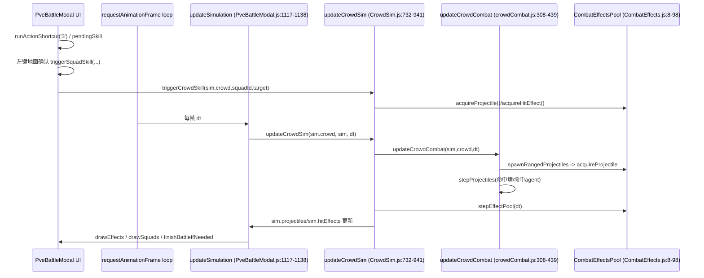

# PVE Unit Skills & Ranged Attacks Context for neruoWar

## 0. Scope
- 本文是静态审计文档，目标是为后续“单位技能/远程投射物/命中结算”改造提供证据化上下文。
- 本次未执行项目运行验证（`npm start` / 浏览器实机），“运行行为”部分均标注为静态推断。
- 战斗权威、技能执行、投射物命中主要审计范围：
  - 前端：`frontend/src/components/game/PveBattleModal.js`
  - 前端模拟：`frontend/src/game/battle/crowd/CrowdSim.js`、`frontend/src/game/battle/crowd/crowdCombat.js`
  - 特效与投射物池：`frontend/src/game/battle/effects/CombatEffects.js`
  - 几何与 LOS：`frontend/src/game/battle/crowd/crowdPhysics.js`、`frontend/src/components/game/battleMath.js`
  - 后端接口与持久化：`backend/routes/nodes.js`、`backend/models/SiegeBattleRecord.js`

审计使用的关键词命令（满足要求）：
```bash
rg -n -i "skill|pendingSkill|cast|targeting|ground|circle|radius|aoe|area|barrage|volley|arrow|archer|artillery|projectile|hit|splash|damage|cooldown|ability|command|技能|落点|圆|范围|齐射|贯射|弹道|投射物|命中|伤害|AOE|炮击" frontend backend
```

命中摘要（按命中量粗排，去除 lock/css 噪音后）：
1. `frontend/src/components/game/PveBattleModal.js` (237)
2. `frontend/src/game/battle/crowd/CrowdSim.js` (100)
3. `frontend/src/game/battle/crowd/crowdCombat.js` (89)
4. `frontend/src/game/battle/effects/CombatEffects.js` (31)
5. `frontend/src/game/battle/crowd/engagement.js` (12)
6. `backend/routes/nodes.js` (10)

## 1. UI Flow: Select Unit → Choose Skill → Place Target Circle → Confirm/Cancel
结论：技能 UI 流程是“选择我方卡片/部队 -> 按 3 或旗帜按钮进入 `pendingSkill` -> 地面显示瞄准覆盖层 -> 左键确认释放 / 右键取消（第一次）”。

证据片段 1（入口状态与关键 state）  
文件：`frontend/src/components/game/PveBattleModal.js`（函数/变量：`selectedSquadId`、`pendingSkill`）行 2202-2224
```js
  2202  const [phase, setPhase] = useState('compose');
  2203  const [composeGroups, setComposeGroups] = useState([]);
  2204  const [selectedGroupId, setSelectedGroupId] = useState('');
  2205  const [activeComposeMoveId, setActiveComposeMoveId] = useState('');
  2206  const [cameraPitch, setCameraPitch] = useState(DEFAULT_PITCH);
  2207  const [cameraYaw, setCameraYaw] = useState(DEFAULT_YAW);
  2208  const [zoom, setZoom] = useState(DEFAULT_ZOOM);
  2209  const [isPanning, setIsPanning] = useState(false);
  2210  const [isRotating, setIsRotating] = useState(false);
  2211  const [selectedSquadId, setSelectedSquadId] = useState('');
  2212  const [hoverSquadId, setHoverSquadId] = useState('');
  2213  const [cardRows, setCardRows] = useState([]);
  2214  const [battleTimerSec, setBattleTimerSec] = useState(DEFAULT_TIME_LIMIT);
  2215  const [toast, setToast] = useState('');
  2216  const [pendingSkill, setPendingSkill] = useState(null);
  2217  const [floatingActionsPos, setFloatingActionsPos] = useState(null);
  2218  const [composeGroupActionsPos, setComposeGroupActionsPos] = useState(null);
  2219  const [battleResult, setBattleResult] = useState(null);
  2220  const [postingResult, setPostingResult] = useState(false);
  2221  const [resultSaveError, setResultSaveError] = useState('');
  2222  const [composeEditorOpen, setComposeEditorOpen] = useState(false);
  2223  const [composeEditorTargetGroupId, setComposeEditorTargetGroupId] = useState('');
  2224  const [composeEditorDraft, setComposeEditorDraft] = useState({ name: '', sortOrder: 1, units: {} });
```

证据片段 2（选择技能动作，设置 `pendingSkill`）  
文件：`frontend/src/components/game/PveBattleModal.js`（函数：`runActionShortcut`）行 3031-3055
```js
  3031  const runActionShortcut = useCallback((actionKey) => {
  3032    const sim = simRef.current;
  3033    if (!sim || phase !== 'battle' || sim.ended) return;
  3034    const squadId = selectedSquadIdRef.current;
  3035    if (!squadId) return;
  ...
  3047    if (actionKey === '3') {
  3048      const squad = findSquadById(sim, squadId);
  3049      if (!squad || squad.remain <= 0) return;
  3050      if (squad.morale <= 0) {
  3051        showToast('士气为 0，无法发动兵种攻击');
  3052        return;
  3053      }
  3054      setPendingSkill({ squadId, classTag: squad.classTag });
  3055      return;
```

证据片段 3（绘制落点圈/箭头等瞄准覆盖层）  
文件：`frontend/src/components/game/PveBattleModal.js`（函数：`buildSkillAimOverlay`、`drawSkillAimOverlay`）行 1815-1889、1903-1969
```js
  1815  const buildSkillAimOverlay = (sim, selectedSquad, aimWorld, view, pitch, yaw) => {
  1816    if (!selectedSquad || !aimWorld) return null;
  1817    const maxRange = skillRangeByClass(selectedSquad.classTag);
  ...
  1858    if (selectedSquad.classTag === 'archer') {
  1859      const points = [];
  1860      const radius = 72;
  ...
  1869      for (const building of (sim?.buildings || [])) {
  1870        if (building.destroyed) continue;
  1871        const hit = lineIntersectsRotatedRect({ x: selectedSquad.x, y: selectedSquad.y }, raw, building);
  1872        if (hit && hit.t >= 0 && hit.t <= 1) {
  1873          clipped = {
  1874            x: selectedSquad.x + ((raw.x - selectedSquad.x) * Math.max(0, hit.t - 0.03)),
  1875            y: selectedSquad.y + ((raw.y - selectedSquad.y) * Math.max(0, hit.t - 0.03))
  1876          };
  1877          break;
  1878        }
  1879      }
  ...
  1903  const drawSkillAimOverlay = (ctx, overlay) => {
  1904    if (!overlay) return;
  1905    if (overlay.type === 'cavalry' && overlay.arrow) {
  ...
  1964      ctx.beginPath();
  1965      ctx.arc(targetScreen.x, targetScreen.y, overlay.type === 'artillery' ? 34 : 30, 0, Math.PI * 2);
  1966      ctx.fillStyle = overlay.type === 'artillery' ? 'rgba(248, 113, 113, 0.18)' : 'rgba(56, 189, 248, 0.18)';
  1967      ctx.strokeStyle = overlay.type === 'artillery' ? 'rgba(248, 113, 113, 0.78)' : 'rgba(125, 211, 252, 0.78)';
  1968      ctx.lineWidth = 1;
  1969      ctx.fill();
```

证据片段 4（左键确认释放 / 右键取消）  
文件：`frontend/src/components/game/PveBattleModal.js`（函数：`handleCanvasPointerDown`）行 2797-2804、2878-2884
```js
  2797  if (phase === 'battle') {
  2798    const sim = simRef.current;
  2799    if (!sim || sim.ended) return;
  2800    if (pendingSkill) {
  2801      setPendingSkill(null);
  2802      showToast('已取消兵种攻击瞄准');
  2803      return;
  2804    }
  ...
  2878  if (pendingSkill && pendingSkill.squadId === selectedSquadIdRef.current) {
  2879    const result = triggerSquadSkill(sim, pendingSkill.squadId, worldPoint);
  2880    if (!result.ok) {
  2881      showToast(result.reason || '兵种攻击执行失败');
  2882    }
  2883    setPendingSkill(null);
  2884    return;
```

推断/影响：
- UI 层存在完整技能瞄准/确认/取消闭环。
- `pendingSkill` 为单值状态，当前没有“多指令队列”或“技能前摇中可中断态”。

## 2. Simulation Flow: Skill Order → Skill Event → Projectile Spawn → Hit/AoE Resolve
结论：运行时主链路是 `requestAnimationFrame -> updateSimulation -> updateCrowdSim -> updateCrowdCombat -> stepProjectiles -> stepEffectPool`；技能命令通过 `triggerSquadSkill` 进入 `triggerCrowdSkill`，再写入 `effectsPool.projectileLive`。



证据片段 1（rAF 驱动和 battle 分支）  
文件：`frontend/src/components/game/PveBattleModal.js`（函数：`renderFrame`）行 3107-3243
```js
  3107  let rafId = 0;
  3108  let lastTs = performance.now();
  3110  const renderFrame = (ts) => {
  ...
  3130    const dt = Math.min(0.05, Math.max(0.001, (ts - lastTs) / 1000));
  ...
  3190    if (phase === 'battle') {
  3191      const sim = simRef.current;
  3192      if (sim) {
  3193        updateSimulation(sim, dt);
  3194        drawBuildings(ctx, sim, view, cameraPitch, cameraYaw);
  3195        drawBattleMoveGuides(ctx, sim, view, cameraPitch, cameraYaw, selectedSquadIdRef.current);
  3196        drawEffects(ctx, sim, view, cameraPitch, cameraYaw);
  ...
  3238        finishBattleIfNeeded(sim);
  3239      }
  3240    }
  3242    rafId = requestAnimationFrame(renderFrame);
```

证据片段 2（simulation 分发到 crowd）  
文件：`frontend/src/components/game/PveBattleModal.js`（函数：`updateSimulation`）行 1117-1138
```js
  1117  const updateSimulation = (sim, dt) => {
  1118    if (!sim || sim.ended) return;
  1119    sim.timerSec = Math.max(0, sim.timerSec - dt);
  1121    sim.effects = (sim.effects || []).map((effect) => ({ ...effect, ttl: effect.ttl - dt })).filter((effect) => effect.ttl > 0);
  1123    if (sim.crowd) {
  1124      updateCrowdSim(sim.crowd, sim, dt);
  1125    } else {
  1126      (sim.squads || []).forEach((squad) => updateSquadCombat(sim, squad, dt));
  1127    }
  1128    updateMoraleDecay(sim, dt);
  ...
  1132    if (sim.timerSec <= 0 || attackerAlive <= 0 || defenderAlive <= 0) {
  1133      sim.ended = true;
```

证据片段 3（crowd 内部调用链和写回）  
文件：`frontend/src/game/battle/crowd/CrowdSim.js`（函数：`updateCrowdSim`）行 744-747、937-941
```js
   744  const spatial = buildSpatialHash(crowd.allAgents, 14);
   745  crowd.spatial = spatial;
   746  syncMeleeEngagement(crowd, sim, walls, safeDt, Number(sim?.timeElapsed) || 0);
   747
  ...
   937  updateCrowdCombat(sim, crowd, safeDt);
   938  stepEffectPool(crowd.effectsPool, safeDt);
   939  sim.projectiles = crowd.effectsPool.projectileLive;
   940  sim.hitEffects = crowd.effectsPool.hitLive;
```

证据片段 4（技能命令进入 crowd）  
文件：`frontend/src/components/game/PveBattleModal.js` / `frontend/src/game/battle/crowd/CrowdSim.js`（函数：`triggerSquadSkill`、`triggerCrowdSkill`）行 862-865、644-650
```js
// PveBattleModal.js
  862  const triggerSquadSkill = (sim, squadId, worldPoint) => {
  863    if (sim?.crowd) {
  864      return triggerCrowdSkill(sim, sim.crowd, squadId, worldPoint);
  865    }

// CrowdSim.js
  644  export const triggerCrowdSkill = (sim, crowd, squadId, targetPoint) => {
  645    const squad = (sim?.squads || []).find((row) => row.id === squadId);
  646    if (!squad || squad.remain <= 0) return { ok: false, reason: '部队不可用' };
  647    if ((Number(squad.morale) || 0) <= 0) return { ok: false, reason: '士气归零，无法发动兵种攻击' };
  648    const agents = getCrowdAgentsForSquad(crowd, squad.id);
  649    if (agents.length <= 0) return { ok: false, reason: '无可用士兵' };
```

推断/影响：
- 当前运行时 skill/combat 主权在前端 crowd；后端只提供 init 和记录 result。
- 若 `sim.crowd` 缺失会退回 legacy squad combat 路径（存在行为差异风险）。

## 3. Projectile Data Schema (fields & lifecycle)
结论：projectile/hit effect 使用对象池，字段由 `CombatEffects.resetProjectile/resetHitEffect` 统一初始化；生命周期为 spawn(`acquireProjectile`) -> step(`stepProjectiles`) -> recycle(`stepEffectPool`)。

证据片段 1（projectile/hit schema）  
文件：`frontend/src/game/battle/effects/CombatEffects.js`（函数：`resetProjectile`、`resetHitEffect`）行 16-53
```js
   16  const resetProjectile = (item, payload = {}) => {
   17    const next = item || {};
   18    next.id = `proj_${payload.id || 0}`;
   19    next.type = payload.type || 'arrow';
   20    next.team = payload.team || '';
   21    next.squadId = payload.squadId || '';
   22    next.sourceAgentId = payload.sourceAgentId || '';
   23    next.x = Number(payload.x) || 0;
   24    next.y = Number(payload.y) || 0;
   25    next.z = Number(payload.z) || 3;
   26    next.vx = Number(payload.vx) || 0;
   27    next.vy = Number(payload.vy) || 0;
   28    next.vz = Number(payload.vz) || 0;
   29    next.gravity = Number.isFinite(Number(payload.gravity)) ? Number(payload.gravity) : 0;
   30    next.damage = Math.max(0, Number(payload.damage) || 0);
   31    next.radius = Math.max(0.2, Number(payload.radius) || 2.2);
   32    next.ttl = Math.max(0.02, Number(payload.ttl) || 1.2);
   33    next.elapsed = 0;
   34    next.spawnedAt = payload.spawnedAt || nowMs();
   35    next.targetTeam = payload.targetTeam || '';
   36    next.hit = false;
   37    return next;
   38  };
   39
   40  const resetHitEffect = (item, payload = {}) => {
   41    const next = item || {};
   42    next.id = `hit_${payload.id || 0}`;
   43    next.type = payload.type || 'hit';
   44    next.x = Number(payload.x) || 0;
   45    next.y = Number(payload.y) || 0;
   46    next.z = Number(payload.z) || 2;
   47    next.radius = Math.max(0.4, Number(payload.radius) || 3);
   48    next.ttl = Math.max(0.04, Number(payload.ttl) || 0.18);
   49    next.elapsed = 0;
   50    next.team = payload.team || '';
   51    next.spawnedAt = payload.spawnedAt || nowMs();
   52    return next;
   53  };
```

证据片段 2（spawn 与回收）  
文件：`frontend/src/game/battle/effects/CombatEffects.js`（函数：`acquireProjectile`、`stepEffectPool`）行 55-97
```js
   55  export const acquireProjectile = (pool, payload = {}) => {
   56    if (!pool) return null;
   57    const node = pool.projectileFree.pop() || {};
   58    const built = resetProjectile(node, {
   59      ...payload,
   60      id: pool.nextId += 1
   61    });
   62    pool.projectileLive.push(built);
   63    return built;
   64  };
  ...
   81  for (let i = pool.projectileLive.length - 1; i >= 0; i -= 1) {
   82    const p = pool.projectileLive[i];
   83    p.elapsed += safeDt;
   84    p.ttl -= safeDt;
   85    if (p.ttl > 0 && !p.hit) continue;
   86    pool.projectileLive.splice(i, 1);
   87    pool.projectileFree.push(p);
   88  }
```

证据片段 3（ranged spawn 参数）  
文件：`frontend/src/game/battle/crowd/crowdCombat.js`（函数：`spawnRangedProjectiles`）行 179-210
```js
  179  const spawnRangedProjectiles = (sim, crowd, attackerSquad, sourceAgent, targetAgent, category, baseDamage) => {
  180    const count = category === 'artillery'
  181      ? Math.max(3, Math.min(6, 2 + Math.floor(Math.log2(Math.max(1, Number(sourceAgent?.weight) || 1)))))
  182      : projectileCountFromWeight(sourceAgent.weight);
  183    const speed = projectileSpeedByCategory(category);
  184    const gravity = category === 'artillery' ? 95 : 70;
  ...
  193    acquireProjectile(crowd.effectsPool, {
  194      type: category === 'artillery' ? 'shell' : 'arrow',
  195      team: sourceAgent.team,
  196      squadId: attackerSquad.id,
  197      sourceAgentId: sourceAgent.id,
  198      x: sourceAgent.x,
  199      y: sourceAgent.y,
  200      z: category === 'artillery' ? 6 : 4.2,
  201      vx: dir.x * speed,
  202      vy: dir.y * speed,
  203      vz: category === 'artillery' ? 44 : 28,
  204      gravity,
  205      damage: baseDamage * (category === 'artillery' ? (1.05 + (i * 0.06)) : (0.9 + (i * 0.08))),
  206      radius: category === 'artillery' ? 4.5 : 2.2,
  207      ttl: category === 'artillery' ? 2.2 : 1.5,
  208      targetTeam: toEnemyTeam(sourceAgent.team)
  209    });
  210  }
```

Projectile 字段清单（依据 `CombatEffects.js:16-37`）：
- `id`, `type` (`arrow|shell`), `team`, `squadId`, `sourceAgentId`
- `x,y,z`, `vx,vy,vz`, `gravity`
- `damage`, `radius`, `ttl`, `elapsed`, `spawnedAt`, `targetTeam`, `hit`

## 4. Hit Resolution: Direct Hit vs Splash/AoE vs Wall Collision
结论：
- 支持“直击 agent 命中”和“命中墙体后扣墙血并可摧毁”。
- 当前 crowd 路径下，炮弹 explosion 主要是视觉效果；没有显式半径 AoE 对多个 agent 的伤害循环。
- UI 瞄准阶段有“弓兵落点被墙裁剪”的预览逻辑，但这不是最终伤害求解本体。

证据片段 1（墙体碰撞与建筑受伤）  
文件：`frontend/src/game/battle/crowd/crowdCombat.js`（函数：`canProjectileHitWall`、`stepProjectiles`）行 237-279
```js
  237  const canProjectileHitWall = (proj, walls = []) => {
  238    for (let i = 0; i < walls.length; i += 1) {
  239      const wall = walls[i];
  240      if (!wall || wall.destroyed) continue;
  241      if (isInsideRotatedRect({ x: proj.x, y: proj.y }, wall, proj.radius * 0.25)) {
  242        return wall;
  243      }
  244    }
  245    return null;
  246  };
  ...
  270  const hitWall = canProjectileHitWall(p, sim?.buildings || []);
  271  if (hitWall) {
  272    p.hit = true;
  273    if (p.type === 'shell') {
  274      const wallDamage = Math.max(1, p.damage * 0.68);
  275      hitWall.hp = Math.max(0, (Number(hitWall.hp) || 0) - wallDamage);
  276      if (hitWall.hp <= 0 && !hitWall.destroyed) {
  277        hitWall.destroyed = true;
  278        sim.destroyedBuildings = Math.max(0, Number(sim.destroyedBuildings) || 0) + 1;
  279      }
```

证据片段 2（直击 agent 命中；命中后 `break`）  
文件：`frontend/src/game/battle/crowd/crowdCombat.js`（函数：`stepProjectiles`）行 292-304
```js
  292  const nearbyAgents = querySpatialNearby(crowd?.spatial, p.x, p.y, Math.max(8, (Number(p.radius) || 2) * 2.8));
  293  const targetAgents = nearbyAgents.filter((agent) => agent && agent.team === p.targetTeam && !agent.dead);
  294  for (let k = 0; k < targetAgents.length; k += 1) {
  295    const target = targetAgents[k];
  296    const hitRadius = Math.max(1.6, (target.radius || 2.6) + (p.radius * 0.25));
  297    if (distanceSq(p, target) > (hitRadius * hitRadius)) continue;
  298    p.hit = true;
  299    applyDamageToAgent(sim, crowd, { squadId: p.squadId, team: p.team }, target, p.damage, p.type === 'shell' ? 'explosion' : 'hit');
  300    if (p.type === 'shell' && !target.dead) {
  301      applyShellKnockback(sim, target, p);
  302    }
  303    break;
  304  }
```

证据片段 3（瞄准预览阶段的墙体裁剪）  
文件：`frontend/src/components/game/PveBattleModal.js`（函数：`buildSkillAimOverlay`）行 1869-1887
```js
  1869  for (const building of (sim?.buildings || [])) {
  1870    if (building.destroyed) continue;
  1871    const hit = lineIntersectsRotatedRect({ x: selectedSquad.x, y: selectedSquad.y }, raw, building);
  1872    if (hit && hit.t >= 0 && hit.t <= 1) {
  1873      clipped = {
  1874        x: selectedSquad.x + ((raw.x - selectedSquad.x) * Math.max(0, hit.t - 0.03)),
  1875        y: selectedSquad.y + ((raw.y - selectedSquad.y) * Math.max(0, hit.t - 0.03))
  1876      };
  1877      break;
  1878    }
  1879  }
  ...
  1886  clippedArea: points,
  1887  arcHeight: clamp(90 - (dist * 0.18), 24, 78),
```

证据片段 4（legacy 路径曾有 squad-AoE，crowd 路径优先）  
文件：`frontend/src/components/game/PveBattleModal.js`（函数：`applyArtillerySkill`、`updateSimulation`）行 834-842、1123-1126
```js
  834  const applyArtillerySkill = (sim, squad, targetPoint) => {
  835    const radius = 100;
  836    const enemies = getAliveSquads(sim, TEAM_DEFENDER);
  837    enemies.forEach((enemy) => {
  838      const d = Math.hypot(enemy.x - targetPoint.x, enemy.y - targetPoint.y);
  839      if (d > radius + enemy.radius) return;
  840      const falloff = 1 - clamp(d / (radius + enemy.radius), 0, 0.95);
  841      applyDamageToSquad(sim, squad, enemy, (38 + (squad.stats.atk * 1.1)) * (0.52 + falloff));
  842    });
...
 1123  if (sim.crowd) {
 1124    updateCrowdSim(sim.crowd, sim, dt);
 1125  } else {
 1126    (sim.squads || []).forEach((squad) => updateSquadCombat(sim, squad, dt));
```

推断/影响：
- 运行主路径（crowd）下“爆炸范围伤害”缺失，会导致炮击观感偏单点。
- 预览裁剪与真实命中并未统一到同一 geometry pipeline（一个在 UI overlay，一个在 projectile step）。

## 5. Existing Skill List (What skills already exist, if any)
结论：当前已有 4 类技能（步/骑/弓/炮），并存在 crowd 与 legacy 两套实现；运行时默认走 crowd 技能逻辑。

证据片段 1（crowd 技能分支与参数）  
文件：`frontend/src/game/battle/crowd/CrowdSim.js`（函数：`triggerCrowdSkill`）行 653-729
```js
  653  if (squad.classTag === 'infantry') {
  654    squad.effectBuff = { type: 'infantry', ttl: 7.5, atkMul: 1.22, defMul: 1.3, speedMul: 0.78 };
  661    squad.waypoints = [{ x: tx, y: ty }];
  662    squad.attackCooldown = Math.max(Number(squad.attackCooldown) || 0, 2.1);
  663    squad.action = '兵种攻击';
  664    return { ok: true };
  665  }
  667  if (squad.classTag === 'cavalry') {
  670    squad.skillRush = { ttl: ..., dirX: dir.x, dirY: dir.y, remainDistance: dist, hitAgentIds: new Set(), ... };
  681    squad.stamina = clamp((Number(squad.stamina) || 0) - 32, 0, STAMINA_MAX);
  682    squad.attackCooldown = Math.max(Number(squad.attackCooldown) || 0, 2.8);
  683    squad.action = '兵种攻击';
  684    return { ok: true };
  685  }
  687  const volleyCount = Math.max(3, Math.min(8, Math.floor(Math.sqrt(agents.length)) + 2));
  697  const isArtillery = squad.classTag === 'artillery';
  700  acquireProjectile(crowd.effectsPool, { type: isArtillery ? 'shell' : 'arrow', ... });
  727  squad.attackCooldown = Math.max(Number(squad.attackCooldown) || 0, squad.classTag === 'artillery' ? 3.1 : 1.9);
  728  squad.action = '兵种攻击';
```

证据片段 2（普攻节奏 CD）  
文件：`frontend/src/game/battle/crowd/crowdCombat.js`（常量/逻辑：`cooldownByCategory`、`agent.attackCd`）行 42-47、434
```js
   42  const cooldownByCategory = (category = 'infantry') => {
   43    if (category === 'artillery') return 4.8;
   44    if (category === 'archer') return 1.16;
   45    if (category === 'cavalry') return 0.86;
   46    return 0.74;
   47  };
...
  434  agent.attackCd = cooldownByCategory(squad.classTag) * (0.86 + Math.random() * 0.22);
```

证据片段 3（legacy 技能列表仍在）  
文件：`frontend/src/components/game/PveBattleModal.js`（函数：`applyInfantrySkill`~`applyArtillerySkill`）行 774-859
```js
  774  const applyInfantrySkill = (sim, squad, targetPoint) => { ... };
  796  const applyCavalrySkill = (sim, squad, targetPoint) => { ... };
  813  const applyArcherSkill = (sim, squad, targetPoint) => { ... sim.effects.push({ type: 'archer', ... }) ... };
  834  const applyArtillerySkill = (sim, squad, targetPoint) => { ... sim.effects.push({ type: 'artillery', ... }) ... };
  862  const triggerSquadSkill = (sim, squadId, worldPoint) => {
  863    if (sim?.crowd) {
  864      return triggerCrowdSkill(sim, sim.crowd, squadId, worldPoint);
  865    }
```

技能清单（静态归纳）：
- 步兵 `infantry`
  - 触发：`triggerCrowdSkill` classTag 分支
  - 效果：`effectBuff{atkMul, defMul, speedMul}` + 向目标推进
  - 技能后摇：`attackCooldown >= 2.1`
- 骑兵 `cavalry`
  - 效果：`skillRush{dir, remainDistance}` + 冲锋路径撞击（`applyCavalryRushImpact`）
  - 消耗：`stamina -32`
  - 技能后摇：`attackCooldown >= 2.8`
- 弓兵 `archer`
  - 效果：从若干 shooter 发射 `arrow` projectile
  - 技能后摇：`attackCooldown >= 1.9`
- 炮兵 `artillery`
  - 效果：发射 `shell` projectile，命中墙可掉耐久并摧毁
  - 技能后摇：`attackCooldown >= 3.1`

## 6. Gaps vs Desired Design (evidence-based)
结论：当前实现已具备“技能命令→投射物→命中”的最小闭环，但与“可精细调优的齐射/弹幕/贯射体系”仍有结构性缺口。

| Gap | Evidence | Why it matters |
|---|---|---|
| 1. 无显式施法阶段（cast/channel/interrupt） | `frontend/src/components/game/PveBattleModal.js:2878-2884` 左键即 `triggerSquadSkill`; `frontend/src/game/battle/crowd/CrowdSim.js:644-729` 立即写入技能效果/投射物 | 难支持“读条、打断、前摇后摇分离” |
| 2. crowd 路径下炮弹/箭缺少真实 AoE 伤害循环 | `frontend/src/game/battle/crowd/crowdCombat.js:292-304` 命中一个目标后 `break`；未见按半径遍历多目标 | 炮击观感偏“单点命中”，与弹幕/溅射设计不符 |
| 3. LOS 在选 squad 目标有惩罚，但技能执行时未强校验 LOS | `frontend/src/game/battle/crowd/crowdCombat.js:73-83`（选敌 LOS 罚分）；`frontend/src/game/battle/crowd/CrowdSim.js:687-717`（直接按 targetPoint 发射） | 可能出现“能选中但弹道行为与预期不一致” |
| 4. 弓兵遮挡裁剪仅在 UI 预览层，非统一命中内核 | `frontend/src/components/game/PveBattleModal.js:1869-1877` 只影响 overlay；真实命中在 `crowdCombat.js:248-306` | 预览与实算可能出现偏差 |
| 5. 投射物与墙碰撞使用离散点检测，缺少 segment sweep | `frontend/src/game/battle/crowd/crowdCombat.js:241-242` `isInsideRotatedRect({x:p.x,y:p.y},...)` | 高速弹体存在穿透风险（tunneling） |
| 6. 存在 crowd 与 legacy 双技能实现分叉 | `frontend/src/components/game/PveBattleModal.js:862-865`（crowd优先）；`774-859`（legacy技能仍在） | 维护成本高、回归风险大（两套参数/判定） |
| 7. 技能参数主要硬编码在前端，非数据驱动能力系统 | `frontend/src/game/battle/crowd/CrowdSim.js:653-729`（ttl/倍率/CD硬编码） | 后续扩展 volley/barrage/piercing 需要频繁改代码 |
| 8. 目标选择仍偏“近邻+局部扫描”，无显式仇恨/优先级队列 | `frontend/src/game/battle/crowd/crowdCombat.js:392-399` + `98-110` | 混战中的战术可控性和可解释性有限 |
| 9. 战斗结果后端仅做记录，模拟权威在前端 | `backend/routes/nodes.js:7701-7761`（接收 summary 直接存储）；`frontend/src/components/game/PveBattleModal.js:2535-2544`（客户端上报） | PVP/PVE一致性校验、回放与反作弊能力受限 |

附加证据（后端记录模型）：`backend/models/SiegeBattleRecord.js:47-60`（只存聚合结果，不存投射物/命中轨迹）。

证据片段 A（crowd 命中单目标后中断，缺少 AoE 循环）  
文件：`frontend/src/game/battle/crowd/crowdCombat.js`（函数：`stepProjectiles`）行 292-304
```js
  292  const nearbyAgents = querySpatialNearby(crowd?.spatial, p.x, p.y, Math.max(8, (Number(p.radius) || 2) * 2.8));
  293  const targetAgents = nearbyAgents.filter((agent) => agent && agent.team === p.targetTeam && !agent.dead);
  294  for (let k = 0; k < targetAgents.length; k += 1) {
  295    const target = targetAgents[k];
  296    const hitRadius = Math.max(1.6, (target.radius || 2.6) + (p.radius * 0.25));
  297    if (distanceSq(p, target) > (hitRadius * hitRadius)) continue;
  298    p.hit = true;
  299    applyDamageToAgent(sim, crowd, { squadId: p.squadId, team: p.team }, target, p.damage, p.type === 'shell' ? 'explosion' : 'hit');
  300    if (p.type === 'shell' && !target.dead) {
  301      applyShellKnockback(sim, target, p);
  302    }
  303    break;
  304  }
```

证据片段 B（前端提交结果，后端按 battleId 去重后直接记录）  
文件：`frontend/src/components/game/PveBattleModal.js` / `backend/routes/nodes.js`（函数：`saveBattleResult` / `battle-result` route）行 2535-2544、7733-7755
```js
// PveBattleModal.js
  2535  const response = await fetch(`${API_BASE}/api/nodes/${battleInitData.nodeId}/siege/pve/battle-result`, {
  2536    method: 'POST',
  2537    headers: {
  2538      'Content-Type': 'application/json',
  2539      Authorization: `Bearer ${token}`
  2540    },
  2541    body: JSON.stringify({
  2542      ...summary,
  2543      startedAt: battleInitData?.serverTime || null
  2544    })

// nodes.js
  7733  const existing = await SiegeBattleRecord.findOne({ battleId }).select('_id battleId').lean();
  7743  await SiegeBattleRecord.create({
  7744    nodeId: node._id,
  7745    gateKey,
  7746    battleId,
  7747    attackerUserId: requestUserId,
  7748    attackerAllianceId: user?.allianceId || null,
  7749    startedAt,
  7750    endedAt,
  7751    durationSec,
  7752    attacker,
  7753    defender,
  7754    details
  7755  });
```

## 7. Hook Points for Implementing Volley / Barrage / Piercing Shot
结论：以下位置可在不改后端协议前提下增量实现“齐射/弹幕/贯射”；优先把“瞄准预览几何”和“命中几何”统一到同一函数族。

1. Hook: 技能命令载荷扩展（UI 层）  
- 位置：`frontend/src/components/game/PveBattleModal.js`  
- 证据：`runActionShortcut` (`3031-3055`), `pendingSkill` (`2216`), 确认释放 (`2878-2884`)  
- 接口建议（不实现）：
  - `pendingSkill = { squadId, classTag, mode, pattern, radius, pierceCount, spreadSeed }`
  - 右键取消仍复用现有逻辑。

2. Hook: crowd 技能入口统一（命令翻译层）  
- 位置：`frontend/src/game/battle/crowd/CrowdSim.js` `triggerCrowdSkill` (`644-729`)  
- 当前输入：`(sim,crowd,squadId,targetPoint)`  
- 可扩展输入：`targetSpec`（点目标/区域目标/方向目标），将 volley/barrage/piercing 参数下传到 projectile payload。

3. Hook: 投射物 schema 扩展（核心）  
- 位置：`frontend/src/game/battle/effects/CombatEffects.js` `resetProjectile` (`16-37`)  
- 可扩展字段（不实现）：
  - `blastRadius`, `blastFalloff`, `pierceRemain`, `pierceDecay`, `patternId`, `seed`, `canHitMultiple`, `maxHitsPerFrame`。

4. Hook: 命中求解器拆层（direct / splash / piercing）  
- 位置：`frontend/src/game/battle/crowd/crowdCombat.js` `stepProjectiles` (`248-306`)  
- 建议接口（不实现）：
  - `resolveProjectileWallHit(p, walls)`
  - `resolveProjectileAgentHit(p, crowd.spatial)`
  - `resolveSplashDamage(p, crowd.spatial, sim.squads)`
  - `resolvePiercingContinuation(p, firstHit)`

5. Hook: 预览-实算几何统一  
- 位置：`frontend/src/components/game/PveBattleModal.js` `buildSkillAimOverlay` (`1815-1901`)，`frontend/src/components/game/battleMath.js` `lineIntersectsRotatedRect` (`127-140`)，`frontend/src/game/battle/crowd/crowdPhysics.js` `lineIntersectsRotatedRect` (`86-105`)  
- 现状：UI 与 sim 使用两套不同签名（一个返回 `hit.t`，一个返回 boolean）。
- 建议：抽象统一 `raycastRect` 返回命中点/法线/t，供 overlay 与 sim 共享。

6. Hook: 后端仅存聚合结果，保持协议不变下新增可选 debug 字段  
- 位置：`backend/routes/nodes.js` `battle-result` (`7701-7761`)  
- 当前协议可容纳 `details`（`sanitizeBattleResultDetails`, `3034-3054`）；可用作“技能统计”落盘（如 volley 次数、命中率）而不改主接口。

证据片段（Hook 2 + Hook 3 对应入口）  
文件：`frontend/src/game/battle/crowd/CrowdSim.js` / `frontend/src/game/battle/effects/CombatEffects.js`（函数：`triggerCrowdSkill`、`resetProjectile`）行 644-651、687-701、16-23
```js
// CrowdSim.js
  644  export const triggerCrowdSkill = (sim, crowd, squadId, targetPoint) => {
  645    const squad = (sim?.squads || []).find((row) => row.id === squadId);
  650    const tx = Number(targetPoint?.x) || squad.x || 0;
  651    const ty = Number(targetPoint?.y) || squad.y || 0;
  ...
  687  const volleyCount = Math.max(3, Math.min(8, Math.floor(Math.sqrt(agents.length)) + 2));
  700  acquireProjectile(crowd.effectsPool, {
  701    type: isArtillery ? 'shell' : 'arrow',

// CombatEffects.js
   16  const resetProjectile = (item, payload = {}) => {
   17    const next = item || {};
   18    next.id = `proj_${payload.id || 0}`;
   19    next.type = payload.type || 'arrow';
   20    next.team = payload.team || '';
   21    next.squadId = payload.squadId || '';
   22    next.sourceAgentId = payload.sourceAgentId || '';
   23    next.x = Number(payload.x) || 0;
```

# Addendum: Evidence Needed for Ground-Targeted Skills

## 8. Full Archer/Artillery Skill Implementation Evidence (triggerCrowdSkill)
结论：
- 运行时（crowd 路径）弓兵/炮兵技能在 `triggerCrowdSkill` 走同一分支：先挑选 shooter，再按 shooter 逐个发射 projectile。
- shooter 数量由 `volleyCount = clamp(sqrt(agentCount)+2, 3..8)` 决定，且优先选择 `weight` 最大的 agent。
- 该技能分支不读取 UI overlay 的 `arcHeight`/`clippedArea`；只消费 `{x,y}` 目标点。

证据片段 1（技能执行主逻辑，含 shooter 选择、数量、投射物参数、状态写入）  
文件：`frontend/src/game/battle/crowd/CrowdSim.js`  
函数/常量：`triggerCrowdSkill`、`volleyCount`、`acquireProjectile`、`attackCooldown`  
行号：644-730
```js
   644  export const triggerCrowdSkill = (sim, crowd, squadId, targetPoint) => {
   645    const squad = (sim?.squads || []).find((row) => row.id === squadId);
   646    if (!squad || squad.remain <= 0) return { ok: false, reason: '部队不可用' };
   647    if ((Number(squad.morale) || 0) <= 0) return { ok: false, reason: '士气归零，无法发动兵种攻击' };
   648    const agents = getCrowdAgentsForSquad(crowd, squad.id);
   649    if (agents.length <= 0) return { ok: false, reason: '无可用士兵' };
   650    const tx = Number(targetPoint?.x) || squad.x || 0;
   651    const ty = Number(targetPoint?.y) || squad.y || 0;
   ...
   687    const volleyCount = Math.max(3, Math.min(8, Math.floor(Math.sqrt(agents.length)) + 2));
   688    const shooters = [...agents]
   689      .sort((a, b) => (b.weight - a.weight))
   690      .slice(0, volleyCount);
   691    const enemyTeam = squad.team === TEAM_ATTACKER ? TEAM_DEFENDER : TEAM_ATTACKER;
   692    shooters.forEach((agent, index) => {
   693      const dir = normalizeVec(
   694        tx - (agent.x || 0) + ((index - (shooters.length / 2)) * 2.2),
   695        ty - (agent.y || 0) + ((index - (shooters.length / 2)) * 2.2)
   696      );
   697      const isArtillery = squad.classTag === 'artillery';
   698      const speed = isArtillery ? 168 : 226;
   699      const gravity = isArtillery ? 95 : 70;
   700      acquireProjectile(crowd.effectsPool, {
   701        type: isArtillery ? 'shell' : 'arrow',
   702        team: squad.team,
   703        squadId: squad.id,
   704        sourceAgentId: agent.id,
   705        x: agent.x,
   706        y: agent.y,
   707        z: isArtillery ? 6 : 4.1,
   708        vx: dir.x * speed,
   709        vy: dir.y * speed,
   710        vz: isArtillery ? 42 : 27,
   711        gravity,
   712        damage: Math.max(0.3, (Number(squad.stats?.atk) || 10) * (isArtillery ? 0.14 : 0.08) * Math.max(1, Math.sqrt(agent.weight || 1))),
   713        radius: isArtillery ? 4.8 : 2.2,
   714        ttl: isArtillery ? 2.1 : 1.45,
   715        targetTeam: enemyTeam
   716      });
   717    });
   718    acquireHitEffect(crowd.effectsPool, {
   719      type: squad.classTag === 'artillery' ? 'explosion' : 'hit',
   720      x: tx,
   721      y: ty,
   722      z: 1.2,
   723      radius: squad.classTag === 'artillery' ? 10 : 6,
   724      ttl: squad.classTag === 'artillery' ? 0.34 : 0.22,
   725      team: squad.team
   726    });
   727    squad.attackCooldown = Math.max(Number(squad.attackCooldown) || 0, squad.classTag === 'artillery' ? 3.1 : 1.9);
   728    squad.action = '兵种攻击';
   729    return { ok: true };
   730  };
```

证据片段 2（UI overlay 中 `arcHeight/clippedArea` 仅用于绘制）  
文件：`frontend/src/components/game/PveBattleModal.js`  
函数：`buildSkillAimOverlay`、`drawSkillAimOverlay`  
行号：1858-1889、1951-1966
```js
  1858  if (selectedSquad.classTag === 'archer') {
  1859    const points = [];
  1860    const radius = 72;
  ...
  1882    return {
  1883      targetPoint,
  1884      originScreen,
  1885      targetScreen,
  1886      clippedArea: points,
  1887      arcHeight: clamp(90 - (dist * 0.18), 24, 78),
  1888      type: selectedSquad.classTag
  1889    };
  ...
  1951  if (overlay.clippedArea && overlay.clippedArea.length > 2) {
  1952    ctx.beginPath();
  1953    overlay.clippedArea.forEach((point, index) => {
  ...
  1964  } else {
  1965    ctx.arc(targetScreen.x, targetScreen.y, overlay.type === 'artillery' ? 34 : 30, 0, Math.PI * 2);
  1966    ctx.fillStyle = overlay.type === 'artillery' ? 'rgba(248, 113, 113, 0.18)' : 'rgba(56, 189, 248, 0.18)';
```

证据片段 3（battle 确认时仅传 worldPoint 给 sim）  
文件：`frontend/src/components/game/PveBattleModal.js`  
函数：`handleCanvasPointerDown`、`triggerSquadSkill`  
行号：2878-2884、862-865
```js
  2878  if (pendingSkill && pendingSkill.squadId === selectedSquadIdRef.current) {
  2879    const result = triggerSquadSkill(sim, pendingSkill.squadId, worldPoint);
  2880    if (!result.ok) {
  2881      showToast(result.reason || '兵种攻击执行失败');
  2882    }
  2883    setPendingSkill(null);
  2884    return;
...
   862  const triggerSquadSkill = (sim, squadId, worldPoint) => {
   863    if (sim?.crowd) {
   864      return triggerCrowdSkill(sim, sim.crowd, squadId, worldPoint);
   865    }
```

影响/改造启示：
- 现有“技能地面瞄准”在 crowd 路径下是“点目标”，不是“区域模板对象”。
- 若要做 Attack Ground Volley / Barrage，最小改造点是 `triggerCrowdSkill` 入参：从 `targetPoint` 升级为 `targetSpec`（含 AoE 半径、贯射参数、裁剪结果）。

## 9. Projectile Kinematics & Collision Order (stepProjectiles)
结论：
- 投射物采用 Euler 积分：`x,y,z` 每帧按速度推进，`vz` 受重力衰减。
- 命中顺序固定：先地面落地（`z<=0`）→ 再墙体碰撞 → 再 agent 碰撞。
- 当前墙体命中是离散点 `isInsideRotatedRect`，在高速+大 dt 下存在 tunneling 风险。

证据片段 1（运动学 + 命中顺序 + 命中特效）  
文件：`frontend/src/game/battle/crowd/crowdCombat.js`  
函数：`stepProjectiles`、`canProjectileHitWall`  
行号：237-306
```js
  237  const canProjectileHitWall = (proj, walls = []) => {
  238    for (let i = 0; i < walls.length; i += 1) {
  239      const wall = walls[i];
  240      if (!wall || wall.destroyed) continue;
  241      if (isInsideRotatedRect({ x: proj.x, y: proj.y }, wall, proj.radius * 0.25)) {
  242        return wall;
  243      }
  244    }
  245    return null;
  246  };
  247
  248  const stepProjectiles = (sim, crowd, dt) => {
  249    const live = crowd.effectsPool?.projectileLive || [];
  250    for (let i = 0; i < live.length; i += 1) {
  251      const p = live[i];
  252      if (!p || p.hit) continue;
  253      p.x += (p.vx * dt);
  254      p.y += (p.vy * dt);
  255      p.z += (p.vz * dt);
  256      p.vz -= (p.gravity * dt);
  257      if (p.z <= 0) {
  258        p.hit = true;
  259        acquireHitEffect(crowd.effectsPool, {
  260          type: p.type === 'shell' ? 'explosion' : 'hit',
  ...
  270      const hitWall = canProjectileHitWall(p, sim?.buildings || []);
  271      if (hitWall) {
  272        p.hit = true;
  ...
  281        acquireHitEffect(crowd.effectsPool, {
  282          type: p.type === 'shell' ? 'explosion' : 'hit',
  ...
  292      const nearbyAgents = querySpatialNearby(crowd?.spatial, p.x, p.y, Math.max(8, (Number(p.radius) || 2) * 2.8));
  ...
  298      p.hit = true;
  299      applyDamageToAgent(sim, crowd, { squadId: p.squadId, team: p.team }, target, p.damage, p.type === 'shell' ? 'explosion' : 'hit');
  300      if (p.type === 'shell' && !target.dead) {
  301        applyShellKnockback(sim, target, p);
  302      }
  303      break;
  304    }
  305  }
  306 };
```

证据片段 2（速度、抛体参数）  
文件：`frontend/src/game/battle/crowd/crowdCombat.js`  
函数：`projectileSpeedByCategory`、`spawnRangedProjectiles`  
行号：36-39、179-208
```js
   36  const projectileSpeedByCategory = (category = 'archer') => {
   37    if (category === 'artillery') return 170;
   38    if (category === 'archer') return 220;
   39    return 0;
   40  };
...
  179  const spawnRangedProjectiles = (sim, crowd, attackerSquad, sourceAgent, targetAgent, category, baseDamage) => {
  ...
  200      z: category === 'artillery' ? 6 : 4.2,
  201      vx: dir.x * speed,
  202      vy: dir.y * speed,
  203      vz: category === 'artillery' ? 44 : 28,
  204      gravity,
  205      damage: baseDamage * (category === 'artillery' ? (1.05 + (i * 0.06)) : (0.9 + (i * 0.08))),
  206      radius: category === 'artillery' ? 4.5 : 2.2,
  207      ttl: category === 'artillery' ? 2.2 : 1.5,
  208      targetTeam: toEnemyTeam(sourceAgent.team)
```

证据片段 3（最大 dt 与墙体最小厚度）  
文件：`frontend/src/components/game/PveBattleModal.js`  
函数：`renderFrame`、`buildObstacleList`  
行号：3130、341-342
```js
  3130  const dt = Math.min(0.05, Math.max(0.001, (ts - lastTs) / 1000));
...
   341  width: Math.max(12, Number(item?.width ?? obj?.width) || 104),
   342  depth: Math.max(12, Number(item?.depth ?? obj?.depth) || 24),
```

影响/改造启示：
- 以 `arrow speed=220` 且 `dt<=0.05`，单帧位移可达约 11 world units；与最小墙厚（12）同量级，离散点检测确实可能漏检边缘穿越。
- 要保证 Barrage 稳定命中，建议在 `stepProjectiles` 增加“上一帧点→当前帧点的 segment 与 OBB 相交”检测（而非仅当前位置点测）。

## 10. UI Target Circle Semantics vs Sim Usage (Range/Radius/Clipping)
结论：
- UI 的射程限制、落点圆、墙体裁剪当前主要服务于“可视瞄准反馈”。
- 在 crowd 路径里，sim 执行时接收的是 `worldPoint` 二维点，不接收 `clippedArea/arcHeight/screenCircleRadius`。
- `triggerSquadSkill` 的“maxRange clamp”只在 legacy 路径生效；crowd 路径直接旁路到 `triggerCrowdSkill`。

证据片段 1（UI 射程与 overlay 半径/裁剪）  
文件：`frontend/src/components/game/PveBattleModal.js`  
函数：`skillRangeByClass`、`buildSkillAimOverlay`、`drawSkillAimOverlay`  
行号：767-771、1817-1822、1860、1886-1888、1965
```js
   767  const skillRangeByClass = (classTag) => {
   768    if (classTag === 'cavalry') return 220;
   769    if (classTag === 'archer') return 260;
   770    if (classTag === 'artillery') return 310;
   771    return 180;
...
  1817  const maxRange = skillRangeByClass(selectedSquad.classTag);
  1820  const targetPoint = dist > maxRange
  1821    ? { x: selectedSquad.x + ((vec.x / dist) * maxRange), y: selectedSquad.y + ((vec.y / dist) * maxRange) }
  1822    : aimWorld;
...
  1860  const radius = 72;
...
  1886  clippedArea: points,
  1887  arcHeight: clamp(90 - (dist * 0.18), 24, 78),
...
  1965  ctx.arc(targetScreen.x, targetScreen.y, overlay.type === 'artillery' ? 34 : 30, 0, Math.PI * 2);
```

证据片段 2（worldPoint 来源与确认传参）  
文件：`frontend/src/components/game/PveBattleModal.js`  
函数：`getCanvasWorldPoint`、`handleCanvasPointerDown`  
行号：2650-2666、2878-2879
```js
  2650  const getCanvasWorldPoint = useCallback((event) => {
  ...
  2665    return unprojectScreen(sx, sy, viewport, cameraPitch, cameraYaw, worldScale);
  2666  }, [cameraPitch, cameraYaw, fieldSize.height, fieldSize.width, zoom]);
...
  2878  if (pendingSkill && pendingSkill.squadId === selectedSquadIdRef.current) {
  2879    const result = triggerSquadSkill(sim, pendingSkill.squadId, worldPoint);
```

证据片段 3（crowd 路径绕过 legacy clamp，sim 只用 tx/ty）  
文件：`frontend/src/components/game/PveBattleModal.js` / `frontend/src/game/battle/crowd/CrowdSim.js`  
函数：`triggerSquadSkill`、`triggerCrowdSkill`  
行号：862-865、870-876、650-651
```js
// PveBattleModal.js
   862  const triggerSquadSkill = (sim, squadId, worldPoint) => {
   863    if (sim?.crowd) {
   864      return triggerCrowdSkill(sim, sim.crowd, squadId, worldPoint);
   865    }
   870    const maxRange = skillRangeByClass(squad.classTag);
   871    const dx = worldPoint.x - squad.x;
   872    const dy = worldPoint.y - squad.y;
   873    const dist = Math.hypot(dx, dy);
   874    const targetPoint = dist > maxRange
   875      ? { x: squad.x + ((dx / Math.max(1, dist)) * maxRange), y: squad.y + ((dy / Math.max(1, dist)) * maxRange) }
   876      : worldPoint;

// CrowdSim.js
   650  const tx = Number(targetPoint?.x) || squad.x || 0;
   651  const ty = Number(targetPoint?.y) || squad.y || 0;
```

UI变量 → 传参 → sim使用点 对照表（证据化）

| # | UI变量/语义 | 传参路径 | sim使用点 | 证据定位 |
|---|---|---|---|---|
| 1 | `pendingSkill.squadId` | 点击动作键3写入 | 左键确认时触发技能 | `PveBattleModal.js:3054`, `PveBattleModal.js:2878` |
| 2 | `selectedSquad.classTag` | `skillRangeByClass(classTag)` | 只影响 UI 射程预览 | `PveBattleModal.js:1817`, `PveBattleModal.js:767-771` |
| 3 | `maxRange` | 仅用于 overlay `targetPoint` clamp | crowd 路径不复用该 clamp | `PveBattleModal.js:1820-1822`, `PveBattleModal.js:862-865` |
| 4 | `overlay.targetPoint` | 由鼠标世界点和 `maxRange` 计算 | 未直接传入 sim | `PveBattleModal.js:1820-1825` |
| 5 | `archer overlay radius=72` | 用于 `clippedArea` 构造 | 未直接进入 crowd 命中 | `PveBattleModal.js:1860`, `crowdCombat.js:248-306` |
| 6 | `overlay.clippedArea` | `drawSkillAimOverlay` 填充多边形 | 未作为 sim 输入 | `PveBattleModal.js:1886`, `PveBattleModal.js:1951-1962` |
| 7 | `overlay.arcHeight` | 只用于曲线控制点 | 未作为 sim 输入 | `PveBattleModal.js:1887`, `PveBattleModal.js:1939` |
| 8 | `screen circle 30/34` | 纯屏幕圈绘制 | 非真实世界 AoE 半径 | `PveBattleModal.js:1965` |
| 9 | `worldPoint` | `getCanvasWorldPoint` 从屏幕反投影 | 技能释放直接传给 trigger | `PveBattleModal.js:2650-2666`, `PveBattleModal.js:2879` |
|10| `triggerSquadSkill` crowd 分支 | 直接调用 `triggerCrowdSkill` | legacy clamp 被旁路 | `PveBattleModal.js:862-865` |
|11| legacy `targetPoint` clamp | `dist>maxRange` 时截断 | 仅非 crowd 路径有效 | `PveBattleModal.js:870-876` |
|12| crowd `tx/ty` | 从 `targetPoint?.x/y` 读取 | 作为 projectile 方向基准 | `CrowdSim.js:650-651`, `CrowdSim.js:693-699` |

影响/改造启示：
- 若要保证“落点圆=真实 AoE”，必须把 `overlay` 半径/裁剪结果实体化为 sim 端结构并参与 `stepProjectiles` 或技能结算。
- 目前 UI 圈和真实命中半径是两套语义（屏幕像素圈 vs 世界单位碰撞半径）。

## 11. Rendering Semantics for Projectiles/Explosions/HitEffects
结论：
- `drawEffects` 对 projectile 的可视大小主要按 `type` 固定值绘制，不读取 `projectile.radius`。
- `hitEffects` 的 `radius/ttl` 直接影响屏幕圈大小与透明衰减，是当前最接近“爆炸范围感”的渲染层参数。
- legacy `sim.effects` 仍可绘制大圈（`effect.radius`），但 crowd 主链路主要使用 `sim.projectiles` + `sim.hitEffects`。

证据片段 1（projectile 渲染没有使用 `proj.radius`）  
文件：`frontend/src/components/game/PveBattleModal.js`  
函数：`drawEffects`  
行号：1492-1516
```js
  1492  (sim?.projectiles || []).forEach((proj) => {
  1493    if (!proj || proj.hit) return;
  ...
  1504    const isShell = proj.type === 'shell';
  ...
  1513    ctx.beginPath();
  1514    ctx.arc(head.x, head.y, isShell ? 3.8 : 2.2, 0, Math.PI * 2);
  1515    ctx.fillStyle = isShell ? 'rgba(254, 215, 170, 0.95)' : 'rgba(219, 234, 254, 0.95)';
  1516    ctx.fill();
```

证据片段 2（hitEffect 使用 `radius/ttl`）  
文件：`frontend/src/components/game/PveBattleModal.js`  
函数：`drawEffects`  
行号：1520-1544
```js
  1520  (sim?.hitEffects || []).forEach((effect) => {
  1521    if (!effect) return;
  ...
  1523    const alpha = clamp((Number(effect.ttl) || 0.1) / 0.36, 0.12, 0.9);
  1524    const radiusPx = Math.max(3, (Number(effect.radius) || 2) * 0.55);
  1525    const isExplosion = effect.type === 'explosion';
  ...
  1529    ctx.arc(center.x, center.y, radiusPx, 0, Math.PI * 2);
  ...
  1541    ctx.fill();
  1542    ctx.stroke();
```

证据片段 3（对象池 schema 中 radius/ttl 定义）  
文件：`frontend/src/game/battle/effects/CombatEffects.js`  
函数：`resetProjectile`、`resetHitEffect`  
行号：30-33、47-49
```js
   30  next.damage = Math.max(0, Number(payload.damage) || 0);
   31  next.radius = Math.max(0.2, Number(payload.radius) || 2.2);
   32  next.ttl = Math.max(0.02, Number(payload.ttl) || 1.2);
   33  next.elapsed = 0;
...
   47  next.radius = Math.max(0.4, Number(payload.radius) || 3);
   48  next.ttl = Math.max(0.04, Number(payload.ttl) || 0.18);
   49  next.elapsed = 0;
```

影响/改造启示：
- 现在“真实命中半径”由 sim 决定，而“视觉圈大小”部分固定写死（如 projectile 头 3.8/2.2）。
- 要做落点圆与 AoE 一致，建议先把 `projectile.radius`/`blastRadius` 直接接入绘制半径，避免 UI 与 sim 观感偏差。

## 12. Damage Pipeline: Free Fire vs Skill Fire (Where to Multiply Power)
结论：
- crowd 路径下，普攻和技能都通过 `stats.atk * 系数 * weightScale` 形成伤害，但系数和触发链路不同。
- `applyDamageToAgent` 不使用 `def` 减伤；而 legacy `applyDamageToSquad` 存在 `def` 减伤与 `hpAvg` 转换。
- 由于 `updateSimulation` 在 crowd 存在时优先走 crowd，legacy `applyDamageToSquad` 仅作后备路径。

证据片段 1（crowd 普攻伤害乘法位置）  
文件：`frontend/src/game/battle/crowd/crowdCombat.js`  
函数：`updateCrowdCombat`  
行号：373-375、416-423
```js
  373  const weightScale = damageScaleFromWeight(agent.weight);
  374  const baseDamage = Math.max(0.42, ((Number(squad.stats?.atk) || 10) * 0.042) * weightScale);
  375  spawnRangedProjectiles(sim, crowd, squad, agent, target, 'artillery', baseDamage);
...
  416  const weightScale = damageScaleFromWeight(agent.weight);
  417  const baseDamage = Math.max(0.18, ((Number(squad.stats?.atk) || 10) * 0.035) * weightScale);
  418  if (isRanged) {
  419    spawnRangedProjectiles(sim, crowd, squad, agent, target, squad.classTag, baseDamage);
  420    agent.state = 'attack';
  421  } else {
  422    applyDamageToAgent(sim, crowd, agent, target, baseDamage, 'slash');
  423    acquireHitEffect(crowd.effectsPool, {
```

证据片段 2（crowd 技能伤害乘法位置）  
文件：`frontend/src/game/battle/crowd/CrowdSim.js`  
函数：`triggerCrowdSkill`  
行号：712-713
```js
  712  damage: Math.max(0.3, (Number(squad.stats?.atk) || 10) * (isArtillery ? 0.14 : 0.08) * Math.max(1, Math.sqrt(agent.weight || 1))),
  713  radius: isArtillery ? 4.8 : 2.2,
```

证据片段 3（crowd 命中结算：agent 扣 weight/hpWeight + 士气）  
文件：`frontend/src/game/battle/crowd/crowdCombat.js`  
函数：`applyDamageToAgent`  
行号：142-177
```js
  142  const applyDamageToAgent = (sim, crowd, sourceAgent, targetAgent, amount = 0, hitType = 'hit') => {
  143    if (!targetAgent || targetAgent.dead) return 0;
  144    const safeAmount = Math.max(0.06, Number(amount) || 0);
  145    targetAgent.hpWeight = Math.max(0, (Number(targetAgent.hpWeight) || targetAgent.weight || 1) - safeAmount);
  146    targetAgent.weight = Math.max(0, (Number(targetAgent.weight) || 0) - safeAmount);
  ...
  152    targetSquad.morale = clamp((Number(targetSquad.morale) || 0) - (safeAmount * 0.22), 0, 100);
  ...
  156    sourceSquad.morale = clamp((Number(sourceSquad.morale) || 0) + (safeAmount * 0.2), 0, 100);
  ...
  167    if (targetAgent.weight <= 0.001) {
  168      targetAgent.dead = true;
  169      targetAgent.state = 'dead';
```

证据片段 4（legacy squad 减伤路径 + crowd 优先分支）  
文件：`frontend/src/components/game/PveBattleModal.js`  
函数：`applyDamageToSquad`、`updateSimulation`  
行号：653-656、1123-1126
```js
   653  const applyDamageToSquad = (sim, attacker, target, damage) => {
   654    if (!target || target.remain <= 0) return;
   655    const mitigation = 100 / (100 + (Math.max(0, target.stats.def) * 3.8));
   656    const finalDamage = Math.max(0.4, damage * mitigation);
...
  1123  if (sim.crowd) {
  1124    updateCrowdSim(sim.crowd, sim, dt);
  1125  } else {
  1126    (sim.squads || []).forEach((squad) => updateSquadCombat(sim, squad, dt));
```

自由攻击 vs 技能攻击：damage 路径对照表

| 路径 | 调用链 | 关键乘法位置 | 备注 |
|---|---|---|---|
| crowd 普攻（远程/近战通用） | `updateCrowdCombat -> baseDamage -> (spawnRangedProjectiles 或 applyDamageToAgent)` | `atk * 0.035 * sqrt(weight)`（普通）`crowdCombat.js:416-423` | melee 直接 agent 伤害 |
| crowd 普攻（炮兵 volley） | `updateCrowdCombat -> baseDamage -> spawnRangedProjectiles` | `atk * 0.042 * sqrt(weight)` `crowdCombat.js:373-375` | 有独立 `_artilleryVolleyCd` |
| crowd 技能（弓/炮） | `triggerCrowdSkill -> acquireProjectile` | `atk * (0.08|0.14) * sqrt(weight)` `CrowdSim.js:712` | 由技能触发而非普攻循环 |
| crowd 命中结算 | `stepProjectiles -> applyDamageToAgent` | `safeAmount` 直接扣 `weight/hpWeight` `crowdCombat.js:145-146` | 无 `def` 减伤 |
| legacy 技能/普攻 | `triggerSquadSkill legacy -> applyArcher/ArtillerySkill -> applyDamageToSquad` | `damage * mitigation(由def)` `PveBattleModal.js:653-656` | 仅无 crowd 时执行 |

影响/改造启示：
- 若要做“落点 AoE 强化”且可控，建议统一把减伤/抗性策略迁移到 crowd 的 `applyDamageToAgent`（或其上层分派），避免 crowd/legacy 语义分叉。

## 13. Randomness Inventory & Seed Hook Points
结论：
- 当前技能/投射物相关随机点总量较少（静态审计共 6 处），其中 3 处在 `crowdCombat`（攻速/CD 抖动），2 处在 `CrowdSim`（agent 拆分位置抖动），1 处用于新建部队 ID。
- 技能发射方向散布本身是“索引抖动”（deterministic），并非 `Math.random`。

证据片段 1（随机点：combat 与 agent 分裂）  
文件：`frontend/src/game/battle/crowd/crowdCombat.js` / `frontend/src/game/battle/crowd/CrowdSim.js`  
函数：`updateCrowdCombat`、`trimOrGrowAgents`  
行号：377、381、434、551-552
```js
// crowdCombat.js
  377  agent.attackCd = 0.55 + (Math.random() * 0.22);
  381  squad._artilleryVolleyCd = cooldownByCategory('artillery') * (0.9 + Math.random() * 0.22);
  434  agent.attackCd = cooldownByCategory(squad.classTag) * (0.86 + Math.random() * 0.22);

// CrowdSim.js
  551  x: (source.x || 0) + ((Math.random() - 0.5) * 2.4),
  552  y: (source.y || 0) + ((Math.random() - 0.5) * 2.4),
```

证据片段 2（技能方向散布是 deterministic，不是 random）  
文件：`frontend/src/game/battle/crowd/CrowdSim.js` / `frontend/src/game/battle/crowd/crowdCombat.js`  
函数：`triggerCrowdSkill`、`spawnRangedProjectiles`  
行号：694-695、186-191
```js
// CrowdSim.js
  694  tx - (agent.x || 0) + ((index - (shooters.length / 2)) * 2.2),
  695  ty - (agent.y || 0) + ((index - (shooters.length / 2)) * 2.2)

// crowdCombat.js
  186  const jitter = category === 'artillery'
  187    ? (i - ((count - 1) / 2)) * 0.16
  188    : (i - ((count - 1) / 2)) * 0.08;
  190  (targetAgent.x - sourceAgent.x) + (jitter * (category === 'artillery' ? 9 : 6)),
  191  (targetAgent.y - sourceAgent.y) + (jitter * (category === 'artillery' ? 9 : 6))
```

证据片段 3（非 combat 但在 PVE 页面内的随机）  
文件：`frontend/src/components/game/PveBattleModal.js`  
函数：`confirmComposeEditor`（新建部队）  
行号：3490
```js
  3490  const newGroupId = `grp_${Date.now()}_${Math.random().toString(36).slice(2, 7)}`;
```

随机点全量清单（技能/投射物相关）

| # | 文件:行号 | 用途 | 对可复现性的影响 |
|---|---|---|---|
| 1 | `frontend/src/game/battle/crowd/crowdCombat.js:377` | 炮兵 volley shooter 的单次 `attackCd` 抖动 | 同场景重复测试时输出节奏不完全一致 |
| 2 | `frontend/src/game/battle/crowd/crowdCombat.js:381` | 炮兵 squad 级 volley CD 抖动 | 炮击批次间隔不稳定 |
| 3 | `frontend/src/game/battle/crowd/crowdCombat.js:434` | 普攻 attackCd 抖动（各兵种） | 近战/远程 DPS 曲线有噪声 |
| 4 | `frontend/src/game/battle/crowd/CrowdSim.js:551` | 拆分 agent 新实例 x 偏移 | 阵型局部形态可重复性下降 |
| 5 | `frontend/src/game/battle/crowd/CrowdSim.js:552` | 拆分 agent 新实例 y 偏移 | 同上 |
| 6 | `frontend/src/components/game/PveBattleModal.js:3490` | 组 ID 生成 | 不影响伤害，但影响回放对象标识一致性 |

推荐 seed 注入 hook（仅位置与接口，不实现）

1. `frontend/src/game/battle/crowd/crowdCombat.js`：`updateCrowdCombat`  
- 建议接口：`updateCrowdCombat(sim, crowd, dt, rng = Math.random)`
- 用于替换 `attackCd` 与 `_artilleryVolleyCd` 抖动。

2. `frontend/src/game/battle/crowd/CrowdSim.js`：`trimOrGrowAgents`  
- 建议接口：`trimOrGrowAgents(..., rng = Math.random)`
- 用于 agent split 的 `(x,y)` 抖动。

3. `frontend/src/game/battle/crowd/CrowdSim.js`：`triggerCrowdSkill` / `spawn pattern`  
- 建议接口：`triggerCrowdSkill(..., rng, seed)` + `projectilePattern(seed,index)`
- 未来用于 Volley/Barrage/贯射模式的可复现散布。

4. `frontend/src/components/game/PveBattleModal.js`：新建部队 ID  
- 建议接口：`idFactory()`（默认 `Date.now + rng`）
- 用于回放/录制模式下稳定对象 ID。
